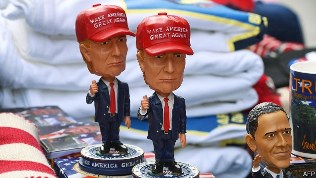

###### The first straw

# What Donald Trump’s campaign swag says about his presidency 

 

> print-edition iconPrint edition | United States | Aug 31st 2019 

WILLIAM HENRY HARRISON was 66 in 1839 when he became the Whigs’ presidential candidate. His rivals mocked his advanced age, calling him Granny and joking, “Give him a barrel of hard cider, and…a pension of two thousand [dollars] a year…and…he will sit the remainder of his days in a log cabin.” Harrison ran with the insult. Though born to a wealthy family, he styled himself the log-cabin-and-cider candidate, a man of the people. He cast his opponent, Martin Van Buren, as an out-of-touch elitist. His supporters sold trinkets—plates, lamps and handkerchiefs—with log-cabin designs. 

Thus began the American political tradition of producing and distributing campaign merchandise. Usually a campaign hands out yard signs, buttons and stickers with the candidate’s name and perhaps an anodyne slogan such as “Kamala Harris For the People” or “Warren Has a Plan for That”. Donald Trump’s campaign takes a different approach. 

Rather than bland slogans designed not to offend, his campaign prefers red meat for the base. Earlier this summer, the president’s campaign began selling branded Trump plastic straws after his campaign manager grew frustrated with a flimsy paper one. They cost $15 for a pack of ten, but sold out quickly. 

The straws are not just straws. They express the sort of cultural grievance that has defined Mr Trump’s presidency. “Liberals want to ban us,” the straws say to his supporters, “but we work better than the politically correct alternative. You like us and using us lets you show your support while triggering the libs.” Mr Trump’s party has followed suit: a few days after Mr Trump baffled the world by musing about buying Greenland, the National Republican Congressional Committee began flogging T-shirts depicting the island as part of America. 

His campaign also sells material such as “Pencil-Neck Adam Schiff” T-shirts, which depict the chairman of the House Intelligence Committee as a clown, and “Fredo Unhinged” shirts, which show Chris Cuomo, a television anchor, mid-meltdown. Campaigns usually leave such mean stuff, such as Bill Clinton corkscrews (you can guess where the screw protrudes) or Hillary Clinton nutcrackers, to third parties. 

Mr Trump’s campaign is nimble. The Cuomo shirts were on sale a day after the anchor threatened to shove someone down a flight of stairs for calling him Fredo, the weak brother in the Godfather films. Politico, which covers Washington politics, reported that the campaign manager’s straw broke as he was boarding a flight. By the time he landed, the campaign was already advertising the Trump straws. They were not focus-grouped or run through committees, just made and sold. That works for trinkets. It may be less effective for policy.■ 

