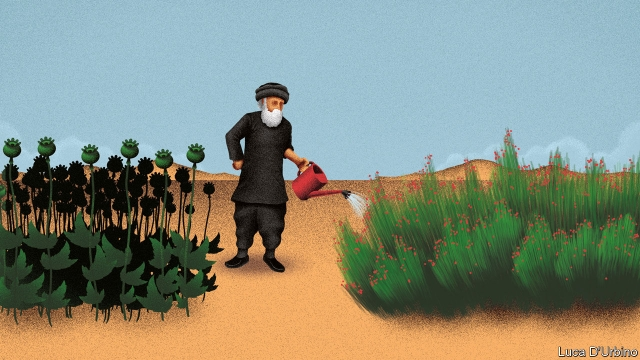

###### Meth in the madness

# Afghan drug barons are branching out into methamphetamines 

 

> print-edition iconPrint edition | Asia | Sep 7th 2019 

DRUG PRODUCERS in Afghanistan have a new line. The country responsible for growing around three-quarters of the world’s opium, as well as mountains of hashish, is diversifying into methamphetamine. The amount seized by the Afghan authorities is increasing exponentially, says the UN’s Office on Drugs and Crime. Police hauled in a meagre 4kg in both 2013 and 2014. In the first six months of this year the tally was 650kg. 

This sudden rise has caught authorities by surprise. Afghanistan’s meth boom appears to have begun in its western neighbour. Iran has long had its own meth problem, but a crackdown there has hobbled producers. Some may have relocated to the lawless western deserts of Afghanistan. Afghan migrant labourers have probably learned the meth business in Iran, then brought it home. 

Afghan meth operations have a twist, says David Mansfield of the London School of Economics. Drug producers normally extract meth’s main precursor, pseudoephedrine, from over-the-counter medicine for colds and flu. But governments are trying to track and restrict sales of such medicines, which have become a lot more costly and difficult to obtain. So Afghan producers have switched to another source: the ephedra bush. These red-berried shrubs grow widely in arid parts of Asia and have long been a staple of herbal medicine to treat asthma, congestion and other breathing problems, since they are a natural source of pseudoephedrine. 

These days, Mr Mansfield says, many heroin factories in Farah province, on the border with Iran, are also cluttered with buckets full of soaking ephedra leaves, in preparation for making meth. Switching to this plant-based method has halved production costs, he reckons. Meanwhile, farmers tell him, the price of ephedra leaves has tripled in a year. 

Where the meth is going is not clear. Much probably travels back to Iran. In July Brigadier-General Masoud Zahedian, Iran’s counter-narcotics chief, complained that four tonnes of the stuff had been seized on his country’s border with Afghanistan since March. But Afghanistan also has its own domestic demand. Meth is popular in Pakistan, too. Some might find its way farther afield. 

How might this new drug affect Afghanistan’s war economy? Opium and its profits permeate the conflict, providing not just livelihoods for poor farmers, but also funding for insurgents and easy money for corrupt officials. Ephedra, known locally as oman, could be a new source of wealth in areas which have so far not cashed in on opium. The bush grows best above 2,500 metres (8,200 feet), and is thus suited to different provinces from opium. But no one knows for sure where ephedra is being farmed in Afghanistan or in what quantities. The UN plans to start satellite and ground surveys to measure the crop, just as it does with opium poppies. 

Afghanistan’s innovative producers are not the first to use ephedra to make meth. Chinese and Burmese villagers have been known to do so as well. But Afghanistan’s lawlessness and its ready-made distribution networks, thanks to the other drugs produced in the country, along with the extremely low cost of farming, could soon make it a fearsome competitor in the global meth business. ■. 

