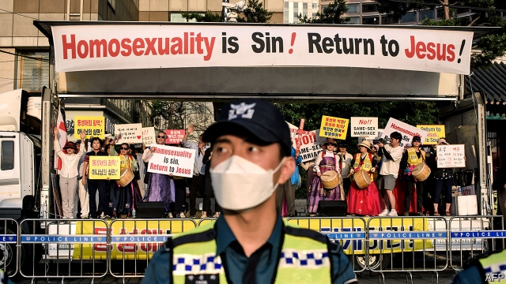

###### Pride and protest

# Hecklers outnumber gay-festival-goers in South Korea 

 

> print-edition iconPrint edition | Asia | Sep 7th 2019 

GETTING TO THE recent “Queer Culture Festival” in Incheon was a challenge. Upon emerging from the subway, participants had to pass through a large crowd of protesters who wept, prayed loudly and told passers-by that they would burn in hell. One man had painted his face and bare feet red and wheeled a large wooden cross up and down the street, wearing a red crown of thorns and a pained expression. Lines of police officers and a barrier separated the protesters from the square where gay-rights organisations, a local left-wing party and a handful of foreign embassies had put up their stalls. Later in the day a colourful parade of several hundred dancing people, vastly outnumbered by hecklers, made its way down the surrounding streets under heavy police protection. 

That was an improvement on last year, when protesters prevented the organisers from setting up their stalls in the first place and violently attacked the parade. Gay-rights activists in South Korea often have to contend with insults and threats of violence. The authorities do not seem to care much. The organisers of a queer festival in the southern city of Busan recently cancelled a street party following a dispute with the local government over permits. They said they would hold a protest instead. “We just don’t feel safe,” says Lee Jong-kwan, who helped organise the festival last year in Busan. “Rather than protecting us, the police harass us.” (The authorities deny any discrimination.) 

Unlike most Western countries, South Korea has never outlawed homosexuality. That is partly because discussing sex has traditionally been considered shameful. Many South Koreans used to be loth to acknowledge that homosexuality even existed, despite the occasional mention of gay affairs at the royal court in historical documents. That blinkered stance carries through to the present: a curriculum for sex education in schools which was introduced in 2015 makes no mention of it, on the ground that talking about it would only encourage it. 

Sex between male soldiers is illegal, and men continue to be sent to jail for it. Many mainstream politicians are vocal homophobes, which appeals to some Confucian traditionalists and evangelical Christians. (Of the 30% of South Koreans who identify as Christian, more than half are members of conservative Protestant congregations.) The leader of the main opposition party recently stressed that he was opposed to homosexuality and that South Korea needed to protect its “beautiful family values”. 

Most South Koreans oppose same-sex marriage, and the government has no plans to recognise it. Young people, however, are more liberal than their elders. More than half of those in their 20s think gay people should be allowed to wed, so no doubt they will be able to some day. 

For now, though, gay life in South Korea can be miserable. “Some of my friends have killed themselves, others have been forced into psychiatric wards or conversion therapy,” says Kim Hye-yeon, a 20-something from Busan. “There’s nowhere for us to go, nobody to protect us.” ■ 
<<<<<<< HEAD

-- 

 单词注释:

1.heckler['heklә]:n. 激烈质问者 

2.outnumber[.aut'nʌmbә]:vt. 数目超过, 比...多 

3.Korea[kә'riә]:n. 朝鲜, 韩国 

4.Sep[]:九月 

5.Incheon[]:n. 仁川（韩国城市名） 

6.participant[pɑ:'tisipәnt]:n. 参加者, 参与者 a. 有份的, 参加的, 参与的 

7.protester[]:n. 抗议者, 持异议者, 拒付者 [经] 反对者 

8.organisation[,ɔ: ^әnaizeiʃən; - ni'z-]:n. 组织, 团体, 体制, 编制 

9.stall[stɒ:l]:n. 厩, 停车处, 牧师职位, 货摊, 托辞, 拖延 vt. 关入厩, 停顿, 推托, 支吾, 使陷于泥中 vi. 被关在厩内, 陷于泥中, 停止, 支吾 

10.colourful['kʌlәful]:a. 颜色丰富的, 鲜艳的, 艳丽的, 多色的, 丰富多彩的, 吸引人的, 引人入胜的 [计] 有色的 

11.vastly['vɑ:stli]:adv. 广大地, 许多, 巨大 

12.violently['vaiәlәntli]:adv. 猛烈地, 激烈地, 极端地 

13.activist['æktivist]:n. 激进主义分子 

14.contend[kәn'tend]:vi. 奋斗, 斗争, 竞争 vt. 为...斗争 

15.busan[]:n. 釜山（韩国一港市） 

16.lee[li:]:n. 背风处, 避风处, 下风处, 保护, 庇护 a. 避风的, 背风的, 下风的, 保护的 

17.harass['hærәs]:vt. 使困扰, 使烦恼, 折磨 

18.outlaw['autlɒ:]:n. 被剥夺法律保护的人, 罪犯 vt. 使...失去法律保护, 将...逐出社会, 宣告非法, 取缔 

19.homosexuality[-'æliti]:n. 同性恋 [医] 同性性欲, 同性恋爱 

20.traditionally[]:adv. 传统上；传说上；习惯上 

21.shameful['ʃeimful]:a. 可耻的, 丢脸的, 不道德的, 淫猥的, 猥亵的, 不体面的 

22.Korean[kә'riәn]:n. 朝鲜人, 朝鲜语 a. 朝鲜人的, 朝鲜语的 

23.loth[lәuθ]:a. 不愿意的, 厌恶的 

24.blinker['bliŋkә]:n. 眨眼睛的人, 闪光交通灯 

25.stance[stæns]:n. 准备击球姿势, 站立的姿势, 位置, 姿态 [经] 地位, 形势 

26.mainstream['meinstri:m]:n. 主流 

27.vocal['vәukl]:a. 嗓音的, 声音的, 有声的, 歌唱的 n. 元音, 声乐作品 

28.homophobe[ˈhɔməfəub]:n. 憎恶同性恋的人 

29.Confucian[kәn'fju:ʃ(ә)n]:a. 孔子的, 儒家学说的, 儒家的, 孔夫子的, 孔丘的 n. 孔子的门徒, 儒家 

30.traditionalist[]:n. 传统主义者, 因循守旧者 

31.evangelical[,i:væn'dʒelikәl]:a. 福音派教会的 n. 福音派信徒 

32.Protestant['prɒtistәnt]:n. 新教徒 a. 新教的, 新教徒的 

33.congregation[.kɒŋgri'geiʃәn]:n. 集合, 聚集 [法] 集会, 人一, 红衣主教会议 

34.opposition[.ɒpә'ziʃәn]:n. 反对, 敌对, 相反, 在野党 [医] 对生, 对向, 反抗, 反对症 

35.wed[wed]:vt. 与...结婚, 使结合 vi. 结婚 

36.psychiatric[saiki'ætrik; (?@) si-]:a. 精神病学的, 医精神病的 [医] 精神病学的 

37.therapy['θerәpi]:n. 治疗 [医] 疗法, 治疗 

38.kim[]:n. 金姆（人名） 
=======
>>>>>>> 50f1fbac684ef65c788c2c3b1cb359dd2a904378

