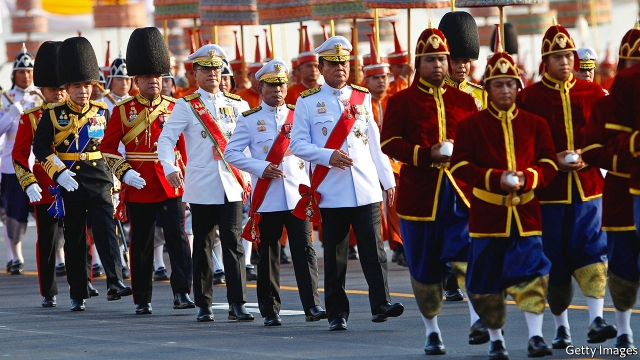

###### Changing of the guard

# Relations between Thailand’s army and king are becoming one-sided 

 

> print-edition iconPrint edition | Asia | Sep 7th 2019 

RIGID AND austere, King Chulalongkorn, the fifth monarch of Thailand’s Chakri dynasty, gazes across Bangkok’s Royal Plaza from a gleaming steed. The bronze statue is just one immovable legacy of the Thai monarchy. The mindset of the country’s armed forces is another. The king overhauled them late in the 19th century, founding a military and naval academy, creating a ministry of defence and indelibly associating them with the crown. 

Thailand’s generals have seized power 12 times since a revolution brought an end to absolute monarchy in 1932. The most recent coup was in 2014. The general who led it, Prayuth Chan-ocha, has remained prime minister ever since. But his authority over the army he once commanded is fading. Instead it is King Maha Vajiralongkorn who is fast becoming the biggest influence over Thailand’s men and women in uniform. 

The armed forces have never really proved themselves in war. Instead they have focused on battling their country’s politicians. Their most fearsome foe was Thaksin Shinawatra, whom they ousted as prime minister in 2006. The feud between his supporters and opponents has tortured Thai politics ever since. But the army appears finally to have bested its enemy, presiding over a rigged election in March that relegated the Thaksinites to a parliamentary minority for the first time since 2001. Politicians backing the army have formed a coalition government led by Mr Prayuth. But the coalition is a rickety one, composed of 18 different parties. That leaves Mr Prayuth ever more dependent on the veneer of legitimacy provided by the king. 

The army’s penchant for politics has always been tied to the prestige of the monarchy. “The consent of the governed is less important than the imprimatur of the monarch,” explains Gregory Raymond of the Australian National University. Military regimes bolster their legitimacy by slavish devotion to the crown. A symbiotic relationship between the barracks and the palace has endured since the 1950s, each defending the other’s standing. 

Close ties to the royals help the armed forces avoid change. The last coup voided a constitution which had established legislative scrutiny over defence policy. Modest reforms occurred after soldiers killed dozens of democratic protesters in 1992 and again after the Asian financial crisis of 1997. Mr Thaksin managed to reduce the army’s budget and placed allies in senior military posts, but achieved little lasting change. Governments which make serious attempts to clip the army’s wings tend to get ousted, as Mr Thaksin’s was. Even so, a popular new party, Future Forward, wants to reduce the number of generals, end conscription and cut military budgets. 

The main impetus for change is coming from the palace itself, however. King Vajiralongkorn, who attended an Australian military academy, served in the army and holds the ranks of field marshal, admiral and air marshal, is obsessed with military titles, training and hierarchy. He expects others to share his passion. The queen, a former flight attendant, has risen through the ranks of his personal guard. Her ascent was not purely a show of grace and favour: she had to complete gruelling training with her men. She now holds the rank of general. His official concubine, a former nurse, was promoted to major-general this year. While crown prince, the king made his pet poodle, since deceased, an air marshal. 

Since he came to the throne almost three years ago, the king has increased the clout of the monarchy in various ways, dispensing with a regent when he is abroad and taking direct control over the administration of all crown property. He has also inserted himself into the administration of the army. A new unit, the Royal Command Guard, has been created at his behest. It includes many of his former bodyguards. Its 5,000-odd soldiers will be under the direct command of the monarch and will be stationed in the heart of Bangkok. At the same time, an infantry regiment and a cavalry battalion that were instrumental in past coups have been ordered out of the capital. This will make it much harder for the army to launch coups without securing the support of the king in advance. 

King Vajiralongkorn has stoked factionalism, too, weakening the bond between the army and the government that it installed. Mr Prayuth and his deputy prime minister, Prawit Wongsuwan, are both former army chiefs. They rose up through the Queen’s Guard, elite troops from a regiment within the army’s Second Infantry Division. The current army chief, Apirat Kongsompong, belongs to the King’s Guard, a faction nestled instead within the First Infantry Division. The king himself once served in it. General Apirat must retire next year and his most likely successor is also from the King’s Guard. 

During the reign of the king’s father, Bhumibol, the relationship between the armed forces and the monarchy was ambiguous. The king’s advisers had a role in the appointment of senior generals, but then again, most of them were former generals themselves. The king never visibly opposed the many coups that took place during his reign, but he did once give a dressing down to a coup leader who had violently suppressed public protests, causing the offending general to resign. 

Under King Vajiralongkorn, the ambiguity has diminished. Mr Prayuth has meekly complied with even the most awkward of the king’s demands, agreeing, for instance, to change the text of the new constitution even after Thai voters had signed off on it. The king left the generals squirming by declining to accept the crown for almost two months after his father’s death, in an unexpected show of modesty. “Prayuth’s days are numbered,” predicts Paul Chambers of Naresuan University. And when the inevitable happens and the army next mounts a coup, the king will be in a commanding position. ■ 

