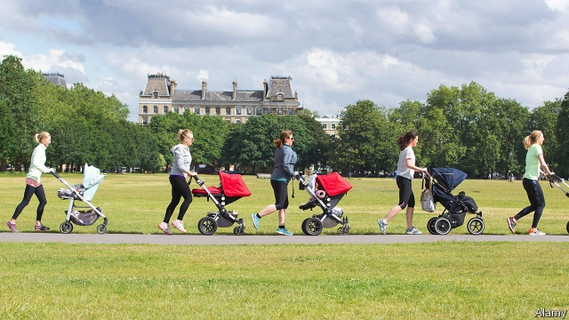
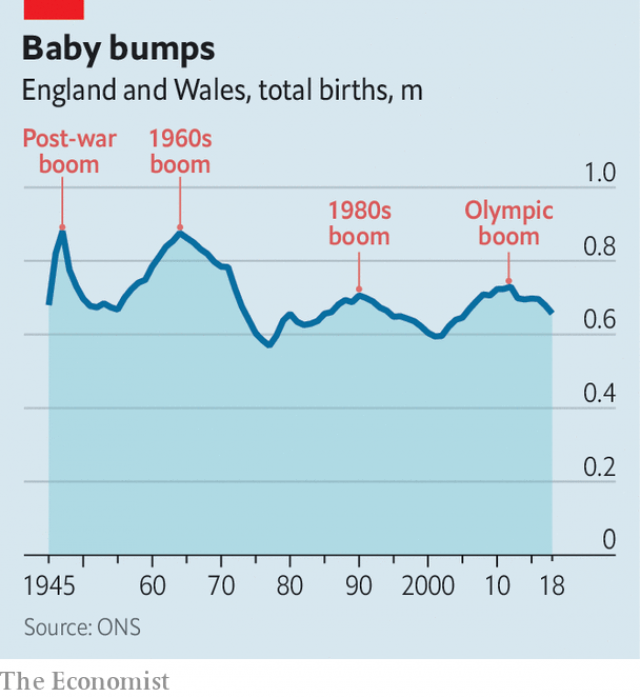

###### An Olympic generation

# A British baby boom grows up 

 

> print-edition iconPrint edition | Britain | Sep 7th 2019 

“THE OH, OH, Ohhh-lympics!” ran one tabloid headline. “As record 150,000 condoms are handed out to a host of super-attractive athletes, could London 2012 be the raunchiest games ever?” Official statistics regarding the sex lives of toned athletes are hard to find. But away from the Olympic village, another reproductive record was indeed broken that year. According to the Office for National Statistics (ONS), mothers in England and Wales gave birth to 729,674 children, the most in over four decades. They have struggled to keep up since (see chart). 

The boom followed a bust. Births began to slump during the 1990s, reaching a low of 594,634 in 2001. The subsequent growth reflected a number of factors (none actually related to the hosting of sports events). There was an echo of earlier baby booms, which increased the number of women of child-bearing age. This coincided with a rise in fertility rates, partly because of more births among older women, who had earlier postponed them. The average maternal age at birth is now 31, up from 28 two decades ago. 

And then there was an increase in immigration. A paper by the ONS estimates that foreign-born mothers accounted for two-thirds of the rise in births between 2001 and 2007. In 2000, 16% of children born in England and Wales had mothers who had been born abroad; by 2012, 26% did. An influx of youngish eastern European migrants after the expansion of the European Union in 2004 contributed to the boom. In 2010 Polish mothers overtook Pakistanis to become the largest group of foreign mums. Polish and Romanian mothers now account for more than 5% of births in Britain. 

 

Changes in population always cause “stomach aches” for the welfare state, notes David Coleman of the University of Oxford. Predicting exactly when birth rates will pick up or slow down is difficult, because it depends on a range of factors from house prices to cultural expectations. But governments, both local and national, are forced to guess, since it takes years to build, say, a school. Another dilemma, notes Piers Elias, a consultant who advises councils on demography, is that local authorities must decide whether to prepare for the peak population, which is more expensive and may later result in empty buildings, or the average, which will lead to a squeeze during the busiest years. 

Maternity services were the first to be put under pressure—initially by the rise in the number of births, then by the increasing age of mothers, which results in more complications. The average class size in primary schools has since risen to 27.1, up from 26.4 in 2010. And a bumper crop of 11-year-olds is now heading into secondary schools, which tend to struggle with higher numbers more than primary schools because of the difficulty of attracting specialist teachers, particularly in subjects like maths and physics, says Jon Andrews of the Education Policy Institute (EPI), a think-tank. In a spending statement on September 4th the government confirmed that it would give schools another £4.6bn ($5.6bn) by 2022-23, a 10% increase. According to the EPI’s estimates, nearly £1bn of that will be sucked up by the extra pupils. 

Being part of a boom generation is something of a curse. Resources are spread more thinly and competition for them is more intense. This year secondary schools are likelier to be oversubscribed than in past years, because of the abundance of 11-year-olds. In contrast, universities are currently going to desperate lengths to attract students, owing to a shortage of 18-year-olds. By the time the Olympic generation come to apply, in a decade or so, it will probably be harder to get in. And things will not get any easier after that. When they head into the workplace they will face a truly Olympian task: supporting the even bigger generation of boomers who will be enjoying retirement. ■ 

-- 

 单词注释:

1.Sep[]:九月 

2.tabloid['tæblɒid]:n. 小报, 小型画报, 药片, 文摘 a. 轰动性的, 扼要的, 缩略的, 小报式的 

3.condom['kɒndәm]:n. 避孕套 [医] 阴茎套 

4.raunchy['rɒ:ntʃi]:a. 不整洁的, 不修边幅的, 肮脏的, 淫秽的 

5.statistic[stә'tistik]:n. 统计量 a. 统计的, 统计学的 

6.reproductive[.ri:prә'dʌktiv]:a. 生殖的, 再生的, 复制的 [医] 生殖的, 复现的 

7.ons[]:abbr. 奥运信息服务（Olympic News Service）；物件名称服务（Object Name Service）；一夜情（One Night Stand） 

8.wale[weil]:n. 隆起的伤痕, 鞭痕, 凸条纹, 精华, 选择 vt. 在...上留下鞭痕, 织成棱纹, 挑选, 撑住 vi. 挑选 

9.bust[bʌst]:n. 半身像, 胸部, 失败, 殴打 vt. 使爆裂, 使破产 vi. 爆裂, 破产 [计] 操作错 

10.slump[slʌmp]:n. 暴跌, 垂头弯腰的姿态 vi. 猛然掉落, 陷入, 衰落(经济等) 

11.coincide[.kәuin'said]:vi. 一致, 符合 [化] 重合 

12.fertility[fә'tiliti]:n. 肥沃, 丰饶, 生产力 [医] 生育力 

13.maternal[mә'tә:nl]:a. 母亲的, 母系的, 母方的 [医] 属母的, 母的, 母性的 

14.influx['inflʌks]:n. 流入, 河口, 汇集 [医] 注入, 流入 

15.youngish['jʌŋiʃ]:a. 还年轻的, 还幼小的 

16.migrant['maigrәnt]:n. 候鸟, 移居者 [法] 移居者 

17.Pakistani[.pɑ:ki'stɑ:ni]:a. 巴基斯坦的 n. 巴基斯坦人 

18.mum[mʌm]:n. 菊花, 沉默 a. 沉默的 vi. 演哑剧 interj. 别说话 

19.Romanian[ru:'meiniәn]:n. 罗马尼亚人, 罗马尼亚语 a. 罗马尼亚的 

20.alway['ɔ:lwei]:adv. 永远；总是（等于always） 

21.ACH[]:[计] 自动化票证交换所 [医] 肾上腺皮质激素 

22.david['deivid]:n. 大卫；戴维（男子名） 

23.coleman['kәulmәn]:n. 科尔曼（姓氏） 

24.Oxford['ɒksfәd]:n. 牛津, 牛津大学 

25.cultural['kʌltʃәrәl]:a. 文化的, 教养的, 修养的 [医] 培养的 

26.pier[piә]:n. 码头, 桥墩, 支框, 防波堤 [医] 桥基, 基牙 

27.Elia['i:liә]:伊利亚(Charles Lamb的笔名) 

28.demography[di:'mɒgrәfi]:n. 人口统计学 [医] 人口学, 人口统计学 

29.maternity[mә'tә:niti]:n. 母性, 怀孕, 妇产科医院 a. 产妇的 

30.complication[.kɒmpli'keiʃәn]:n. 复杂化, 复杂情况 [医] 并发症, 并发病 

31.bumper['bʌmpә]:n. 缓冲器, 满杯 a. 大胜利的 

32.physic['fizik]:n. 药品, 泻药, 医学 vt. 给...服药, 治愈, 使通便 

33.jon[dʒɔn]:n. 乔恩（男子名） 

34.andrew['ændru:]:n. 安德鲁（男子名） 

35.epi[ei 'pi:]:直沙嘴, 离岸沙坝 

36.thinly['θinli]:adv. 薄, 细, 瘦 

37.oversubscribe[.әuvәsәb'skraib]:vt. 超额认购(公债等), 过量预订 [经] 超额认购(公债等), 订购(某物)过多 

38.abundance[ә'bʌndәns]:n. 丰富, 充足, 大量 [经] 丰富, 充裕 

39.currently['kʌrәntli]:adv. 现在, 当前, 一般, 普通 [计] 当前 

40.olympian[әu'limpiәn]:a. 威严的；奥林匹克竞赛的；奥林匹斯山的 

41.boomer['bu:mә]:n. 往来无定的临时工 

42.retirement[ri'taiәmәnt]:n. 退休, 隐居, 撤退 [经] 退休, 退股, (固定资产)报废 

