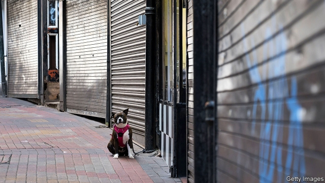

###### Left-behind places

# A new index finds neglect in Britain’s banlieues 

 

> print-edition iconPrint edition | Britain | Sep 7th 2019 

THERE ARE no public toilets in Bartley Green, a neighbourhood on the fringes of Birmingham. Caught short, your correspondent begs for relief at a funeral parlour. The question is asked so often at the dentist’s next door that a sign forbids passers-by from spending a penny. “That’s one of the things we don’t have round here,” says the undertaker. It is not the only thing. Several shops are boarded up; the library opens only two days a week. One of the few places with a buzz is a bus shelter on the main road. “Everything’s a bus away,” groans one resident, queuing for the number 18. “There’s nothing here.” 

Few things in politics are as fashionable as unfashionable places. The Brexit referendum and Donald Trump’s election sent journalists on both sides of the Atlantic scurrying to the margins of Britain and America, in search of the source of disaffection. Academics are making careers interpreting the whims of people who live there. In his first speech as prime minister, Boris Johnson promised to answer “the plea of the forgotten people and the left-behind towns”. On September 5th, Oxford Consultants for Social Inclusion (OCSI), a group of wonks for hire, added some welcome crunch to the rhetoric with a new measure of England’s “left-behind” places. 

OCSI already compiles the index of multiple deprivation, an official ranking that combines different measures of quality of life. But Local Trust, a charity, asked OCSI to devise a community-needs index with a narrower focus. Whereas the multiple-deprivation index largely assesses the presence of negative factors like crime and unemployment, the new index highlights the absence of positives, such as civic amenities and transport links. Stefan Noble of OCSI defines left-behind places as local-authority wards that fall within the first decile of both indices. Of England’s 7,433 wards, 206 fit that bill. 

Much of the list is unsurprising. Many of the poorest-performing wards are concentrated in post-industrial parts of the country or unloved seaside towns. About 13% of wards in the north-east are classed as left-behind, the country’s highest rate. More interesting is the presence on the list of plenty of housing estates on the fringes of prosperous cities and large towns. They are only a short drive or bus ride from thriving city centres and yet feel neglected. “Public transport outside of London is expensive,” says Mr Noble. “It is difficult for people to leave these areas and participate in the core.” 

Left-behind places are less diverse, with a much greater proportion of white residents than other deprived areas and England as a whole. They are also growing more slowly. On average, their populations rose by 5% in 2001-17, compared with 12% in all of England and 17% in other deprived areas. And they are struggling for jobs. Before the financial crash of 2008, the unemployment rate was lower in these wards than in other deprived places. But it has been higher ever since, and is now double the national average. 

Perhaps the most intriguing finding concerns Brexit. There is a strong association between a ward’s position on the new index and its vote to leave. The correlation is more than three times stronger than that between the Leave vote and the conventional deprivation-index ranking. This could bolster the argument of those who reckon cultural and social factors—as much as economic ones—determine people’s satisfaction with the status quo. 

Bartley Green is typical. It is only six miles from central Birmingham but the bus journey takes at least half an hour. Buses have been cut and there are two pubs where once there were six, says John Lines, a councillor. Laura Smith was a youth worker until her job was axed. Now, she says, “there’s nothing for the kids”. Her disabled daughter is due to start at school this week, but she is still waiting for a place on the bus to be confirmed. “If we have to take taxis, it’s £30 [$37] a day.” Only 27% of voters turned out in the last local election. In the Brexit referendum, two-thirds voted Leave. 

The data do not capture everything. In Bartley Green, volunteers have enabled the library to expand from opening one day a week to two days. They run coffee mornings and sewing classes and use social media to encourage the isolated to join in. In the Henley ward of Coventry, another left-behind place, locals were so riled by the negative publicity of their billing on the multiple-deprivation index that they made a calendar with pictures of their community groups, like armchair exercise classes for the elderly. Such places might lack many amenities that other Britons take for granted, but they are not short of pride. ■ 

