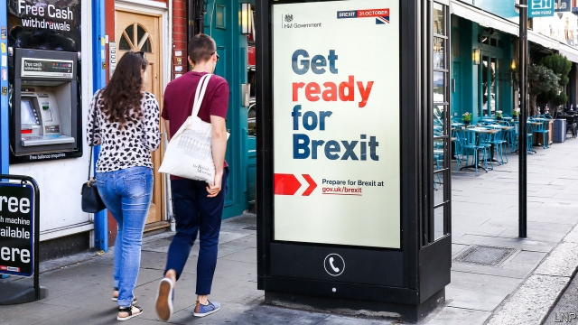

###### Cupboard love

# Brexit-related food stockpiling is on the rise 

 

> print-edition iconPrint edition | Britain | Sep 7th 2019 

WHEN THE food riots start, says Linda, a university administrator from Brighton, “I plan to watch them on TV enjoying a nice puttanesca whipped up from the Brexit cupboard.” Often included on no-deal-Brexit recipe lists, the fiery pasta dish from Naples requires nothing fresh. From her stash of tins and frozen veg, Linda is self-sufficient for up to three weeks. Stockpilers are seen as a bit crackers, but the chance of a disorderly exit from the European Union is prompting more people to take precautions. 

One survey in August by HIM, a shopper-research firm, found that 61% of consumers expect Brexit-related food shortages. Nearly a third of people plan to stockpile and 14% are already doing so. Anecdotal evidence of hoarding is plentiful. A manager of a big Waitrose store in London says he has seen a rise in purchases of tins and frozen veg. Does he, a supermarket insider, plan to stockpile? “Absolutely,” comes the answer. Shoppers who have done no hoarding plan to go into panic-buying mode later if no-deal stays on the cards. 

The government’s “Get ready for Brexit” campaign, launched this week by Michael Gove, the minister in charge of preparing for no-deal, will spur them on (though the associated website makes no mention of provisioning, focusing on health certificates for EU-bound pets, not what to do if the dog food runs out). 

But the food industry has driven home the relevant facts. Britain imports between two-fifths and half of its food, mostly from the EU. That supply could be halved because 50% of lorries coming from Calais into Dover are expected to get blocked by border checks and traffic chaos, says Tim Rycroft of the Food & Drink Federation, which represents giant food manufacturers. There are plans to fly in vital medicines, but not food. 

Stockpiling groups are aware of the risk of exacerbating shortages. A prominent, 10,960-strong Facebook group, 48% Preppers—a reference to the share of people who voted Remain in 2016—has stopped talking publicly about its activities. Jo Elgarf, an administrator, explains that it is now too late to stock up bit by bit. “Anything now will be panic.” 

Nor are stockpilers all nervy Remoaners. Zoe, an entrepreneur from Lewes, wants a no-deal Brexit and believes in self-reliance. She is using her five acres to raise animals for meat to supply family, friends and neighbours through any disruption. She has pigs booked into an abattoir in the first week of October—it takes time to process the meat. “I was gutted when we didn’t leave in March,” she says. “I was so prepared.”■ 

