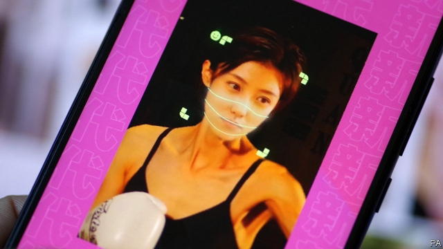

###### About face

# Chinese netizens get privacy-conscious 

 

> print-edition iconPrint edition | Business | Sep 7th 2019 

ON THE NIGHT of August 30th, soon after ZAO—an app whose name means “to make”—was launched, it proved so wildly popular that its servers crashed repeatedly. Almost as rapidly, a sudden backlash from its many fans nearly unmade it. Technology-news outlets and meticulous netizens who had combed through the terms of its user agreement found that by signing up, users had granted ZAO “completely free”, “irrevocable” and “perpetual” rights to all content they uploaded to its platform. 

Furious comments flooded Apple’s app store in China, where ZAO is now rated a measly two stars out of five. (This did not stop it from becoming China’s most-downloaded free app in the store.) WeChat, a dominant Chinese app—always eager to stick it to a potential rival—blocked ZAO links from being shared on its messaging service citing “security risks”. ZAO swiftly removed the offending clause. On September 3rd it apologised to users and pledged to protect their personal data “in every possible way”. 

China’s freewheeling internet users hand plenty of precious information over to the country’s data-grubbing apps. A report published last month by a Chinese cyber-security think-tank found that 1,000 of the country’s most-downloaded mobile applications hoover up an average of 20 types of data from each user. These often include call logs and videos of no obvious relevance to the apps themselves. And the notion of digital privacy seems almost quaint in the face of the vast data-gathering apparatus of an authoritarian state that regards public consent as optional at best. 

So why did ZAO hit a nerve? One reason is that it appears to belong to a new crop of apps that generate “deepfakes”, computational creations that use artificial intelligence to doctor video footage. One form involves pasting a face onto someone else’s body—in ZAO’S tantalising offering, your kisser can be stitched onto the svelte silhouette of an actor or actress in a hit film or television drama. 

Until recently such fakery had required hundreds of images to conjure a convincing clip. But deepfake technology has rapidly improved. ZAO’s winning claim is that, as its slogan promises, it takes “just one photo for you to star in all the world’s shows”. But for the best result, ZAO requires precise facial mapping, which users can feed into the app by following prompts to blink and move their mouths about. 

When ZAO’s grasping terms of service came to light, many users were alarmed at the idea of these biometric data being misused. Facial verification is being widely tested in China: to pay in supermarkets, glide through the gates at railway stations and even withdraw cash. On September 1st Alipay, a big payment app, assured users that “images created through face-swapping apps, no matter how realistic, cannot trick our system”. The government, too, has taken note. On September 4th it summoned Momo, a Chinese dating-app giant with ties to ZAO, to explain itself and launched an inquiry into the company’s “data-safety issues”. 

The state’s reaction continues its clampdown that began in January on non-consensual harvesting of personal information (by private firms, that is). Citizens are increasingly anxious about online fraud. More than four-fifths of respondents to a survey last year by the China Consumers’ Association said they had suffered from data theft. In an unusual case in May, a man from Jiangxi province sued Tencent, the internet giant behind WeChat, for sharing his personal data across its many services without his approval. The court ruled in the plaintiff’s favour—and ordered Tencent to stop the practice.■ 

-- 

 单词注释:

1.netizens[nə'taɪzənz]:abbr. Internet citizens 网络公民 

2.Sep[]:九月 

3.APP[]:[计] 应用, 应用程序; 相联并行处理器 

4.wildly[]:adv. 狂暴地, 激动地, 狂热地, 鲁莽地, 轻率地 

5.server['sә:vә]:n. 服伺者, 上菜用具, 发球员 n. 服务器 [计] 服务器, 服务器启动程序, 服务台程序 

6.backlash['bæklæʃ]:n. 后冲, 强烈反对 [电] 反撞, 逆栅流 

7.unmade[ʌn'meid]:unmake的过去式和过去分词 

8.meticulous[mә'tikjulәs]:a. 一丝不苟的, 精确的, 过细的 

9.zao[]:abbr. 掺铝氧化锌（zinc aluminium oxide） 

10.irrevocable[i'revәkәbl]:a. 不能挽回的, 不能取消的, 不能变更的 [经] 不能撤销的, 不能恢复的 

11.perpetual[pә'petʃuәl]:a. 永久的, 不断的, 无期限的, 没完没了的, 四季开花的 [经] 永远的, 终身的, 持续的 

12.upload['ʌp,lәud]:[计] 上装, 加载, 储入 

13.measly['mi:zli]:a. 患麻疹的 [医] 米珠的, 含囊尾蚴的 

14.WeChat[]:[网络] 微信；微讯；腾讯微信 

15.dominant['dɒminәnt]:a. 占优势的, 支配的 [医] 优性的, 显性的 

16.cite[sait]:vt. 引用, 引证, 表彰 [建] 引证, 指引 

17.swiftly['swiftli]:adv. 很快地, 即刻 

18.clause[klɒ:z]:n. 子句, 条款 [计] 子句 

19.apologise[ә'pɔlәdʒaiz]:vi. 道歉（等于apologize） 

20.pledge[pledʒ]:n. 诺言, 保证, 誓言, 抵押, 信物, 保人, 祝愿 vt. 许诺, 保证, 使发誓, 抵押, 典当, 举杯祝...健康 

21.datum['deitәm]:n. 论据, 材料, 资料, 已知数 [医] 材料, 资料, 论据 

22.freewheeling['fri:'hwi:liŋ]:n. 惯性滑行 a. 惯性滑行的, 随心所欲的 

23.hoover['hu:vә]:n. 胡佛电动吸尘器 vi. 用真空吸尘器打扫 

24.relevance['relivәns]:n. 中肯；关联；相关性 

25.privacy['praivәsi]:n. 隐私, 隐居, 秘密 [计] 个人保密权 

26.quaint[kweint]:a. 古雅的, 离奇有趣的, 奇怪的 

27.authoritarian[ɒ:.θɒri'tєәriәn]:a. 独裁的, 独裁主义的 

28.computational[.kɒmpju'teiʃәnәl]:a. 计算的 

29.creation[kri:'eiʃәn]:n. 创造, 创作物, 发明 [化] 产生 

30.footage['futidʒ]:n. 英尺长度, 英板尺, (影片的)连续镜头 

31.pasting['peistiŋ]:n. 裱糊, 涂；粘合 

32.tantalise['tæntәlaiz]:vt. 诱发无法实现的希望, 使干着急, 惹弄, 逗惹, 逗弄 

33.kisser['kisә]:n. 接吻的人 

34.svelte[svelt. sfelt]:a. 苗条的；线条清晰的；和蔼的 

35.silhouette[.silu:'et]:n. 黑色半身侧面影, 影子, 轮廓, 剪影 vt. 描绘...成侧面影, 使照出影子来, 使仅仅显出轮廓 

36.fakery[-kәri]:n. 伪造, 赝品, 假货, 伪装, 捏造 [法] 伪造, 捏造, 伪装 

37.conjure['kʌndʒә]:vt. 念咒文召唤, 变戏法, 想象 vi. 变戏法, 施魔法 

38.clip[klip]:n. 修剪, 夹子, 回形针, 剪下来的东西 vt. 修剪, 痛打, 夹牢, 剪报 vi. 剪报 

39.blink[bliŋk]:vi. 眨眼, 闪亮 vt. 眨眼, 使闪亮 n. 眨眼, 瞬间, 闪光, 闪烁 [计] 闪烁 

40.biometric[ˌbaɪəʊˈmetrɪk]: 计量生物学 

41.misuse[.mis'ju:z]:n. 误用, 滥用 vt. 误用, 滥用, 虐待 

42.verification[.verifi'keiʃәn]:n. 证实, 查证, 证明属实 [计] 验证 

43.alipay[]:n. 支付宝 

44.realistic[riә'listik]:a. 现实的, 逼真的, 现实主义的, 实在论的 

45.cannot['kænɒt]:aux. 无法, 不能 

46.summon['sʌmәn]:vt. 召唤, 召集, 号召, 振奋, 唤起, 鼓起 [经] 传唤, 传讯 

47.momo[]:n. 卯卯 

48.clampdown['klæmdaun]:n. 压制, 取缔 

49.online[]:[计] 联机 

50.fraud[frɒ:d]:n. 欺骗, 欺诈, 诡计, 骗子 [经] 欺诈, 舞弊, 骗子 

51.respondent[ri'spɒndәnt]:a. 回答的, 应答的, 反射的 n. 应答者, 被告 

52.Jiangxi['dʒjɑ:ŋ'ʃi:]:江西(位于中国长江中、下游南岸) 

53.sue[su:]:vt. 控告, 起诉, 请求 vi. 提出诉讼, 提出请求 

54.Tencent[]:[网络] 腾讯；腾讯公司；腾讯控股 

