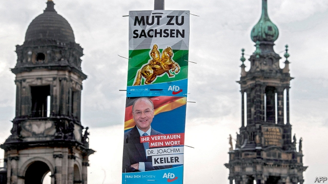

###### German business

# Deutschland AG worries about the rise of the hard-right AfD 

 

> print-edition iconPrint edition | Business | Sep 7th 2019 

WHEN JAN PAUL BACH moved his business, which makes ceramic-heating kit, from Berlin to Brandenburg 13 years ago he never thought about politics. Abundant land near Werneuchen, a city of 9,000, allowed Bach RC to build two new production lines. Today it has 50 employees and an overflowing order book from clients across the globe. And Mr Bach has become distracted by the rise of the xenophobic Alternative for Germany (AfD). He is now hesitating about building another much-needed line. He occasionally thinks about relocating the business altogether. 

The strong gains by the AfD in elections on September 1st in the eastern states of Brandenburg (where its vote almost doubled to 24%) and Saxony (where it tripled to 28%) is worrying the export-driven companies of Deutschland AG. The bosses of the BDA, an association of German entrepreneurs, and of the BDI, which groups German industry, released statements signalling their concern about the result. In Mr Bach’s district the AfD was the strongest party. International clients and distributors are asking Mr Bach if Brandenburg has become a no-go area. “They think Nazis are running around in the street,” he says. 

Eastern Germans have never had it so good. The average salary in eastern Germany increased from less than 50% of western German pay in 1991 to 82% today (and 90% when accounting for lower living costs). Yet they seem more discontented and less tolerant of foreigners than ever. Almost one-third of eastern Germans consider themselves “second-class citizens”. Their frustration is born of the exodus of youngsters in particular, according to a study by the IFO Institute of Economic Research, a think-tank. Eastern Germany has lost more than 2m people since 1990; western Germany has gained 5m. Many vibrant rural towns, which used to have a shop, a school and a community centre, have turned ghostly. The AfD did best in such sparsely populated areas. 

The vast majority of eastern Germans do not vote for the AfD and so far the mainstream parties have spurned it in coalition talks, so it will hardly influence economic policy. The problem is the damage the AfD is doing to the image of eastern German states, says Joachim Ragnitz of the IFO. At a time when companies in depopulating eastern Germany need immigrants to fill skilled and unskilled jobs, some voters want to pull up the drawbridge. 

Net outflows of labour may get worse if the AfD gains strength and scares away outsiders. Thomas Morgenstern, head of the Dresden operation of GlobalFoundries, a big American producer of semiconductors, which employs 200 foreigners in a workforce of 3,200, sees no sign of foreign workers’ retreat. But, he says, let the AfD’s result serve as a wake-up call for mainstream politicians to do better by Ossies. All of corporate Germany would benefit. ■ 

