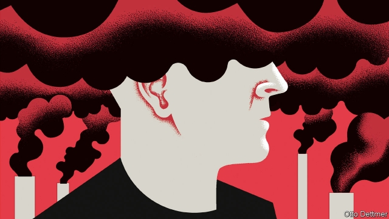

###### Free exchange

# Martin Weitzman died on August 27th 

 

> print-edition iconPrint edition | Finance and economics | Sep 5th 2019 

MARTIN WEITZMAN, one of his colleagues observed last year, was not an economist you would expect to encounter on the 7am plane from Boston to Washington. That was not because the retired Harvard University professor, who died on August 27th, lacked influence. On the contrary, his research was cited by policymakers around the world. Nor was it because he objected to flying, although he might have done on the basis of his field, environmental economics. It was because he was a recluse who, according to many who knew him, preferred thinking in his study to being with his friends, let alone with politicians. Making intellectual advances was the most important thing. 

But what he made of his time at his desk. He was of a rare breed: a theorist capable of brilliant abstract reasoning whose work was nevertheless squarely relevant to essential—and increasingly pressing—policy choices. In 1974, early in his career, he wrote a paper that became a foundation stone of every course on public economics. It posed the question: how should regulators rein in pollution? Should they issue (tradable) pollution permits to firms, thereby picking a quantity? Or should they tax polluters, thereby picking a price? 

Two sides of the same coin, went existing thinking, which assumed perfect knowledge on the part of bureaucrats. But Mr Weitzman assumed that predicting the reaction of prices to a regulated quantity, and vice versa, is partly guesswork (an assumption that would be borne out, decades later, when the prices of carbon permits in the European Union’s emissions-trading scheme collapsed unexpectedly after the financial crisis). Which you should regulate depends on the relative costs of mistakes. If getting the quantity of pollution slightly wrong would be costlier, then quantity should be pinned down, with prices allowed to work themselves out. If a slightly errant price can do more damage—say, because the need to buy expensive permits could put many firms out of business—then a tax, fixed at a safe level, is the way to go. 

Uncertainty was the theme that ran through Mr Weitzman’s career. It was also another reason to avoid that Washington shuttle: how could an economist ever make a precise recommendation in such a complex world? He would provide the intellectual machinery for thinking about a problem; others would have to choose the precise settings. For example, perhaps the biggest debate in environmental economics in recent years has concerned discount rates. By how much should you mark down the environmental damage of pollution to take account of the fact that it comes mostly in the future? Mr Weitzman assumed that the correct discount rate is itself uncertain. He demonstrated mathematically that whatever rate is chosen, uncertainty means it should decline over time. The further you peer into the future, the lower your discount rate should be. Many governments, including those of Britain, Denmark, France and Norway, now apply declining discount rates in their economic analyses, although the debate about the right starting-point is far from settled. 

The latter stages of Mr Weitzman’s career were defined by an assault on what he saw as false precision in predictions of the costs of climate change. In 2018 William Nordhaus, his longtime colleague—and rival, although there was no animosity between them—won the Nobel prize in economics for his work on the costs and benefits of acting to reduce greenhouse-gas emissions. Mr Nordhaus carefully prices the potential damage from global warming using an economic model, discounts it appropriately (he favours a relatively high rate) and compares the result to the costs of reducing emissions today. His models suggest that policymakers should implement a carbon tax starting at around $30-40 per tonne of carbon dioxide and tolerate warming this century of over 3°C, compared with temperatures in pre-industrial times.  

Mr Weitzman thought this approach problematic. Climate change, he argued, does not lend itself easily to cost-benefit analysis. Despite advances in climate science, the sensitivity of global surface temperature to atmospheric carbon dioxide remains uncertain. Even if the central case is that a given amount of pollution produces a manageable eventual rise in temperatures, a cataclysmic event, such as global warming of over 6°C, remains worryingly possible. Cost-benefit analysis, he showed, can break down in these conditions. His “dismal theorem” proved that with fat-tailed distributions, and under certain mathematical assumptions about people’s preferences, society should be willing to pay unlimited amounts today to avoid catastrophic risk. 

Mr Weitzman acknowledged that this result was detached from reality: “obviously it cannot be taken literally,” he said. Nobody believes in giving up everything today in the name of future safety. Atheists are rarely persuaded by Pascal’s wager—the argument that you should believe in God to avoid the infinite downside risk of eternal hellfire. But Mr Weitzman thought he had made a deeper point about the fragility of cost-benefit analysis in the face of extreme risks. “We desperately need more information about what’s going on in these tails,” he said. “It’s not the median values that are gonna kill us.” 

Mr Weitzman is thought to have taken his own life, the second celebrated economist to do so this year. His ideas on tail risks might yet prevail in the profession, despite his apparent passing-over for the Nobel prize. Certainly campaign groups, such as Britain’s Extinction Rebellion, increasingly emphasise catastrophic risk above all else. He died a political moderate and, according to one colleague’s recollection, was no fan of the Green New Deal, the plan for fighting climate change proposed by America’s left, which downplays the role of carbon pricing. 

Still, Mr Weitzman was not one to say precisely what should be done. His domain was that which is not known. ■ 

