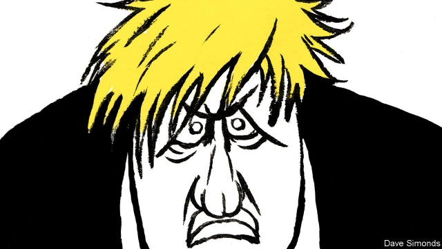

###### British politics

# Boris Johnson’s Unconservative Party 

 

> print-edition iconPrint edition | Leaders | Sep 7th 2019 

BORIS JOHNSON has been Conservative leader for little more than a month, and until this week had appeared in Parliament as prime minister only once. But that did not stop him carrying out the biggest purge in the party’s history on September 3rd. After a backbench rebellion led to a resounding defeat of his uncompromising Brexit policy, 21 moderate Conservative MPs, including seven former cabinet members and a grandson of Winston Churchill, had the whip withdrawn and were told they would not be allowed to stand as Tories at the next election. 

It was the most dramatic step in a long process: the transformation of Britain’s ruling party from conservatives into radical populists (see article). The capture of the Tories by fanatics determined to pursue a no-deal Brexit has caused the party to abandon the principles by which it has governed Britain for most of the past century. With an election looming, and the Labour opposition captured by an equally radical hard-left, the Tories’ sinister metamorphosis is terrible news. 

Junking more than 40 years of cautious pro-Europeanism after the referendum of 2016 was itself a big change. But under Mr Johnson and his Svengali-like adviser, Dominic Cummings, who masterminded the Leave campaign, the Tory party has become not just pro-Brexit but pro-no-deal. Mr Johnson claims he is working flat-out to get a better withdrawal agreement from the EU. Yet in his flailing performance before MPs this week, like an undergraduate bluffing his way through a viva, he was found out. He has no real proposal for replacing the contested Irish backstop. Reports that Mr Cummings privately admitted the negotiations in Brussels are a “sham” ring all too true. Mr Johnson’s unconservative plan seems to be to win a quick election, either after crashing out with no deal or, as it has turned out, claiming to have been thwarted by “enemies of the people” in Parliament. 

The religion of no-deal has wrecked other Conservative principles. Sajid Javid, the fiscally prudent chancellor, this week dished out billions of pounds worth of pre-election goodies. He gave money to public services without demanding much in the way of reform, and focused on day-to-day spending rather than investing for the future. Spending power was supposedly being kept aside to cope with a no-deal crash-out. But faith dictates that no-deal will do no great harm to the economy, so no safety-net is required. To show any such caution, as Mr Javid’s predecessor (now an ex-Tory) did, is a form of heresy. 

The most unconservative behaviour of Mr Johnson’s government has been its constitutional recklessness. Not only has it suspended Parliament (having said that it would not), so as to limit MPs’ time to legislate on Brexit (which, again, it said was unconnected). It also toyed with using even more underhand tactics, such as recommending that the queen not enact legislation passed by Parliament. Would the government abide by the law, a cabinet ally of Mr Johnson was asked? “We will see what the legislation says,” he replied. In a country whose constitution depends on a willingness to follow convention and tradition, even making such a threat weakens the rules—and paves the way for the next round of abuses, be it by a Labour or Tory government. 

This week there were still just enough conservatives in the Conservative Party to block the most dangerous part of Mr Johnson’s Brexit policy. As we went to press, a bill designed to stop no-deal was making its way through the House of Lords. But the defeat of the government, and its loss of any sort of majority, points towards an election. It will be a contest in which, for the first time in living memory, Britain has no centre-right party. Nor, thanks to Labour’s far-left leader, Jeremy Corbyn, will it have a mainstream opposition. Instead the two leading parties will, in their different ways, be bent on damaging the economy; and both will pose a threat to Britain’s institutions. Brexit’s dreadful consequences continue. ■ 

