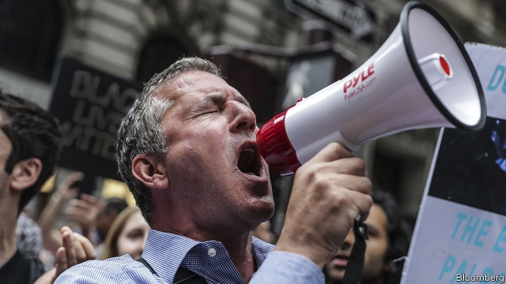

###### On Hungary, the great auk, Brexit, Hong Kong, language, conservatism

# Letters to the editor 

> Sep 7th 2019 

The achievements of Viktor Orban, Hungary’s prime minister, “are bad for Hungarian liberty”, you say in your briefing (“The entanglement of powers”, August 31st). In fact, the opposite is true. The past nine years of the Orban governments have been good for the country. GDP growth is one of the best in the European Union and our unemployment rate has hit all-time lows. Debt-to-GDP is down and deficits remain well below 3%. Investment is up, interest rates down and real wages are growing. The number of marriages has increased by 43% and divorces have fallen. The employment rate of women has reached an all-time high and abortions have dropped by nearly a third. Those are not the numbers of a “hollowed-out” democracy, but point to the optimism and confidence of a free people. 

Moreover, we did not build “a fence to keep out Middle Eastern refugees”. The fence was built as a barrier to prevent illegal entries into the EU’s visa-free Schengen area, with which Hungary met its Schengen treaty obligations to secure the EU’s external border. Most of those attempting to cross illegally were not refugees. 

And, yes, the governing parties have won three straight parliamentary elections, and many other electoral contests, with big margins. This has given us the democratic mandate to pursue these policies. Hungary’s free and vociferous press do a much better job than The Economist at asking why the opposition continues to fail to win over voters. 

You, along with many of our critics, have a hard time with Prime Minister Orban’s unapologetic defence of the Christian cultural identity of Europe. But the fact is, as the prime minister said in a speech in July, “liberal democracy was capable of surviving until it abandoned its Christian foundations.” Illiberal democracy, he said, “is Christian liberty and the protection of Christian liberty.” In our view, illiberalism is about putting the common good first. An illiberal is one who protects the country’s borders, who protects the nation’s culture. 

ZOLTAN KOVACSState secretary for international communications and relationsCabinet Office of the Prime MinisterBudapest 

 

You reported on the conservation efforts to protect the puffins of the Faroe Islands (“Well worth saving”, August 10th). This is not the first time the Faroes have witnessed a survival drama between hunters and seabirds. The islands were one of the last redoubts of the puffin’s larger cousin, the great auk (Pinguinus impennis). An iconic three-foot-tall flightless bird with a close resemblance to a penguin, it was one of the greatest examples of convergent evolution. Sadly the last pair were killed in 1844 so that their egg could be sold at auction in London. 

EDEN COTTEE-JONESLondon 

 

One solution to the conundrum surrounding the “backstop” in the Brexit withdrawal agreement (“Who’s gonna stop no-deal?”, August 31st) is to create an all-Ireland No-Custom Area, which would qualify as a Frontier Traffic area under Article 24 of the GATT/WTO. This would entail the free circulation within Ireland only of products originating in either part of the island, trade which represents the majority of intra-Ireland trade. Products originating from the rest of the European Union and directed to Northern Ireland (or the rest of the United Kingdom), or vice versa, would not benefit from this “passporting”. 

The issue is one of controlling circumvention and fraud. This can be done by appropriate controls not at the border but before products reach their destination, through labelling, marks of origins and so on, backed by adequate sanctions. In this way both the freedom of the UK to establish its own custom and regulatory regime for all its territory, including Northern Ireland, and the absence of an intra-Ireland border would be preserved. The establishment of such an area and its principles could be immediately agreed in an additional protocol to the withdrawal agreement before October 31st, to be completed during the transition period. 

PROF. GIORGIO SACERDOTIFormer member of the Appellate Body of the WTOMilan 

 

The row over reintroducing French as a language of instruction in Moroccan schools (“Quel est le problème?”, August 17th) reminds me of the mother-tongue teaching policy in Hong Kong, which was introduced when China took control of the city in 1997. For many pupils, this means learning in Cantonese Chinese. In a place where both English and Chinese are the official languages, the dismal reality is that many local graduates leave school with subpar English proficiency. Indeed, Hong Kong is consistently outranked by Singapore and Shanghai in the EF English Proficiency Index, blemishing Hong Kong’s reputation as an international commercial hub. In an interconnected world, not all languages are equally prominent, particularly in business and diplomacy. Re-establishing cultural identity can be achieved without undermining efforts to keep up with the tide of globalisation. 

JUSTIN BONG-KWANHong Kong 

 

You rightly questioned the right not to be offended (“Speak up”, August 17th). One of the foremost experts on offensive language was the late Reinhold Aman, the publisher of Maledicta, “an international journal of verbal aggression”. Aman argued that an agitated person can be compared to an overflowing steam boiler. The use of invective, in his view, serves as a relief valve that restores emotional and physical balance. 

CHRISTOPHER STEHBERGERTraunstein, Germany 

 

Bagehot submits that Margaret Thatcher’s famous quote, “There is no such thing as society”, is a “sin” against Burkean conservatism (August 3rd). But in that interview for Woman’s Own in 1987, Thatcher went on to say that we are a “living tapestry” of people, who by “our own efforts” help those who are unfortunate. In her autobiography she gave this clarification: “It’s our duty to look after ourselves and then to look after our neighbour.” Her point was that society is not abstract; if everyone thinks that others are responsible for looking after the vulnerable, then nothing will be done for them. Individuals have primacy in Thatcherism, but they do have social duties. Edmund Burke would agree. 

WILLIAM PEDENAncona, Italy 

Bagehot might review The Economist’s recent coverage of Boris Johnson, which aptly describes him as more Rabelaisian harlequin than “Rousseauan” ideologue. 

TRAVIS WHITE-SCHWOCHChicago 

My greatest joy as an American reading your publication is to become acquainted with British slang. Bagehot lamented the “berks” who now control the Tory party. Upon looking up the etymology of this particular lingo, I was not disappointed. I recommend your other readers give it a whirl. 

JED CRUMBONashville, Tennessee 
<<<<<<< HEAD

-- 

 单词注释:

1.Hungary['hʌŋgәri]:n. 匈牙利 

2.auk[ɒ:k]:n. 海雀 

3.Brexit[]:[网络] 英国退出欧盟 

4.hong[hɔŋ]:n. （中国、日本的）行, 商行 

5.kong[kɔŋ]:n. 含锡砾石下的无矿基岩；钢 

6.conservatism[kәn'sә:vәtizәm]:n. 保守, 守旧性, 保守主义, [the]保守党的主张和政策, 保守党 [医] 保守性 

7.Sep[]:九月 

8.Viktor[]:维克托（人名） 

9.orban[]: [人名] 奥尔班 

10.Hungarian[hʌŋ'gєәriәn]:a. 匈牙利的, 匈牙利人的, 匈牙利语的 n. 匈牙利人, 匈牙利语 

11.entanglement[in'tæŋglmәnt]:n. 纠缠, 卷入, 缠绕物 [化] 缠结 

12.deficit['defisit]:n. 赤字, 不足额 [医] 短缺 

13.optimism['ɒptimizm]:n. 乐观主义, 乐观, 乐天 [医] 乐观主义, 乐观 

14.refugee[.refju'dʒi:]:n. 难民, 流亡者 [法] 避难者, 流亡者, 难民 

15.schengen['ʃɛŋən]: [地名] [卢森堡] 申根 

16.illegally[]:[法] 非法地, 不合法地, 违法地 

17.parliamentary[.pɑ:lә'mentәri]:a. 国会的, 议会的, 议会制度的 

18.electoral[i'lektәrәl]:a. 选举人的, 选举的, (有关)选举的 [法] 选举的, 选举人的, 由选举人组成的 

19.mandate['mændeit]:n. 命令, 指令, 要求 vt. 委任统治 

20.vociferous[vәu'sifәrәs]:a. 大声叫的, 喊叫的, 喧嚷的 

21.economist[i:'kɒnәmist]:n. 经济学者, 经济家 [经] 经济学家 

22.opposition[.ɒpә'ziʃәn]:n. 反对, 敌对, 相反, 在野党 [医] 对生, 对向, 反抗, 反对症 

23.voter['vәutә]:n. 选民, 投票人 [法] 选民, 选举人, 投票人 

24.unapologetic[ˌʌnəˌpɒləˈdʒetɪk]:a. 不道歉的, 不认错的； 不辩解的 

25.cultural['kʌltʃәrәl]:a. 文化的, 教养的, 修养的 [医] 培养的 

26.illiberal[i'libәrәl]:a. 狭隘的, 无教养的, 吝啬的 

27.illiberalism[i'libərәlizəm]:n. 反自由主义,非自由主义 

28.illiberal[i'libәrәl]:a. 狭隘的, 无教养的, 吝啬的 

29.zoltan[]:n. (Zoltan)人名；(英、罗、塞、意、捷)佐尔坦 

30.puffin['pʌfin]:n. 角嘴海雀 

31.faroe[]: 法罗群岛 

32.faroes['fɛərəuz]:abbr. Faererne (Faroe Islands) 法罗群岛 

33.seabird['si:bә:d]:n. 海鸟 

34.redoubt[ri'daut]:n. 多面堡, 防御阵地 

35.Pinguinus[]:[网络] 大海雀属 

36.iconic[ai'kɔnik]:[计] 图标的 

37.flightless['flaitlis]:a. 不能飞的 

38.resemblance[ri'zemblәns]:n. 相似处, 类似, 肖像 

39.penguin['pengwin]:n. 企鹅, 空军地勤人员 

40.convergent[kәn'vә:dʒәnt]:a. 趋集于一点的, 会聚性的, 收敛的 [医] 会聚的, 集合的 

41.auction['ɒ:kʃәn]:n. 拍卖 vt. 拍卖 

42.Eden['i:dn]:n. 伊甸园, 乐园 

43.conundrum[kә'nʌndrәm]:n. 谜语, 难题 

44.backstop['bækstɒp]:n. 挡球网, 接球手 [电] 背向停止 

45.withdrawal[wið'drɒ:l]:n. 提款, 撤退, 退回, 撤消, 退隐, 戒毒过程 [医] 戒除, 脱瘾 

46.gonna['ɡɔnә]:abbr. （美）将要（等于going to） 

47.entail[in'teil]:vt. 使成为必需, 需要, 使承担, 遗传给 n. 限定继承 

48.circulation[.sә:kju'leiʃәn]:n. 流通, 循环, 发行量 [化] 环流 

49.versa[]:a. 反的 

50.passporting[]:[网络] 护照 

51.circumvention[.sә:kәm'venʃәn]:n. 陷害, 包围 [法] 陷害, 计谋 

52.fraud[frɒ:d]:n. 欺骗, 欺诈, 诡计, 骗子 [经] 欺诈, 舞弊, 骗子 

53.sanction['sæŋkʃәn]:n. 核准, 制裁, 处罚, 约束力 vt. 制定制裁规则, 认可, 核准, 同意 

54.UK[ju: 'kei]:n. 联合王国 

55.regulatory['regjulәtәri]:a. 受控制的, 统制的, 调整的 [经] 规则的 

56.regime[rei'ʒi:m]:n. 政权, 当权期间, 政体, 社会制度, 体制, 情态 [医] 制度, 生活制度 

57.protocol['prәutәkɒl]:n. 草案, 礼仪, 协议 v. 拟定 [计] 协议, 协议列表实用程序 

58.transition[træn'ziʃәn]:n. 转变, 转换, 变迁, 过渡时期, 临时转调 [化] 跃迁 

59.Prof[prɒf]:n. 教授 

60.Giorgio[]:n. 希奥尔希奥（男子名） 

61.appellate[ә'pelit]:a. 上诉的, 有权受理上诉的 [法] 受理上诉的, 上诉的, 控诉的 

62.reintroduce[ri:intrә'dju:s]:vt. 再引进, 再介绍 

63.Moroccan[mә'rɒkәn]:a. 摩洛哥的 n. 摩洛哥人 

64.quel[]:n. [医]嘧啶醇；植物生长抑制剂嘧啶醇 

65.EST[]:(美国)东部时间 

66.LE[]:[计] 小于或等于 

67.Cantonese[.kæntә'ni:z]:n. 广东人, 广东话 

68.dismal['dizmәl]:a. 阴沉的, 凄凉的, 令人忧郁的 n. 低落的情绪, 沼泽 

69.subpar[ˊsʌbˊpaː]:a. 在一般标准以下的,在平均水平以下的;在票面价值以下的 

70.proficiency[prә'fiʃәns]:n. 精通, 熟练, 精练 

71.consistently[]:adv. 坚固, 坚实, 一致, 始终如一, 连贯 [计] 相容地 

72.outrank[aut'ræŋk]:vt. 在级别方面比...高, 在地位方面比...高, 在身分方面比...高 

73.Singapore[.siŋgә'pɒ:]:n. 新加坡 

74.ef[]:abbr. 每面（each face）；超精度（extremely fine）；仰角指示器（Elevation Finder） 

75.proficiency[prә'fiʃәns]:n. 精通, 熟练, 精练 

76.blemish['blemiʃ]:n. 污点, 缺点 vt. 弄脏, 玷污, 损害 

77.hub[hʌb]:n. 毂, 木片, 中心 [计] 插座; 插孔; 集线器, 集中器, 连接器, 中继站 

78.interconnect[.intәkә'nekt]:vt. 使互相连接 

79.equally['i:kwәli]:adv. 相等地, 同样地, 平等地 

80.diplomacy[di'plәumәsi]:n. 外交, 外交手腕, 交际手段 [法] 外交, 外交手腕, 权谋 

81.undermine[.ʌndә'main]:vt. 在...下面挖, 渐渐破坏, 暗地里破坏 [法] 暗中破坏, 以阴谋中伤伤害 

82.globalisation[,gləubəlai'zeiʃən]:n. 全球化, =globalization 

83.justin['dʒʌstin]:n. 贾斯廷（男子名） 

84.rightly['raitli]:adv. 合适地, 正当地, 正确地 

85.offensive[ә'fensiv]:a. 令人不快的, 侮辱的, 攻击性的 [法] 攻击的, 进攻的, 冒犯的 

86.reinhold['rainhәuld]:n. 莱因霍尔德（男子名） 

87.aman[]:n. [圣经]哈曼（波斯王亚哈随鲁的宰相, 阴谋杀死所有犹太人, 等于Haman） 

88.publisher['pʌbliʃә]:n. 出版者, 发行人 [法] 发行人, 出版者, 报刊发行者 

89.maledicta[]: 

90.verbal['vә:bl]:a. 用言辞的, 言语的, 口头的, 逐字的, 动词的 [医] 言语的, 口述的 

91.agitate['ædʒiteit]:vt. 使摇动, 搅动, 使激动, 使不安 vi. 鼓动, 煽动 

92.overflow[.әuvә'flәu]:n. 溢值, 超值, 泛滥 v. (使)泛滥, (使)溢出, (使)充溢 [计] 上溢; 溢出 

93.boiler['bɒilә]:n. 煮器, 汽锅, 锅炉 [化] 锅炉 

94.invective[in'vektiv]:n. 恶言漫骂, 臭骂 a. 漫骂的, 非难的, 恶言的 

95.valve[vælv]:n. 活瓣, 阀, 活门 v. 装阀, 用阀调节 

96.christopher['kristәfә]:n. 克里斯多夫（男子名） 

97.Bagehot[ˈbædʒət]:白芝浩；巴杰特（人名） 

98.margaret['mɑ:^әrit]:n. 玛格利特（女子名） 

99.burkean[]:[网络] 伯克派；伯克式 

100.thatcher[]:n. 盖屋顶者 

101.tapestry['tæpistri]:n. 挂毯, 绒绣 vt. 用挂毯装饰 

102.vulnerable['vʌlnәrәbl]:a. 易受伤害的, 有弱点的, 易受影响的, 脆弱的, 成局的 [医] 易损的 

103.primacy['praimәsi]:n. 第一, 首位, 卓越 

104.thatcherism['θætʃərizəm]:n. 撒切尔主义 

105.edmund['edmәnd]:n. 艾德蒙（男子名） 

106.burke[bә:k]:vt. 秘密地除去, 秘密地消灭, 压制 

107.william['wiljәm]:n. 威廉（男子名）；[常作W-][美俚]钞票, 纸币 

108.coverage['kʌvәridʒ]:n. 覆盖的范围, 保险总额, 新闻报导 [化] 可达范围; 覆盖度 

109.boris['bɔris]:n. 鲍里斯（男子名） 

110.johnson['dʒɔnsn]:n. 约翰逊（姓氏） 

111.aptly['æptli]:adv. 适当地, 适宜地 

112.Rabelaisian[ræbә'leiziәn]:a. 粗俗幽默的, 法国讽刺作家拉伯雷的 

113.harlequin['hɑ:likwin]:n. 丑角 [医] 花斑眼镜蛇 

114.Rousseauan[]:[网络] 卢梭 

115.ideologue['aidi:әulɔ^]:n. 理论家, 思想家,空想家 

116.travis['trævis]:n. 崔维斯合唱团；特拉维斯（男子名） 

117.acquaint[ә'kweint]:vt. 使认识, 介绍 

118.slang[slæŋ]:n. 俚语 v. 辱骂, 用俚语说 

119.lament[lә'ment]:n. 悲叹, 悔恨, 恸哭, 挽歌, 悼词 vt. 哀悼 vi. 悔恨, 悲叹 

120.berk[bɜ:k]:n. 傻瓜 

121.Tory['tɒ:ri]:n. 托利党党员, 保守党员, 亲英分子 a. 保守分子的 

122.etymology[.eti'mɔlәdʒi]:n. 语源, 语源学 

123.lingo['liŋgәu]:n. 外国话, 隐语 [经] 行话, 航业暗语 

124.jed[dʒed,jed]:n. 杰德（男子名, Jedediah的昵称） 

125.Tennessee[.teni'si:]:n. 田纳西州 
=======
>>>>>>> 50f1fbac684ef65c788c2c3b1cb359dd2a904378

