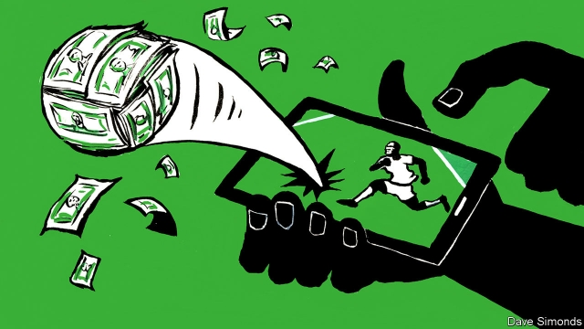

###### All bets are on

# Ethiopia has caught gambling fever 

 

> print-edition iconPrint edition | Middle East and Africa | Sep 7th 2019 

GETABALEW SEIFE is beginning to feel suspicious. Four times a week he saunters into the same bar in downtown Addis Ababa and puts down a bet. He often punts on Manchester United, his favourite football club. But he almost always loses. “I think Manchester United is somehow supporting the betting companies,” he says. Still, he returns. “I’m playing just to get my money back.” 

Like Getabalew, Ethiopia has caught gambling fever. Sports betting shops are springing up across the country. “People have gone crazy,” he says. His friend had to sell his car last year after a run of bad luck. Others, though, are making out just fine. “It’s a cash cow,” says Sophonias Thilahun of Bet251, which plans to open 100 betting shops in Addis Ababa over the next six months. It may soon compete with 18 other companies, most of which were granted licences in the past year. 

Sports gambling has been growing across Africa, fuelled by the spread of smartphones and mobile money. Kenya, Nigeria and South Africa lead the way, with multimillion-dollar gambling industries. A survey in 2017 across six sub-Saharan African countries found that more than half of young people had tried gambling. Over 75% of young Kenyans have placed a bet. 

Ethiopia was until recently a laggard. Addis Ababa had a hotel casino in the time of Emperor Haile Selassie, but this was closed by the Marxist junta known as the Derg in the 1980s. Its successor, the Ethiopian People’s Revolutionary Democratic Front, shared the Derg’s suspicion of gambling. The first betting licence was not granted until 2013 and the market remained mostly empty until 2016. Foreign firms are still prohibited. 

Recent improvements in Ethiopia’s telecoms infrastructure help explain the boom. “Without internet you couldn’t do anything,” says Michael Demissew of Abyssinia Bet, a gambling firm that uses mobile money. The government has also softened its stance since the appointment of Abiy Ahmed, the relatively liberal prime minister, last year. It has allowed gambling advertisements on radio and television and may soon permit casinos. It is motivated by the potential for new tax revenue, says Sophonias. 

But the boom also reflects deepening economic frustration among the country’s youth. “Almost everyone is playing for money, not entertainment,” says one punter. “You could get money here that you can’t get anywhere else.”■ 

-- 

 单词注释:

1.Ethiopia[.i:θi'әupiә]:n. 埃塞俄比亚 

2.gamble['gæmbl]:n. 赌博, 冒险 v. 赌博, 孤注一掷 

3.Sep[]:九月 

4.seife[]:[网络] 肥皂 

5.saunter['sɒ:ntә]:n. 闲逛, 漫步 vi. 闲逛, 漫步 

6.addis['ædis]:n. 艾缔思（姓氏） 

7.Ababa[]:n. (Ababa)人名；(塞)阿巴巴 

8.punt[pʌnt]:n. 方头平底船, 踢悬空球, 赌博者 v. 踢悬空球, 用篙撑船, 赌博 

9.Manchester['mæntʃestә]:n. 曼彻斯特 

10.alway['ɔ:lwei]:adv. 永远；总是（等于always） 

11.Sophonias[,sɔfә'naiәs]:n. [宗]西番雅书(基督教《圣经·旧约》中的一卷,亦译作《索福尼亚》) 

12.smartphones[]: 智能手机（smartphone的复数） 

13.Kenya['kenjә]:n. 肯尼亚 

14.Nigeria[nai'dʒiriә]:n. 尼日利亚 

15.kenyan['kenjәn]:n. 肯尼亚人 

16.laggard['lægәd]:n. 迟钝者, 落后者 a. 迟钝的, 落后的 

17.casino[kә'si:nәu]:n. 卡西诺赌场, 卡西诺牌戏 

18.Haile[]:n. (Haile)人名；(西)艾莱；(阿拉伯、索、埃塞)海尔；(英)黑尔 

19.Selassie[]:n. (Selassie)人名；(埃塞)塞拉西 

20.junta['dʒʌntә]:n. 以武力政变上台的(军)政府, 私党, 阴谋小集团, 政务会 

21.derg[]:abbr. decreasing 减少，削减，递减 

22.successor[sәk'sesә]:n. 继承者, 接任者 [计] 后继 

23.Ethiopian[.i:θi'әupiәn]:a. 埃塞俄比亚的 n. 埃塞俄比亚人 

24.telecom['telәkɔm]:telecommunication 电信 

25.infrastructure['infrәstrʌktʃә]:n. 基础结构, 基础设施 [经] 基础设施 

26.michael['maikl]:n. 迈克尔（男子名） 

27.Abyssinia[.æbi'sinjә]:n. 阿比西尼亚 

28.soften['sɒftn]:v. (使)变柔软, (使)变柔和 

29.stance[stæns]:n. 准备击球姿势, 站立的姿势, 位置, 姿态 [经] 地位, 形势 

30.ahmed[]:n. 艾哈迈德（男子名） 

31.frustration[frʌs'treiʃәn]:n. 挫折, 顿挫 [医] 挫折 

32.punter['pʌntә]:n. 用篙撑船的人, 船夫, 赌博者 

