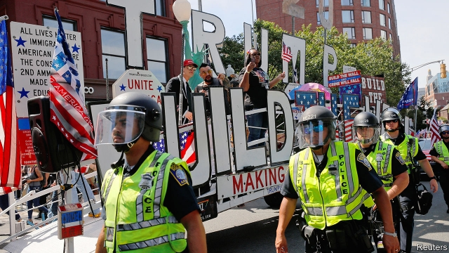

###### Dire straights

# Straight pride struggles to catch on 

 

> print-edition iconPrint edition | United States | Sep 7th 2019 

“IT’S HARDER to come out as conservative than gay,” complains David Elkins, a pensioner whose T-shirt reads “It’s OK to be white, straight, and male”. Luckily he found acceptance at Boston’s first straight-pride parade. Behind him a clown with a rainbow wig and green face-paint wandered past a truck festooned with “Trump 2020” posters, and a child held a sign that says “Make normalcy normal again.” The music in the background veers from “YMCA” (an odd choice) to “God Bless the USA”, before settling on a disco number whose chorus is just the word “freedom” sung over and over. “We don’t hate gay people,” insists Dawn, who is reluctant to give her surname, and stands amid a sea of American flags. “Some of us used to be gay.” 

The event, held on August 31st, was organised by a group called Super Happy Fun America, which says it campaigns for heterosexuals, America’s “oppressed majority”. As the group’s name suggests, its intention was partly to troll critics and provoke them into outrage. The language on its website often mockingly mirrors that used by social-justice activists. Some LGBT activists thought it was best to ignore the parade and starve it of attention. Others felt compelled to oppose it. The roughly 200 people who attended it were vastly outnumbered not just by the almost 1,000 counter-protesters, but also by the police keeping the groups apart. 

Debates over gay rights have largely taken a back seat in the current round of America’s culture wars, compared with issues of race and gender. (This is less true of transgender rights.) Polling by the Pew Research Centre shows that almost two-thirds of Americans, including nearly half of Republicans, now support gay marriage. Straight pride, which has lived for years on the fringes of social media, has struggled to catch on; analogous movements like men’s-rights activism and white nationalism, both of which have inspired acts of terrorism, are far better known. 

Even among those at the parade, motivations varied. A few, like Lois, who had travelled from Los Angeles, warned darkly of “gay domination” and “schools teaching anal sex to five-year-olds”. Others, like Kristy, a transgender woman, said they just wanted to support free speech. Some brought signs supporting the president’s proposed border wall. “I’m only here to make the left look ridiculous, to draw them out and expose their true colours,” said Patrick. Many spent the entire parade filming the counter-marchers. 

Attitudes like Patrick’s made it tricky for the event’s critics to decide how to respond. The organisers of Boston’s gay-pride parade, which drew 750,000 people this year, released a statement saying they were “not interested in responding to their bait”. The counter-marchers, chanting slogans like “Boston hates you!”, disagreed. “I know they want to go home and say ‘I triggered a snowflake’, but it’s a stronger message to oppose them,” said Meghan Self, a schoolteacher. “To do nothing is to say it’s OK.” Many described their opponents, rightly or wrongly, as white supremacists; like a lot of the parade-goers, they saw this march as just another front in the culture wars, or the resistance to the president. 

The parade ended with speeches outside Boston’s city hall. The small audience cheered as one roared “I want to say it’s not OK to be gay,” but they seemed more hesitant when another, an African-American woman introduced only as Barbara from Harlem, said “Thank God for slavery”. Her tribute to America’s “Judeo-Christian principles” was interrupted by a cry of “not Judeo!”. A later speaker declared, “We are living in a time when bad is good and good is bad.” Many of the counter-protesters, kept far away with multiple layers of barricades, would probably have agreed.■ 

