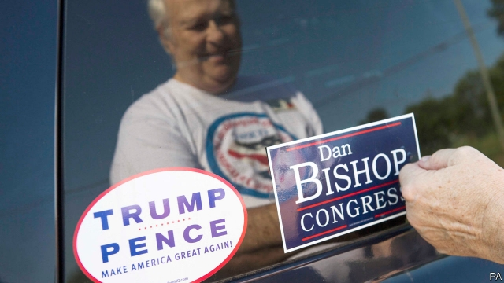

###### First in flight

# There is more to North Carolina’s special election than Donald Trump 

 

> print-edition iconPrint edition | United States | Sep 7th 2019 

THE MID-TERM elections in 2018 filled quietly and without notable controversy nearly all of the 435 seats in the House of Representatives. The election in North Carolina’s ninth congressional district was an exception. In the ten months since last November’s contest the district has been the focus of several trials for election fraud, a restructuring of the state election supervisory board and the departure of a discredited would-be congressman. After September 10th, if all goes according to plan, residents of the ninth district will at last have a representative in Congress. The race is close. In a district that has sent Republicans to Washington in every election since 1963, that alone is remarkable. 

The 2018 election in NC-9, which stretches from suburban Charlotte through the backwoods of the Tar Heel State, was invalidated in February 2019 after campaign operatives for the Republican candidate, Mark Harris, were accused of falsifying absentee votes. Leslie McRae Dowless, a low-level campaign organiser and the mastermind of the operation, has since been indicted for obstruction of justice, conspiracy to obstruct justice and unlawful possession of absentee ballots. Mr Dowless allegedly ran a similar scheme in the 2016 general election and the 2018 primary, in which Mr Harris defeated the incumbent Republican, Robert Pittenger. 

Mr Pittenger, who now works to educate parliamentarians in allied countries about surveillance, counterterrorism and intelligence-sharing, blames Mr Dowless for his loss in last year’s primary. “It was all fraud,” he says. Yet although he misses representing his fellow Carolinians in Washington—“I loved the job”—he did not seek the Republican nomination for next week’s special election. Instead the party picked Dan Bishop, a Republican state senator, to run for the seat. 

In more normal times Mr Bishop ought to be a shoo-in. Yet with every election seemingly a referendum on President Donald Trump, these are not those times. The tightness of the race is not only a Trump phenomenon, though. NC-9—which was once as friendly to Republicans as a church picnic on the lawn of a country club to celebrate Barry Goldwater’s birthday—has been becoming steadily more competitive for a decade as its fields and trees have been replaced by suburbs and parking lots. In 2006 voters in the district gave the Republican candidate a vote share that was 20 points higher than the nationwide Republican tally. In 2018 the district was leaning to the right by just 2 percentage points (see chart). Mr Harris defeated his 2018 Democratic challenger Dan McCready, an ex-marine, by a mere 900 votes last year (and that includes the cheating). 

 

In light of the seat’s newfound competitiveness, money has flooded in. According to number-crunching by the Centre for Responsive Politics, a non-partisan research group, Mr McCready has raised $4.7m, whereas Mr Bishop has raised $1.9m. According to political polling, the race remains close. One survey from Harper Polling found Mr McCready beating Mr Bishop by four percentage points—within the margin of error—while another survey from the Democratic firm ALG Research found the two candidates tied on 46% each. McCready appears to have a slight edge, but the election could go either way. With luck, this time nobody will stuff the ballot boxes.■ 

