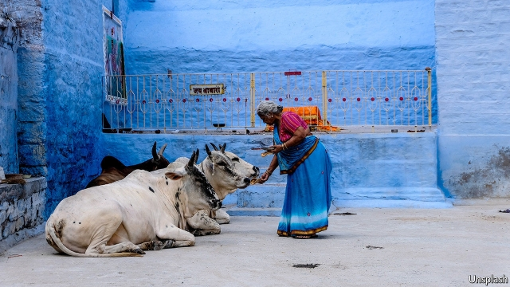

###### Lunacy

# India’s government is pouring money into dung 

 

> print-edition iconPrint edition | Asia | Sep 12th 2019 

ON SEPTEMBER 7TH mission control in Bengaluru lost contact with an Indian-designed and -built lunar probe mere seconds before it was supposed to land. Some Indians were consoled by the fact that their country had nearly pulled off an extraordinarily complex mission on a shoestring budget. But others asked why the budget was quite so pinched. 

As a proportion of GDP—0.6%—public spending on research and development has not budged in 20 years. That is one of the lowest figures among big economies. Since 2015 the largest state funding agency, the Council of Scientific and Industrial Research, has seen its budget decline in real terms. The government wants it to attract private money. Yet firms are even stingier: India’s top companies spend barely half a percent of their income on R&D. 

Scientists complain, too, that state funding bodies seem increasingly driven by ideology. A particular focus, since the Hindu-nationalist Bharatiya Janata Party (BJP) took power in 2014, has been on promoting ancient Indian science and medicine. One recent three-year, government-funded hospital study explored the effects of Vedic chants on brain-trauma victims. This included consultation with an authority on “medical astrology” who incorporated horoscope data in the chants, undertook purification rituals with holy Ganges water and performed special prayers. The results of the study have yet to be published. 

Scientists also describe mounting pressure to propose work on gomutra (cows’ urine) or panchagavya (a mixture of milk, yogurt, clarified butter, urine and dung), so as to win funding from a recently created government board tasked with “validating” the beneficial qualities of all things bovine. “These ideas are based on absolutely unscientific mythology and scripture,” complains a researcher who declined to be named, fearing funding cuts. “But my department needs equipment and lab facilities for our real research, and we can’t get funds without doing this stuff.” A newly created National Cow Commission has pledged to fund up to 60% of startup capital for businesses that commercialise panchagavya. 

A recently elected BJP MP insists that it was drinking cow urine that cured her breast cancer, not the three operations she had. The Cow Urine Therapy and Research Institute of Indore claims to have cured dozens of patients, while Junagadh Agricultural University says its researchers have not only destroyed cancer cells in vitro with gomutra, but discovered gold in the miraculous liquid. Online retailers happily flog dung-based soaps and urine-based medicines promising to cure cancer. The benefits of the lunar mission are less clear. 

