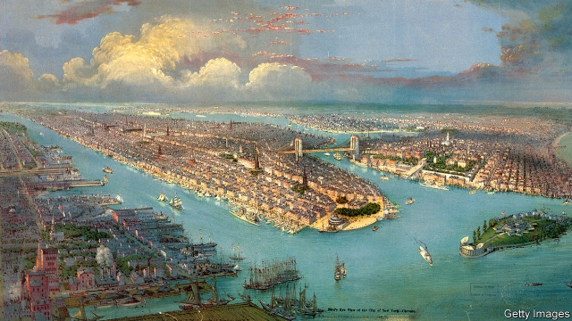

###### The fractured lands

# A technicolour history of Brooklyn 

 
<<<<<<< HEAD

> print-edition iconPrint edition | Books and arts | Sep 14th 2019 
=======

> print-edition iconPrint edition | Books and arts | Sep 12th 2019 
>>>>>>> 50f1fbac684ef65c788c2c3b1cb359dd2a904378

Brooklyn: The Once and Future City. By Thomas Campanella. Princeton University Press; 552 pages; $35 and £27. 

THE FIRST photograph in Thomas Campanella’s fascinating history of the borough of Brooklyn seems, at first glance, to have little to do with his subject. Here is the north-east coast of Baffin Island, in the high Arctic, where, looking towards the Barnes Ice Cap, you can glimpse the “rapidly vanishing last vestige of the Laurentide ice sheet”. But that ice sheet was, as Mr Campanella evocatively writes, the “great sculptor” of New York state, and Brooklyn is the “long-settled western rump of that glacial pile known as Long Island”, left behind when the ice retreated. 

Mr Campanella, who teaches at Cornell University, aims to give an account of “the Brooklyn unknown, overlooked and unheralded—the quotidian city taken for granted or long ago blotted out by time and tide.” He succeeds admirably, tracing the development of the land first inhabited by the Canarsee Indians, part of the Leni Lenape Nation of Algonquian peoples, and later by the Dutch and the English. He points to ghostly mementoes of native habitation: the present-day junction of Flatbush Avenue and Kings Highway marks the crossroads of two native trails, “which explains why both roads look like random rips in the urban fabric on a map”. 

Dutch settlers called the place breukelen, “the fractured lands”, because of the many tidal inlets that scored the plain above Jamaica Bay. Those parcels of land were consolidated first into a city in its own right and then—after 1898—into a part of Greater New York. Much of the book concerns the borough’s struggle against the draw of its more glamorous neighbour across the East River, and indeed against the state of New Jersey: Newark, not Brooklyn, became the home of the region’s major port, and Newark airport overtook Brooklyn’s Floyd Bennett Field, despite the energetic efforts of Brooklyn’s boosters. 

Mr Campanella’s book is richly peopled with the likes of Floyd Bennett himself, a heroic and handsome aviator who flew to the North Pole in 1926, perishing two years later on another adventure. Many engaging characters feature in Brooklyn’s stormy story. John McKane, a carpenter and builder, became the powerbroker behind the growth of Coney Island into a pleasure resort at the end of the 19th century (before winding up in jail). Fred Trump, the president’s father, threw a party to celebrate the destruction of Coney Island’s “Pavilion of Fun”, which, in “an act of vandalism”, he razed to make room for an abortive apartment project. 
<<<<<<< HEAD

“Brooklyn: The Once and Future City” is, however, more than a story of boom and bust. It is a nuanced portrait of a diverse group of communities. Genteel farmland, then a byword for urban blight, and now the apotheosis of hipsterdom and gentrification—Brooklyn has seen it all. Mr Campanella, a native Brooklynite himself, brings both love and scholarship to his writing, revealing the true spirit of this fractured land. 
=======

“Brooklyn: The Once and Future City” is, however, more than a story of boom and bust. It is a nuanced portrait of a diverse group of communities. Genteel farmland, then a byword for urban blight, and now the apotheosis of hipsterdom and gentrification—Brooklyn has seen it all. Mr Campanella, a native Brooklynite himself, brings both love and scholarship to his writing, revealing the true spirt of this fractured land. 
>>>>>>> 50f1fbac684ef65c788c2c3b1cb359dd2a904378

