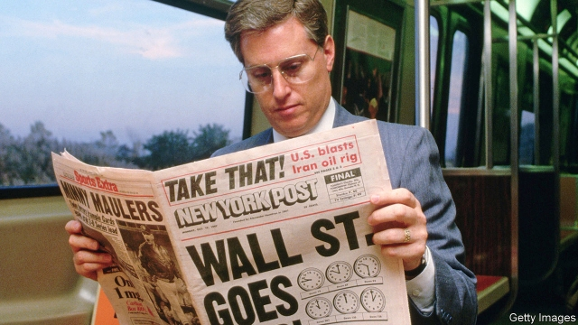

###### The descent of man

# Nicholas Lemann traces the history of American corporations 

 

> print-edition iconPrint edition | Books and arts | Sep 12th 2019 

Transaction Man. By Nicholas Lemann. Farrar, Straus & Giroux; 320 pages; $28. 

IN THE 1970S a course on investing at Harvard Business School was nicknamed “Darkness at noon”, because it was held in a basement at lunchtime and badly attended. By the mid-1990s the classes on finance were jammed with wannabe masters of the universe. That telling contrast is among the many illuminating snapshots of the past in Nicholas Lemann’s ambitious new book on corporate America. 

Even in the headquarters of capitalism, Mr Lemann reveals, attitudes to business have oscillated wildly, both in boardrooms and on Wall Street. His book is an unusual addition to a growing canon that seeks to explain why, for many ordinary people, the American Dream has come to seem out of reach. Rather than focusing on macroeconomic factors such as growth, productivity or unemployment, in “Transaction Man” Mr Lemann dwells on how companies are run. Its publication is timely, given the recent statement by the Business Roundtable, a group of bosses, that firms should be run for all stakeholders, not just shareholders. But for all its rich reporting and panache, it lacks rigour. 

Mr Lemann splits modern American business history into three phases. In the largely benign age of Institution Man, roughly from the 1930s until the 1970s, large corporations dominate, under the control of technocrats who often adopt elements of a corporate welfare state—from job security to pensions and health care. From the 1970s onwards the malign era of Transaction Man begins, in which financial deregulation and more assertive owners see big firms broken up and managers take a more ruthless view of social obligations. In the 2000s the era of Network Man is inaugurated, led by tech firms seeking to overthrow the old order with platforms that have millions of connected users. The jury is still out on whether this latest phase is an improvement, the book suggests. 

Onto this simple structure, Mr Lemann builds many narratives about individuals and institutions. Three people loom large, each representing a distinct phase: Adolf Berle, a thinker born in 1895 who wanted to harness big business for social ends; Michael Jensen, an economist who preached a radical doctrine of shareholder value in the 1970s and 1980s; and Reid Hoffman, a co-founder of LinkedIn and a Silicon Valley guru. The book also tracks the evolution of two firms, General Motors (GM) and Morgan Stanley. As if that were not enough, it follows a working-class neighbourhood on the South Side of Chicago over the decades. 

As an intricate feat of storytelling, the author (who writes for the New Yorker) just about carries it off. There are dazzling passages. In the prologue he skewers today’s elite, whose typical member “is suspicious of politics and provincial concerns; his perspective is global and based on what he regards as universal principles.” He lampoons the Clinton administration’s chumminess with bankers. Gems are dug from the past. Alfred Sloan, autocratic boss of GM in the mid-20th century, had a private railway carriage, with an office and bedrooms, which he used to travel the country to visit car dealers. Mr Hoffman is depicted in a Californian sushi joint, swapping vacuities with a consultant from McKinsey who proclaims, “There’s a non-zero chance that AI will be smarter than humans.” 

Yet for all the sparkle, the book suffers from two flaws. One is a smouldering identity crisis: it can’t make up its mind whether it is a polemic about how America has gone to hell or a more standard history, anchored in empiricism. As a result, the reader often has the uneasy feeling of not being given the full picture. Globalisation is barely mentioned. Mr Lemann never establishes whether the majority of the workforce, or only a small elite of workers—and their pampered, sometimes reprehensible overlords—benefited during the glory days of behemoths such as AT&T and IBM. Given his generally favourable depiction of such outfits, that is a huge omission. The description of the subprime crisis fails to tackle Fannie and Freddie, presumably because the mortgage giants were, inconveniently, government-sponsored. Mr Lemann is furious about the treatment of GM, which got a bail-out in 2009, but overlooks its inefficiency and bad management. 

The second flaw is that “Transaction Man” does not furnish a considered framework for how the economy works and creates prosperity. Although it is never put this clearly, the book’s dominant mental model seems to be a producer-led one in which workers make things and the gains are split between labour and capital. Consumers are an afterthought. The role of creative destruction in raising long-term living standards, partly by shrinking obsolete industries and redeploying resources to new ones, is downplayed. 

The result is that the hard questions are dodged. Should inefficient firms with bad products that disadvantage tens of millions of consumers be protected in order to save hundreds of thousands of jobs? Does globalisation mean that the government must bear the burden of social obligations, because if companies do they will find their costs are too high to be able to compete with foreign businesses? Why has economic performance been dismal in many European countries that stuck with corporatism? Read this book for the vivid panorama, not for the logic of its argument. ■ 

