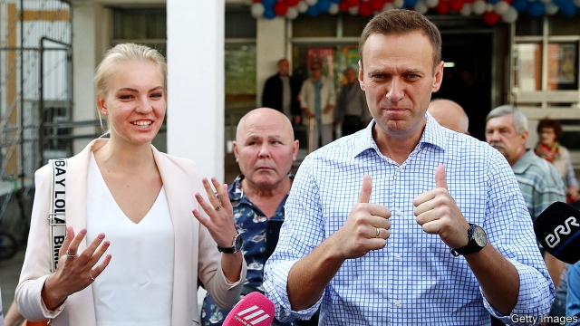

###### Moscow’s slap to Putin

# Local elections embarrass the Kremlin 

 

> print-edition iconPrint edition | Europe | Sep 12th 2019 

THE FIRST indication that things were not going to plan for Vladimir Putin came when the official exit polls for city-council elections in Moscow failed to materialise on schedule at 6pm on September 8th. By the early hours, the majority enjoyed by United Russia, the ruling party, had taken a huge dent, a sign of a growing mood of discontent in the capital. 

Before the election, United Russia had held 40 of the 45 seats in the largely powerless but symbolically significant city council. By the time the final votes were totted up next day, it had seen that total fall by almost half, to 25. 

United Russia’s collapse was all the more remarkable given that over a dozen aspiring candidates linked to Alexei Navalny (pictured), Mr Putin’s most prominent domestic critic, had been barred from the polls, a move that sparked weeks of protests in Moscow over the summer. The decision to blacklist the opposition figures was reportedly taken when the Kremlin realised that they would win at least nine seats, providing them with a political springboard for parliamentary elections due in 2021. But the move turned the election into a referendum on the government’s record, leading to a much stronger protest vote than anyone had expected. 

A number of United Russia candidates had opted to run as nominal independents in a bid to mask their association with the regime. Mr Navalny outed them as members of the party. This, even more than the formal vote, exposed the fact that United Russia has become a liability rather than an asset for the Kremlin. The party’s ratings have slumped to near-record lows this year, amid anger over an increase in the national pension age and frequent allegations of corruption. Mr Putin’s popularity has slumped too, for the same reasons. 

Mr Navalny also called on his supporters to vote for whichever candidate was best placed to defeat United Russia, even if that meant for fake opposition parties; he called this tactic “smart voting”, and it succeeded beyond expectation. “This is a fantastic result for ‘smart voting’,” said Mr Navalny as the election results started to come in. The Communist Party, the largest officially recognised opposition party, won 13 seats, up from five last time round. A Just Russia, a centre-left party that, like the Communists, is part of the Kremlin-loyal “opposition”, won three seats. Yabloko, the only genuine opposition party allowed on the ballot, saw all four of its candidates enter the city council. 

The plan produced some odd effects. Liberal Russians who celebrated the collapse of the Soviet Union in 1991 gritted their teeth and voted for Communist Party candidates, some of them open admirers of Stalin. “It’s not ideal, but there’s no other way left to register my disapproval of United Russia in Moscow,” said Mikhail, a middle-aged voter. “The Communists have the best chance of victory.” 

Even widely reported ballot-box trickery was unable to save one United Russia heavyweight. Andrei Metelsky, the head of the party’s offices in Moscow, lost his seat to a little-known socialist running on the Communist Party ticket. 

Besides the vote in Moscow, Russians also voted for the heads of 16 regions, as well as lawmakers for 13 regional parliaments. United Russia suffered a colossal defeat in the Khabarovsk region, in the country’s far east, where the nationalist Liberal Democratic Party of Russia won 34 of 35 seats in the local parliament. 

There was better news for Mr Putin in the elections for governorships, where United Russia’s candidates all triumphed in the first round. However, six of its incumbent governors ran as independents, including Alexander Beglov, the party’s former boss in St Petersburg. Mr Beglov’s biography was removed from United Russia’s website before the vote. 

Dmitry Medvedev, Russia’s toothless prime minister, said the election results proved that United Russia remains the country’s biggest political force. He is right. But Mr Putin’s foes will have scented a new vulnerability in the ruling party. ■ 

