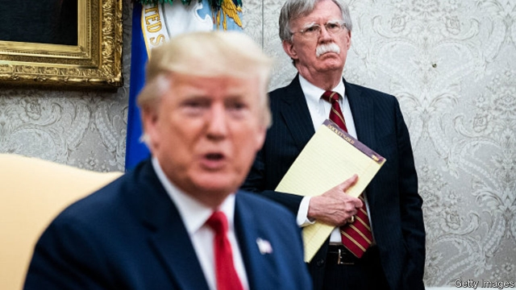

###### Our election endorsement

# Politics this week 

 

> Sep 12th 2019 

 Donald Trump sought his fourth national security adviser in less than three years after firing John Bolton, who had been in the job for 17 months. Mr Bolton says he resigned before Mr Trump sacked him. The pair had not seen eye to eye: Mr Bolton was far more hawkish on Iran, North Korea and Russia. See article. 

At least one of Mr Bolton’s views appears to have prevailed. Mr Trump abruptly cancelled a peace summit with the Taliban. Hawks had fretted that Mr Trump’s proposed deal made a big concession—the partial withdrawal of American troops from Afghanistan—without even securing a ceasefire from the Taliban. See article. 

The CIA removed one of its most highly placed intelligence sources from the Kremlin in 2017, according to press reports, in part because of concerns that the new Trump administration was careless in handling sensitive material. The decision to extract the spy came shortly after Mr Trump discussed classified information with the Russian foreign minister during a meeting at the White House. 

Thousands of protesters marched to the American consulate in Hong Kong to show support for a bill being considered by Congress that could result in sanctions against officials who suppress freedoms in the Chinese territory. On the fringes, some demonstrators set fires and engaged in other vandalism. 

The government in Beijing closed the city’s central thoroughfare to allow the army to practise a parade that will be staged on October 1st, the 70th anniversary of Communist rule. The state news agency said about 90,000 people were involved in the rehearsal. 

Indian scientists lost contact with the country’s first lunar lander during its final descent to the Moon. The craft’s mothership, in orbit around the Moon, later located it near its intended landing site, but attempts to resume contact with the probe have failed. See article. 

Shinzo Abe, Japan’s prime minister, reshuffled his cabinet. Shinjiro Koizumi, the son of a former prime minister and a rising star within the ruling Liberal Democratic Party, was appointed environment minister. 

North Korea offered to resume disarmament talks with America. But it also tested two short-range missiles, the eighth such exercise since July. 

Canada’s prime minister, Justin Trudeau, formally began the campaign leading up to a general election on October 21st. Both his Liberal Party and the opposition Conservatives, led by Andrew Scheer, have the support of about 30% of voters. Among the main issues will be climate change and allegations that Mr Trudeau’s office improperly tried to end the prosecution of SNC-Lavalin, a big engineering firm, for paying bribes. 

Marcelo Crivella, the mayor of Rio de Janeiro, who is a former evangelical bishop, ordered the confiscation from a book fair of a comic book that depicts two men kissing. He said “Avengers: The Children’s Crusade” was unsuitable for children. The president of Brazil’s supreme court ruled the book-grabbing unlawful. 

Violent protests in South Africa against immigrants from other African countries entered their second week. About 12 people have been killed in the riots. Other African nations have responded with outrage. A Nigerian airline began evacuating terrified Nigerians who want to leave South Africa. See article. 

Robert Mugabe, who ruled Zimbabwe for almost four decades after its independence until he was overthrown in a coup in 2017, died aged 95. Much-praised by leftists when he took over, he swiftly started locking up and murdering his opponents. His policies caused economic collapse, hyperinflation and a mass exodus of hungry Zimbabweans. See article. 

Almost 300,000 people have fled their homes in Burkina Faso because of attacks by jihadist groups. The country, which was moving towards democracy, has been destabilised by jihadist insurgencies in neighbouring Mali and Niger. 

Israel’s prime minister, Binyamin Netanyahu, promised to annex the Jordan Valley and northern Dead Sea (about a third of the occupied West Bank) if he wins a general election on September 17th. Sceptics called it a political stunt to woo hawkish voters. See article. 

An Iranian tanker seized by British marines in July delivered its cargo of oil to Syria. The ship was released after Iran promised that it was not bound for Syria. Britain said the move represented an “unacceptable violation of international norms” and summoned Iran’s ambassador in London. It was also revealed that Iran had detained three westerners. 

In Britain opposition MPs demanded to return to work after Scotland’s highest court ruled that Parliament’s prorogation by the British government was unlawful. The UK Supreme Court will decide the matter. Before Parliament’s suspension MPs again voted down the Brexit plans of Boris Johnson, the prime minister, handing him six defeats. John Bercow said he would resign as Speaker. Though a hero to Remainers, he has been criticised by Leavers for helping MPs thwart the government’s Brexit plans. See article. 

Ursula von der Leyen, the next president of the European Commission, unveiled her proposed team of commissioners. Three new “executive vice-presidents” will help her. Margrethe Vestager is the most interesting of these, with the key job of making Europe “fit for the digital age” on top of her powerful existing role overseeing competition policy. See article. 

Russia and Ukraine swapped prisoners who had been held over the conflict in east Ukraine. Dozens were freed in what is seen as a modest step towards easing tensions. See article. 

 

Vladimir Putin’s ruling United Russia party suffered a stinging rebuke at the hands of voters in Moscow, losing 15 of the 40 seats on the city council it had controlled. This was despite the fact that many opposition candidates had been barred from contending. See article. 

