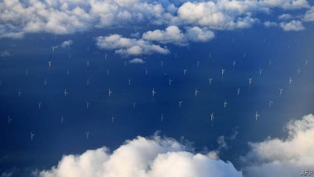
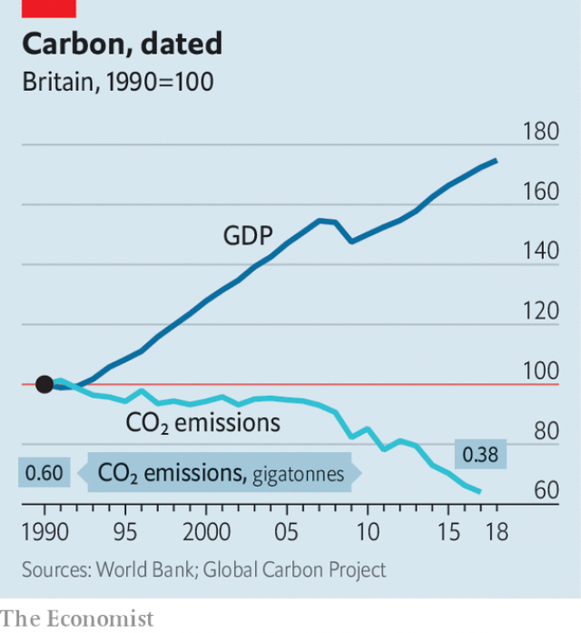

###### The experiment

# Lessons from Britain, the world’s biggest offshore wind market 

 

> print-edition iconPrint edition | Britain | Sep 21st 2019 

ABOUT EVERY seven days, turbine parts are loaded onto a giant ship in Hull docks: blades measuring 75 metres (250 feet), 90-metre-high towers and 400-tonne nacelles, the masses of steel, fibreglass and gears that together transform wind into power. The ship brings its cargo 120km into the North Sea, where foundations wait in the waves. Workers erect four wind turbines, then the ship returns to shore for more parts. In the next few weeks installations for the Hornsea One project will be completed, with 174 turbines dotted across 407 square kilometres of water. It will be the largest offshore wind farm in the world. Hornsea Two, already planned, will be bigger still. 

Britain is already the world’s largest offshore wind market. Last year turbines planted off its coasts had eight gigawatts (GW) of capacity, about a third more than the next-biggest market, Germany. That number is due to jump. In 2030 Britain will have 30GW of offshore wind capacity, forecasts BloombergNEF, an energy data firm, second only to China, which is set to zoom ahead (see chart). Britain’s Committee on Climate Change expects investment to continue, with offshore wind a crucial part of the government’s efforts to achieve net-zero emissions by 2050. 

To some, Britain proves how government can spur the rapid deployment of clean technology. To others, it shows the cost of meddling in power markets. Both assessments are correct. 

 

Governments around the world are seeking to slash emissions from electricity generation, a task made more urgent by the shift to electric cars. Offshore wind has natural appeal. The wind blows at night and in winter, complementing the power from solar panels. Place turbines in the sea and you also dodge the NIMBYs who detest them on land. Even so, offshore wind’s global capacity is about one-twentieth that of onshore wind or solar. The main reason is that, until very recently, it was extremely expensive. 

Yet Britain has seen a boom. That is due in part to geography, with high winds and shallow seas, and in part to policy. Britain’s push for renewable power gained steam in 2008, when the Climate Change Act required greenhouse-gas emissions in 2050 to be at least 80% below their level in 1990. Politicians have favoured offshore wind, funding research and a giant facility in Northumberland to test blades. Most important, however, has been subsidy. 

The government decided to provide more financial support to early large-scale wind farms, such as the London Array off the Kent coast, completed in 2013, than to onshore wind or solar. Offshore wind was capital-intensive and immature, the logic went, so needed help. In 2013 ministers authorised competitive auctions for low-carbon power. Companies bid to supply electricity in 15-year contracts and the government pays the difference between the bid price and the market price. Since 2015, those auctions have excluded onshore wind and solar. 

Long contracts gave companies the certainty to invest. Siemens Gamesa, which is making the turbines for Hornsea One, decided in 2014 to build a blade factory in Hull. “We could see there was volume coming,” explains Clark MacFarlane, who runs the company’s British business. Siemens will build longer blades in Hull for Hornsea Two, so more power can be generated from fewer turbines, lowering installation costs. The new turbines’ diameter will be 167 metres, 40% wider than the London Eye. 

 

The rest of the industry has matured, too. Orsted, a Danish firm that is now the world’s biggest offshore-wind developer, cut its teeth in Britain. In 2014 it won contracts to build three big wind farms, including Hornsea One. “It allowed us to start industrialising the way we built,” says Henrik Poulsen, the firm’s boss. Orsted made bulk purchases of turbines and cables, and refined each stage of development, from site planning to maintenance. 

By some measures, results have been a big success. In the past decade offshore-wind capacity in Britain has grown 20-fold, meaning it now comprises a quarter of renewable generation. The lowest price secured in the first round of auctions, in 2015, was £114.39 ($142) per megawatt hour (MWh). In 2017 the cheapest projects, including Orsted’s Hornsea Two, won with bids of just £57.50. The next contracts are expected to be announced on September 20th. Other countries, including America and Taiwan, now have their own plans for offshore wind, benefiting from the expertise that companies honed in Britain. 

Even so, big questions loom. In March the government announced an agreement with the offshore-wind industry that it hopes will amplify its economic impact. The government will hold auctions every two years. In return, it said, “we expect the sector to continue cutting costs, committing to lower their impact on bill-payers, while investing in and driving growth in the UK’s manufacturing base.” 

Offshore wind has produced factory jobs, as at the plant in Hull. But it is not clear that creating British manufacturing jobs advances the aim to lower power prices, given Britain’s relatively high labour costs. Richard Howard of Aurora Energy Research, an analytics firm, points out that the country has expertise in building and servicing wind farms, as well as exploring technical problems through research. Britain “doesn’t tend to have a comparative advantage in making things—it tends to have a comparative advantage in making knowledge.” 

The debate over costs may escalate, too. In 2017 Dieter Helm of Oxford University wrote a scathing review of Britain’s energy market, pointing out that consumers were paying high prices even as the cost of renewables plunged. He named lengthy, generous offshore-wind contracts as a principal culprit. Orsted agreed to build Hornsea One for £140 per MWh, about three times today’s wholesale price. Last year environmental policies accounted for a fifth of consumers’ electricity bills, according to Ofgem, the energy regulator. Mr Helm argues that an economy-wide carbon price would help the country choose the cheapest power with the lowest emissions. Instead, he says, “we make those choices by protecting different technologies.” 

As Britain aims for net-zero, it must also grapple with the broader challenge of balancing the grid. This year the Committee on Climate Change suggested that offshore wind capacity may reach a staggering 75GW in 2050. That would require about 180 of today’s biggest turbines to be installed in each of the next 30 years. Generating that much more power from intermittent sources will need investment in technology that does not yet exist, including batteries that can store power for weeks. 

The current state of the grid does not inspire confidence. Lightning strikes on August 9th contributed to halting operations at Hornsea One and a small gas plant, causing a power-cut. The blackout illuminated broader problems in Britain’s electricity system that will need to be resolved as it tries to decarbonise. The government was due to publish an energy white paper this year to deal with such questions. Amid broader political turmoil, the paper, like so much else, has been put on hold. ■ 

