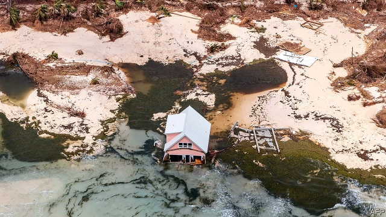
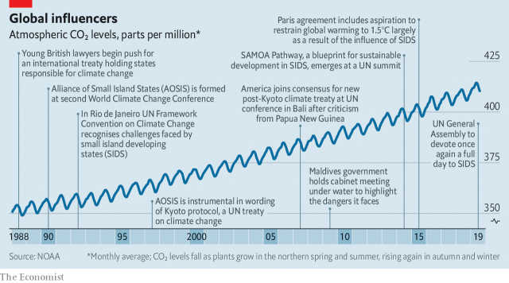

###### Nothing so concentrates the world’s mind

# Island states have had an outsized influence on climate policy 

 

> print-edition iconPrint edition | International | Sep 19th 2019 

WHEN HURRICANE DORIAN rolled across the Abaco islands on September 1st, packing winds of 300kph (185mph) and bringing sea surges of nearly eight metres (26 feet), it was as powerful as any Atlantic storm ever to have hit land. The destruction it wrought was devastating, the death toll said to be “staggering”. Dorian’s ravages have drawn attention to the vulnerability of small islands. It is, laments James Cameron, head of the ODI, a development think-tank, “a vision of the future”. 

The fear is that climbing global temperatures will bring more extreme storms and rising sea levels which threaten the very existence of small island states and low-lying coastal regions. They are vulnerable not only to violent weather but also to loss of livelihoods as farmers and fishermen feel the effects of warming. Eventually whole islands may be submerged. More than half of the territory of the Maldives is less than a metre above sea level. “We are most impacted and we are continuously leading the way by example, advocating and persuading others to increase ambition on addressing climate change,” says Thilmeeza Hussain, the Maldives’ ambassador to the UN. 

Small island developing states (SIDS) account for less than 1% of the world’s GDP, territory, population and greenhouse-gas emissions. On most issues their voice barely registers on the world stage. Yet on climate matters they have, over three decades, become an effective lobby. 

Mr Cameron was one of a small group of young British lawyers who helped them come together. In 1988 he wrote a legal opinion for Greenpeace on whether the United States could be taken to the International Court of Justice for its failure to act on climate change. He concluded that such a case would be hard to bring as America would refuse jurisdiction for it, but that the arguments for state responsibility based on the evidence could and should be made in an international treaty. Along with the most affected states, he and others pushed for one. This led to the formation in 1990 of the Alliance of Small Island States (AOSIS). 

By the Earth Summit in Rio de Janeiro in 1992 Mr Cameron had his treaty—the UN Framework Convention on Climate Change. AOSIS had grown to more than three dozen members and gained recognition as representing a distinct set of interests. Today, its 39 full members and five observers are spread across three regions (the Caribbean, the Pacific and a group straddling the African, Indian and South China seas) and include some low-lying coastal countries, such as Belize and Guyana. Individually, they have limited means: when Fiji presided over the annual global climate gathering in 2017 it had to be held in Bonn. But their collective influence has been big. 

“AOSIS put the climate crisis on the map, way before anyone else was taking it seriously,” says Mark Lynas, a writer and adviser to the Maldives’ government. Island states were the first to feel the impact of rising sea levels. They risked being drowned by richer nations’ carbon emissions—and they told those countries so. “They’ve been incredibly successful in changing the tone and influencing policy,” says Mr Lynas. 

They have managed to get wording included in climate accords that addresses their specific concerns—on losses and damages from climate change, for example, or on their need for financial support to adapt to it. In the Paris agreement of 2015 the inclusion of an aspiration to restrain global warming to 1.5°C above pre-industrial levels (going beyond the target of 2°C) was “almost entirely down to SIDS and other developing states”, according to Mr Lynas. More generally, the island states have offered an example of getting organised and pushing for international collaboration, in an area where joint action is the only way to make a difference. 

On September 27th a whole day is to be devoted to the SIDS towards the end of the UN General Assembly in New York. Leaders will review progress of the SAMOA Pathway (short for SIDS Accelerated Modalities of Action Pathway), a blueprint for sustainable development which happened to emerge from a summit in Samoa in 2014. 

Why the outsized impact? The SIDS have three things going for them. One is focus: survival concentrates the mind. Ms Hussain, of the Maldives, estimates she spends 70-80% of her time on climate-change and sustainable-development issues. 

Second, their moral argument packs a punch. The islanders have been skilled at pointing to the peril they face, with catchphrases such as “Save Tuvalu, save the world” and “1.5 to stay alive”. Shortly before the Copenhagen climate summit in 2009, the Maldives’ government held a cabinet meeting under water. 

Island leaders do not mince their words. Take the recent summit of the Pacific Islands Forum in Tuvalu. Australia, one of the group’s 18 members, insisted on removing references to coal in the final declaration and on softening the language. Tuvalu’s prime minister, Enele Sopoaga, chided his Australian counterpart, Scott Morrison: “You are concerned about saving your economy in Australia…I am concerned about saving my people in Tuvalu.” Mr Sopoaga reported that during the meeting Tonga’s prime minister, Akilisi Pohiva (who died this month), “actually cried”. 

Third, crucially, the SIDS have strength in numbers. Together, they are about a third of all developing countries and a fifth of UN members. That gives them ample speaking time and voting power in the UN. 

Kevin Conrad, who became an activist after seeing beaches disappearing at home in Papua New Guinea and now heads the Coalition for Rainforest Nations, recalls the drama of the Montreal climate summit in 2005. More than 20 countries spoke in support of greater efforts to reduce greenhouse-gas emissions that America was resisting. The momentum worked: “Building broad coalitions is what wins,” he says. 

Mr Conrad was involved in more drama two years later, at the UN climate conference in Bali. Once again, America was holding out against the consensus, this time for a plan for a new climate treaty. Speaking as Papua New Guinea’s representative, Mr Conrad addressed the United States: “We seek your leadership, but if for some reason you’re not willing to lead, leave it to the rest of us; please, get out of the way.” He was cheered. In a moment that has gone down in climate-diplomacy lore, America soon announced it would join the consensus. 

There is no chance of a similar moment at the UN secretary-general’s Climate Action Summit in New York on September 23rd. President Donald Trump is not about to reverse his decision to take America out of the Paris agreement. But the island states are still hoping to make a splash in New York next week, and have put together a “SIDS package” to be presented there. 

For a start, they want to highlight the need to heed the warnings from the Intergovernmental Panel on Climate Change (IPCC) on what is required to limit global warming to 1.5°C. In a report published last October the IPCC stressed the difference in terms of impact between capping warming at 1.5°C and letting it rise to 2°C; drastic action would be needed over the next decade to have any hope of achieving this. The islanders are calling for scaled-up ambition. They hope to see the bigger carbon-emitters publicly accepting the IPCC’s report. 

They also want to show how bold action can be taken. “SIDS have absolutely nothing to do with this mess that we’re in with climate change, we have contributed the least, and yet we want to proceed by example,” says Lois Young, the UN ambassador of Belize, which this year took over from the Maldives as chair of AOSIS. They aspire to shift to 100% renewable energy and map a path to carbon neutrality. The Marshall Islands have led the way in submitting a plan to become carbon-neutral by 2050. 

Such plans are costly, as is investment needed in things like reinforced harbours and desalination plants to adapt to the climate changes the island states are already seeing. So mobilising finance is another priority. The SIDS complain that the money pledged to date is inadequate and often tied up in red tape. In New York, they want chunky commitments from big countries. 

 

Impressive as their diplomatic efforts have been, however, the island states face further struggles. Keeping the world’s attention is not easy. Belize has been scrambling to persuade world leaders to attend the SIDS day on September 27th. Climate outrage has spread, and other groups of countries have piled in. For the island states the broadening of climate concern is welcome but means their own leaders are less often the go-to spokespeople. 

AOSIS remains largely united in its message and strategy. But its members are affected by climate change in different ways so divisions can arise. Advisers who push for climate radicalism and those who give priority to getting things done for development do not always see eye to eye. 

Nor is it clear that the island states are winning the diplomatic fight. Apparent victories in public forums can get beaten back in subsequent bureaucratic battles. As the spat with Australia in Tuvalu shows, and as arguments ahead of next week’s review of the SAMOA Pathway also suggest, the island states still find themselves having to argue over language that reflects the scale of action needed. 

Above all, the threat has not gone away. In the long term, extinction still beckons since the world has done far too little to curb greenhouse-gas emissions. “Adaptation can only go so far when your nation is going under water,” says Mr Lynas of the atoll countries. If the moral case does not work, some say, it is time for a new strategy, for example embracing radical technologies such as climate engineering. 

Failing that, for some small island states the future may involve negotiating with countries that can offer higher land to move their people to, or trying to defend rights over territorial waters whose boundaries were drawn based on land that has become submerged. AOSIS could find itself back where it began—with lawyers. 

Hence the urgency in the run-up to the sessions in New York next week. At stake is the islands’ future—and much more. According to Janine Felson, Ms Young’s deputy and Belize’s technical lead for AOSIS, “we have a very small window of opportunity to make a very big shift.” ■ 

