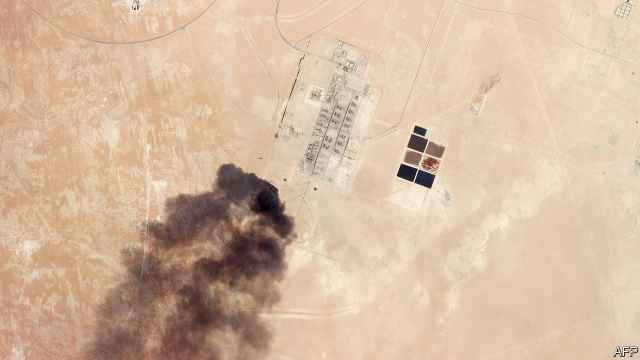

###### Abqaiq the powder keg

# The attacks on Saudi Arabia merit a firm response 

 

> print-edition iconPrint edition | Leaders | Sep 21st 2019 

TO REDUCE ITS climate risks, the world needs to curtail its production of oil. But there was nothing risk-reducing about the strike on Saudi Arabian oil facilities on September 14th. The drones and missiles that pummelled Abqaiq and Khurais cut the kingdom’s output by 5.7m barrels a day (see article). It was a bigger loss to world markets than that brought about by Saddam Hussein’s invasion of Kuwait in 1991. That aggression led to a march on Baghdad by 35 countries. The strike last weekend was not an invasion; but an attack that reduces global oil supply by 6% is everybody’s business. Even if Saudi Arabia fulfils its pledge to restore output by the end of September, supplies from the world’s largest oil exporter are now vulnerable. 

Houthi rebels fighting Saudi Arabia in Yemen claimed responsibility for the attack. They are backed by Iran and used Iranian weapons. America may have evidence the strike came from inside Iran itself. Mike Pompeo, the secretary of state, has called it “an act of war”. The details matter, but do not change the question: how to curb the aggression of Iran and its proxies? 

Among the causes of this crisis lie two terrible mistakes. The first is Saudi Arabia’s four-year war in Yemen—not just a moral disaster but a strategic one, too. Over 90,000 people have died in the fighting and almost as many children under five from famine and disease. Far from defeating the Houthis, it has turned them into dangerous foes; far from severing their loose links with Saudi Arabia’s sworn enemy, Iran, it has strengthened them. 

The second blunder was the Trump administration’s withdrawal last year from the deal to limit Iran’s nuclear programme. America switched to a policy of “maximum pressure”: sanctions designed to cause Iranians to rebel against the mullahs or to force Iran meekly back to the negotiating table. Predictably, however, maximum pressure has strengthened the hardliners, who reject talks with America. One reason President Donald Trump ditched the nuclear accord was because it failed to restrain Iran’s regional aggression, yet if Iran was behind Saturday’s attack, it shows that the regime is more belligerent than ever. 

Over everything hangs the spectre of yet another Middle Eastern conflict. That poses a dilemma. With its back to the wall, Iran may meet any retaliation by striking even harder. But unless Iran sees that aggression carries a cost, it will be emboldened to use force again. That, sooner or later, also leads towards war. 

Consider the cost of recent Western restraint. In May Iran hit four tankers in the United Arab Emirates; in June it struck two more tankers in the Strait of Hormuz; later it took down an American drone. Mr Trump was prepared to retaliate only after that last aggression—and even then he pulled back at the last minute. The attack on September 14th was vastly more consequential. The president has said that America is “locked and loaded”. In Tehran they are watching to see whether he is all talk, as they are in Beijing, Moscow, Pyongyang, and in countries whose security depends on the idea that America will turn up. 

If any nuclear negotiations are to succeed, Iran must pay a price for Abqaiq. America wants a more sweeping agreement than the original one, but only the pragmatic faction in Tehran, weakened by America’s approach, will make such a deal. While Iran can hit out again, the hardliners will have a veto over any talks. If America is seen as a paper tiger, they will be able to argue that Iran need not give much ground. On the contrary, they will say that their country should pile pressure on America by accelerating its nuclear programme. America and its allies therefore need to convince Iran that it cannot use violence to get its way. 

The first stage of a response is to establish precisely where Saturday’s attack originated and who planned it. America must share this publicly, partly because Mr Trump’s word alone does not carry weight, but also to build a coalition and help stifle the objections of Iran’s apologists. Evidence against Iran could pave the way for new sanctions. Mr Trump has promised more—though America is already doing pretty much all it can. He should be backed by the Europeans, who need to understand that peace depends on deterring Iran, and China, which imports over 9m b/d of oil, much of it from the Middle East. 

That is not all. If the Abqaiq attack is the work of Iran’s revolutionary guards, they should face direct consequences. That involves covert operations, by cyber-units that can disrupt their communications and finances; and air strikes on guard units outside Iran in Syria. Ideally, these would be carried out by a coalition, but if need be, America and Saudi Arabia should act alone. The risk of escalation should not be ignored, but Iran does not want all-out war any more than Saudi Arabia and America do. Israel frequently launches air strikes against Iranian targets in Syria and Iraq without provoking an Iranian escalation. 

A show of force is part of the way back to nuclear talks—and to repairing those two terrible mistakes. Saudi Arabia’s allies must press it to sue for peace in Yemen. And America needs to signal to Iran that it will be reasonable in re-establishing the bargain embodied in the nuclear deal. If it demands that Iran surrenders everything, the Middle East will get nothing but more misery. ■ 

