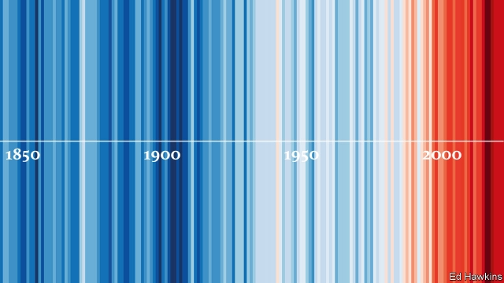
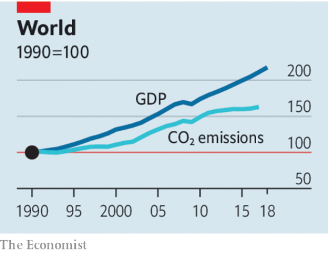

###### A warming world

# The climate issue 

 

> print-edition iconPrint edition | Leaders | Sep 19th 2019 

FROM ONE year to the next, you cannot feel the difference. As the decades stack up, though, the story becomes clear. The stripes on our cover represent the world’s average temperature in every year since the mid-19th century. Dark blue years are cooler and red ones warmer than the average in 1971-2000. The cumulative change jumps out. The world is about 1ºC hotter than when this newspaper was young. 

To represent this span of human history as a set of simple stripes may seem reductive. These are years which saw world wars, technological innovation, trade on an unprecedented scale and a staggering creation of wealth. But those complex histories and the simplifying stripes share a common cause. The changing climate of the planet and the remarkable growth in human numbers and riches both stem from the combustion of billions of tonnes of fossil fuel to produce industrial power, electricity, transport, heating and, more recently, computation. 

That the changing climate touches everything and everyone should be obvious—as it should be that the poor and marginalised have most to lose when the weather turns against them. What is less obvious, but just as important, is that, because the processes that force climate change are built into the foundations of the world economy and of geopolitics, measures to check climate change have to be similarly wide-ranging and all-encompassing. To decarbonise an economy is not a simple subtraction; it requires a near-complete overhaul. 

To some—including many of the millions of young idealists who, as The Economist went to press, were preparing for a global climate strike, and many of those who will throng the streets of New York during next week’s UN General Assembly—this overhaul requires nothing less than the gelding or uprooting of capitalism. After all, the system grew up through the use of fossil fuels in ever-greater quantities. And the market economy has so far done very little to help. Almost half the atmosphere’s extra, human-made carbon dioxide was put there after the turn of the 1990s, when scientists sounded the alarm and governments said they would act. 

In fact, to conclude that climate change should mean shackling capitalism would be wrong-headed and damaging. There is an immense value in the vigour, innovation and adaptability that free markets bring to the economies that took shape over that striped century. Market economies are the wells that produce the response climate change requires. Competitive markets properly incentivised, and politicians serving a genuine popular thirst for action, can do more than any other system to limit the warming that can be forestalled and cope with that which cannot. 

This special issue of The Economist is not all about the carbon-climate crisis. But articles on the crisis and what can be done about it are to be found across all this week’s sections. In this, our reporting mirrors the world. Whether it is in ensuring a future for the Panama Canal or weaning petrol-head presidents off their refinery habit, climate is never the whole story. Other things matter to Manhattan stockholders and Malawian smallholders. But climate change is an increasingly dangerous context for all their worlds. 

To understand that context, it is important to understand all the things that climate change is not. It is not the end of the world. Humankind is not poised teetering on the edge of extinction. The planet itself is not in peril. Earth is a tough old thing and will survive. And though much may be lost, most of the wondrous life that makes Earth unique, as far as astronomers can yet tell, will persist. 

Climate change is, though, a dire threat to countless people—one that is planetary in scope if not in its absolute stakes. It will displace tens of millions, at the very least; it will disrupt farms on which billions rely; it will dry up wells and water mains; it will flood low-lying places—and, as time goes by, higher-standing ones, too. True, it will also provide some opportunities, at least in the near term. But the longer humanity takes to curb emissions, the greater the dangers and sparser the benefits—and the larger the risk of some truly catastrophic surprises. 

The scale of the implications underlines another thing that climate change is not. It is not just an environmental problem alongside all the others—and absolutely not one that can be solved by hair-shirt self-abnegation. Change by the people who are most alarmed will not be enough. What is also needed is change in the lives of those who do not yet much care. Climate is a matter for the whole of government. It cannot be shunted off to the minister for the environment whom nobody can name. 

And that leads to a third thing that climate change is not. It is not a problem that can be put off for a few decades. It is here and now. It is already making extreme events like Hurricane Dorian more likely. Its losses are already there and often mourned—on drab landscapes where the glaciers have died and on reefs bleached of their coral colours. Delay means that mankind will suffer more harm and face a vastly more costly scramble to make up for lost time. 

What to do is already well understood. And one vital task is capitalism’s speciality: making people better off. Adaptation, including sea defences, desalination plants, drought-resistant crops, will cost a lot of money. That is a particular problem for poor countries, which risk a vicious cycle where the impacts of climate change continuously rob them of the hope for development. International agreements stress the need to support the poorest countries in their efforts to adapt to climate change and to grow wealthy enough to need less help. Here the rich world is shirking its duties. 

Yet, even if it were to fulfil them, by no means all the effects of climate change can be adapted away. The further change goes, the less adaptation will be able to offset it. That leads to the other need for capital: the reduction of emissions. With plausible technological improvements and lots of investment, it is possible to produce electricity grids that need no carbon-dioxide-emitting power stations. Road transport can be electrified, though long-haul shipping and air travel are harder. Industrial processes can be retooled; those that must emit greenhouse gases can capture them. 

 

It is foolish to think all this can be done in ten years or so, as demanded by many activists and some American presidential hopefuls. But today’s efforts, which are too lax to keep the world from two or even three degrees of warming, can be vastly improved. Forcing firms to reveal their climate vulnerabilities will help increasingly worried investors allocate capital appropriately. A robust price on carbon could stimulate new forms of emission-cutting innovations that planners cannot yet imagine. Powerful as that tool is, though, the decarbonisation it brings will need to be accelerated through well-targeted regulations. Electorates should vote for both. 

The problem with such policies is that the climate responds to the overall level of carbon dioxide in the atmosphere, not to a single country’s contribution to it. If one government drastically reduces its own emissions but others do not, the gallant reducer will in general see no reduced harm. This is not always entirely true: Germany’s over-generous renewable-energy subsidies spurred a worldwide boom in solar-panel production that made them cheaper for everyone, thus reducing emissions abroad; Britain’s thriving offshore wind farms may achieve something similar. But it is true enough in most cases to be a huge obstacle. 

The obvious fix will be unpalatable to many. The UN’s climate talks treat 193 countries as equals, providing a forum in which all are heard. But three-quarters of emissions come from just 12 economies. In some of those, including the United States, it is possible to imagine younger voters in liberal democracies demanding a political realignment on climate issues—and a new interest in getting others to join in. For a club composed of a dozen great and middling-but-mucky powers to thrash out a “minilateral” deal would leave billions excluded from questions that could shape their destiny; the participants would need new systems of trade preference and other threats and bribes to keep each other in line. But they might break the impasse, pushing enough of the world onto a steeper mitigation trajectory to benefit all—and be widely emulated. 

The damage that climate change will end up doing depends on the human response over the next few decades. Many activists on the left cannot imagine today’s liberal democracies responding to the challenge on an adequate scale. They call for new limits to the pursuit of individual prosperity and sweeping government control over investment—strictures some of them would welcome under any circumstances. Meanwhile, on the right, some look away from the incipient disaster in an I’m-alright-Jack way and so ignore their duties to the bulk of humanity. 

If the spirit of enterprise that first tapped the power of fossil fuels in the Industrial Revolution is to survive, the states in which it has most prospered must prove those attitudes wrong. They must be willing to transform the machinery of the world economy without giving up on the values out of which that economy was born. Some claim that capitalism’s love of growth inevitably pits it against a stable climate. This newspaper believes them wrong. But climate change could nonetheless be the death knell for economic freedom, along with much else. If capitalism is to hold its place, it must up its game.■ 

