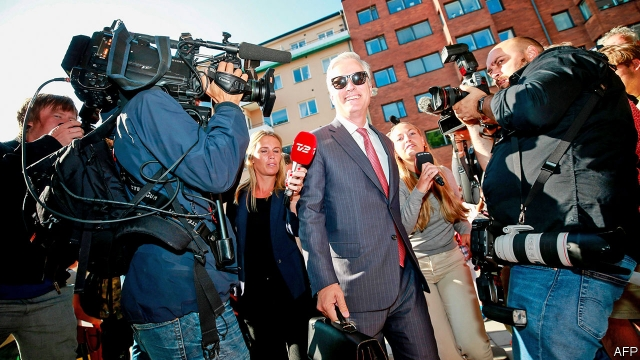

###### Bob’s your adviser

# Donald Trump replaces John Bolton with a hostage negotiator 

 

> print-edition iconPrint edition | United States | Sep 19th 2019 

TWO MONTHS before the 2016 election Robert O’Brien, a lawyer from Los Angeles, opined on Russian interference to a radio talk-show host. “It’s clear that Vladimir Putin just doesn’t like [Hillary Clinton], and is going to do what he can to help Donald Trump.” After the election Mr O’Brien—who had advised Ted Cruz, Scott Walker and Mitt Romney in their presidential runs—changed his tune, praising Mr Trump before he even took office for getting NATO allies to boost their defence spending. 

Last year Mr Trump named Mr O’Brien an envoy for hostage affairs. Mr O’Brien, according to Mr Trump, called the president “the greatest hostage negotiator...in the history of the United States.” Flattery works. On September 18th Mr O’Brien became Mr Trump’s fourth national security adviser, succeeding John Bolton, who was fired a week earlier. 

Unlike Mr Bolton, Mr O’Brien is relatively unknown in foreign-policy circles. Jim Talent, a former Republican senator who worked with him on Mr Romney’s campaign, says Mr O’Brien “absorbs enormous amounts of information quickly” and will be an “honest broker at ensuring options for the president”—the “opposite model” to Mr Bolton. 

Mr O’Brien worked under Mr Bolton at the UN, then spent four years at the State Department, spanning the administrations of George W. Bush and Barack Obama, working on the justice system in Afghanistan. Mr Trump considered him for secretary of the navy, a job he would probably have held had Mr Romney won. 

In “While America Slept: Restoring American Leadership to a World in Crisis”, published in 2016, Mr O’Brien comes off as a garden-variety hawk. He criticises the Obama administration’s pusillanimity, condemns the 2015 Iranian nuclear agreement as “the worst diplomatic deal since Munich” and warns that Mr Obama “is decimating America’s unparalleled armed forces”. He urges America to support Egypt’s despot, General Abdel Fattah al-Sisi, and wants to wants to “serve notice upon North Korea that it is within reach of American naval air power”. It is time, he says, to return to a policy of “peace through strength”. 

Such views resemble Mr Bolton’s, though Mr O’Brien, unlike his predecessor, has a reputation for congeniality. That may help restore comity and morale at the National Security Council. But legal work and diplomatic dabbling may not have given him sufficient expertise to guide a mercurial president’s foreign policy. A former senior official who worked with Mr O’Brien describes him as a “very smart, very nice and very capable lawyer from Los Angeles with a long-standing interest in national security matters.” But “there’s nothing in his biography that suggests he has the experience or bandwidth to take on this job.” 

