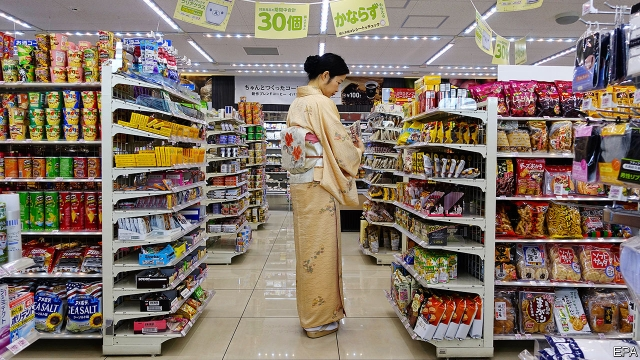
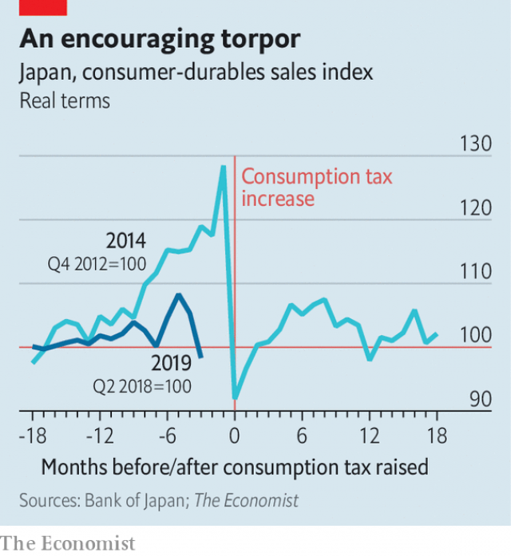

###### Up and under

# A tax hike threatens the health of Japan’s economy 

 

> print-edition iconPrint edition | Asia | Sep 28th 2019 

EARLIER THIS year the organisers of the Rugby World Cup, now taking place in Japan, held a briefing for bar and restaurant owners in Oita, a city on the island of Kyushu that will host five matches. As an example of what to expect, the briefing included a photo of a South Africa fan holding five jugs of beer in one hand. Rugby fans are a thirsty lot, the audience were warned. At the 2007 World Cup in France, beer ran short in Marseille when South Africa played Fiji. And something similar had happened four years earlier when Ireland played in Adelaide. The message to bar owners was clear: stock up. 

An influx of boozy rugby fans is not the only reason for retailers to top up their inventories this month. They must also prepare for quick-footed customers hoping to sidestep the onrushing taxman. On October 1st (after Scotland plays Samoa and before France meets America) Japan will raise its consumption tax from 8% to 10%. The tax falls on almost everything the Japanese buy, including gadgets, cars, new homes, magazines, restaurant meals and booze. Once in effect, the 10% rate will leave people with less money to spend. Until then, it gives consumers a powerful reason to buy what they can sooner rather than later. 

No tax is popular, but Japan’s consumption tax has an unusually fraught history. The cabinet first approved such a tax in 1979, but abandoned the idea after a public outcry. A similar bill was introduced in 1987, then dropped for a similar reason. After a gentle 3% tax was at last imposed in 1989, the rate was raised to 5% in 1997, contributing to a nasty downturn. The economy also swooned in 2014 when the rate was increased to 8% by Shinzo Abe’s new government. Mr Abe had promised to raise the tax again to 10% in 2015, in an attempt to improve the government’s finances. But the increase was postponed until 2017 and then put off again until this year, even as net public debt climbed past 150% of GDP. Japan’s vaunted reputation for punctuality, much admired by visitors to the World Cup, seems not to apply to fiscal policy. 

Despite the repeated delays, it is still not clear the economy is ready for the higher rate. Exports have fallen for nine months in a row, thanks partly to America’s trade war with China and Japan’s own tussle with South Korea. Exports to China fell by 12% in August, compared with a year earlier, and sales to South Korea fell by 9%. (Japan did strike a trade deal with America this week—see finance section.) Business investment is largely flat, because the expansion plans of service industries, such as hotels, retail and logistics, have been cancelled out by nervous manufacturers. That has left consumers to keep the economy expanding. They accounted for 100% of the economy’s growth in the second quarter. It therefore seems an inopportune moment to extract more yen from their pockets. 

 

The tax increase in 2014 precipitated a dramatic boom and bust in home-building and consumption (especially purchases of cars, furniture and appliances). Nothing similarly spectacular has appeared in the data so far this year (see chart). Home-builders have been busy starting work on new owner-occupied houses (which incur the lower 8% tax rate if the sales contract was signed before April). That has boosted the demand for air-conditioners, according to the Bank of Japan (BoJ), the central bank. But they see few other signs of pre-emptive purchases. Of course, consumers may be waiting until the last minute to buy some smaller-ticket items (including beer). 

The absence of a boom does not necessarily mean no bust will follow. But the government hopes the impact this year will be much less than it was five years ago. The tax increase is smaller (two percentage points, not three). And unlike today, households five years ago expected a second increase (from 8% to 10%) to follow hard on the heels of the first (from 5% to 8%). Their purchases in early 2014 were an attempt to avoid both. They stocked up on cars, furniture and other durable items they would not need to replace for years. 

The higher tax will also be offset by other measures. The government will spend part of its increased revenue on child care and pensions. It will cut a separate tax on car emissions. And with the government’s help, thousands of small retailers will offer rebates or “reward points” worth up to 5% of a product’s price, to customers who make cashless purchases by card or phone. 

The government will also punctuate the smooth uniformity of the consumption tax with a number of exemptions. The increased rate will not apply to food (except meals served in restaurants), beverages (except alcohol) and newspapers (excluding those, like this one, published less than twice a week). That will make it easier for people to read reports of the economic fallout over a green tea and a takeaway. 

In principle, any damage to the economy could also prompt an offsetting response from the BoJ. In a speech this week, Haruhiko Kuroda, the bank’s governor, predicted that the tax’s impact would be “marginal” compared with the previous increase. But he was also fairly relaxed about that increase prior to the fact. “Even assuming two consumption-tax hikes...Japan’s economy will continue to grow above its potential growth rate as a trend,” he said in 2014. In fact, the economy’s growth was about 1.5 percentage points below potential for the next six months. 

If Mr Kuroda is unpleasantly surprised again, the bank could cut short-term interest rates even further below zero (its benchmark rate has been -0.1% for almost four years) or expand the scope of its asset purchases. But that would be unpopular both with bankers, who worry about their margins, and with households, who worry about their savings. It might also be ineffective. As Goushi Kataoka, a dovish member of the BoJ’s policy board, has pointed out, the central bank has repeatedly cut its outlook for inflation without easing policy accordingly. That suggests the board’s hawks, who think easing is unwarranted, have been joined by defeatist doves, who think further easing would be warranted but doubt it would be effective. 

Their defeatism is easy to understand. Inflation was originally scheduled to climb to 2% in 2015. That timetable has been revised six times since. Now the bank merely says that inflation will increase to 2% “gradually”. Japan’s vaunted reputation for punctuality does not apply to monetary policy either. It’s enough to drive a central banker to drink. ■ 

