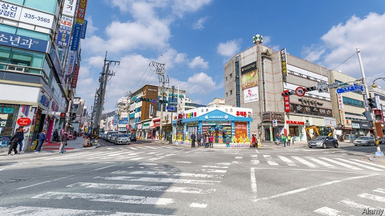

###### Peninsular draw

# Even provincial towns in South Korea are becoming more cosmopolitan 

 

> print-edition iconPrint edition | Asia | Sep 28th 2019 

PROVINCIAL TOWNS in South Korea, like their counterparts in other countries, are not known for a great variety of culinary offerings. Lunch options are typically stew, noodles or barbecue. Not so in Gimhae, a sprawling city of 550,000 in the far south of the country. A stroll around the old market area takes visitors past Thai supermarkets, Vietnamese coffee shops and Burmese, Cambodian and Indonesian restaurants. An Uzbek eatery offers fragrant meat dumplings along with a generous helping of post-Soviet kitsch in the form of glittering gold lamé tablecloths and spangled voile curtains. 

The diversity is a recent development, says Chun Jung-hee, who runs the local government’s support centre for foreign workers. “Until about ten years ago there was only this one Chinese restaurant.” The change is the result of government policy. South Korea, which got rich by exporting its products all over the world, has recently begun to import people. 

Starting in the mid-2000s, the government struck agreements with several South-East and Central Asian countries, making it easier for their citizens to apply for work visas of strictly limited duration to take up low-skilled jobs. Until then, most immigrants arrived in the country either illegally or through international-marriage schemes designed to find wives for farm workers and other manual labourers, since South Korean women were shunning harsh lives in the countryside. Both groups suffer exploitation and abuse. Partly as a result, many local authorities no longer support the marriage schemes. 

The aim of the new work permits was not just to reduce labour shortages for menial work, but also to ensure that those who arrived had certain rights and protections, says Ms Chun. Over the past decade the number of foreigners living in the country has nearly doubled, from 1.2m in 2009 to 2.4m in 2018, according to official data, out of a total population of 52m. 

Most of the new arrivals move to Seoul or to its suburbs in Gyeonggi, the province next door. The capital, where most of those on professional visas end up, has acquired many of the trappings of a globalised metropolis over the past few years, with lots of high-end coffee shops, bars illuminated by unshaded filament light bulbs and co-working spaces that would not be out of place in London, New York or Copenhagen. 

South Gyeongsang, the province in which Gimhae is located, has the highest concentration of foreign residents outside the capital region. In Gimhae just over 5% of the local population is not South Korean, much more than in other provincial towns. Most of the foreign labourers work for the many small suppliers to the local carmaking and shipbuilding industries. 

The cosmopolitan smorgasbord of the market area is not the only sign of this influx. Much of the space in the city centre not filled by exotic restaurants is occupied by shops offering international phone plans and remittances. Unusually, many of them are open on Sundays to cater to foreign workers on their day off. 

On a weekday morning South Korean passers-by are vastly outnumbered by those from other parts of Asia, a rarity in a country that is usually striking for its homogeneity. A local shopkeeper says nearly all of his customers are foreigners. He has staff from several countries to offer sales advice in multiple languages. The town also boasts a Filipino football team and a book club run by immigrant brides, which meets in Ms Chun’s support centre every weekend. Many of the members have also found work as interpreters at the centre, helping those who arrive after them to navigate their new home. 

In a glitzy new shopping centre just five minutes’ drive from the old market, however, the only hint of foreign influence is a branch of Starbucks, a global coffee chain. Throughout the city, there is little integration between the new arrivals and residents of longer standing. According to Ms Chun, most locals were initially scared of the influx of immigrants. Now many of them volunteer at the support centre, although the way she describes their work suggests a certain paternalism. “There’s this choir of old ladies, they treat the workers at the centre like their own children.” 

Even the unusual restaurants do not attract many Korean customers. “Some younger Koreans come because they are curious about the food, but not many,” says a 36-year-old Filipina barista in a coffee shop near the market. Her social circle consists mainly of other immigrant women, even though her husband is Korean. She arrived in Gimhae 12 years ago and says the best thing about living in the town is being able to work and to send her children to local schools. She says her children, a girl and a boy, are sweet and obedient and thoroughly integrated. “They love playing games on their phones and go to cram school and taekwondo until the evening, just like other South Korean kids.” ■ 

