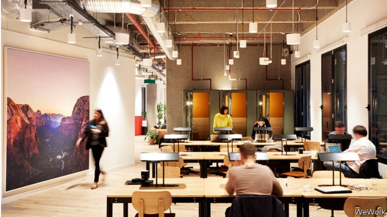

###### The future of the office

# Even if WeWork is in trouble the office is still being reinvented 

 

> print-edition iconPrint edition | Leaders | Sep 28th 2019 

“FROM NINE till five, I have to spend my time at work,” warbled Martha and the Muffins back in 1980. “My job is very boring, I’m an office clerk.” Many of the hundreds of millions of people who trek into an office will feel as despondent at the prospect as Martha did. The office needs a revamp (see article). But the crisis at WeWork, a trendy office-rental firm whose boss, Adam Neumann, stepped down this week after its attempt to float its shares turned into a debacle, shows that businesses are still struggling to come up with a new format. 

The large office, like the factory, is an invention of the past two centuries. The factory arose because of powered machinery, which required workers to be gathered in one place. Big offices grew from the need to process lots of paperwork, and for managers to instruct clerks on what to do. But now the internet, personal computing and handheld devices mean that transactions can be dealt with on-screen and managers can instantly communicate with their workers, wherever they are. The need for staff to be in one place has been dramatically reduced. 

A new model may take time to emerge—electric power was first harnessed in the 1880s but it was not until the 1920s that factories changed their layouts to make full use of it. The new model will have to balance three factors: the desire of many workers for a flexible schedule; the high cost for firms of maintaining office space; and the countervailing desire to gather skilled workers in one place, in the hope that this enhances collaboration. 

People who work at home or in a Starbucks have no need for a stressful commute and can adjust their hours to suit their way of life. In turn, that flexibility lets companies cut down on space. Our analysis of 75 large listed services firms in America and Britain shows that annual rental costs per employee have dropped by 15% over the past 15 years, to $5,000. Many firms operate a hot-desking system where workers find a new seat every day. At the London offices of Deloitte, a consultancy, 12,500 people have access to the building but only 5,500 desks are available. 

But hot-desking can be alienating (see Bartleby). Every night, workers must erase all trace of their existence, hiding away their possessions. When crammed into desks sited close together, workers wear headphones to shut out noisy neighbours. Studies suggests this leads to more emails and less face-to-face communication. So much for collaboration and camaraderie. 

High-skilled workers can be repelled by these conditions. So the hot-desking drive has been accompanied by a countervailing trend, in which this elite get better facilities. Those who need to concentrate have quiet spaces. Better lighting and air conditioning aim to keep employees healthy. Apple’s new headquarters has parks, a meadow and a 1,000-person auditorium. The hope is that when workers mingle or relax, that will spark ideas. 

All this looks like a shift towards an airline-style world of work, with economy seating for the drones and business-class luxury for skilled workers, who enjoy some of the benefits once reserved for senior executives. But this is a hard trade-off to get right. WeWork offers a “premium economy” service in which a wider range of workers can get a few perks. But fears that its rental income may be insufficient to offset its $47bn of lease liabilities were one reason its IPO was delayed. 

The office is bound to change further. Some firms may ask if it makes sense to have offices in city centres. In an era of remote collaboration, software and documents sit in the cloud and offices could disperse to cheaper places. Mr Neumann’s business plan is in tatters. But one of his insights is surely right: the office of the mid-21st century will be as different from today’s as the high-tech factory is from the Victorian mill.■ 

