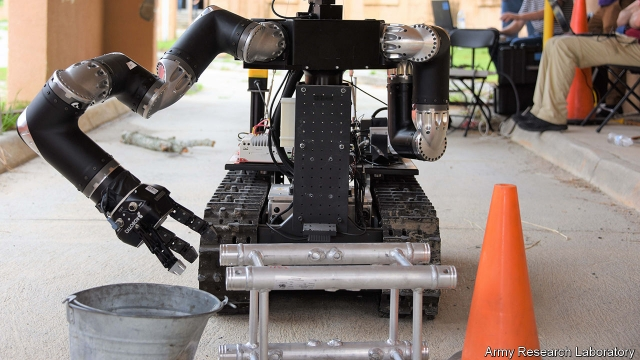

###### Robotics

# Robots’ abilities to recognise and manipulate things are improving 

 

> print-edition iconPrint edition | Science and technology | Sep 28th 2019 

A TRACKED ROBOT approaches a pile of brushwood blocking its path. This is RoMan, short for Robot Manipulator, and it is practising for what is, in effect, its graduation ceremony, on October 17th, when it will show off its skills to a group of American army top brass in a so-called capstone demo at Carnegie-Mellon University, in Pittsburgh. After a pause for thought, it reaches out an arm, takes hold of a branch, lifts it up and drags it clear. Though this is a trivial action for a human being, it is a breakthrough for robots, according to Stuart Young of the Army Research Laboratory (ARL), in Adelphi, Maryland, who is in charge of the RoMan project. And it has implications for the future of robotics. 

As anyone with a Roomba cleanerbot knows, robots easily become confused by something unexpected, like a piece of furniture in the wrong place. A barricade can be made of many objects, some unfamiliar, and none with convenient handles. Taking it apart is far beyond the capability of any industrial robot. 

Progress in automated manipulation of this sort has been slow. Amazon, a large e-commerce firm, ran a “pick and place” challenge for three years, with teams of roboteers competing to retrieve random known objects from warehouse shelves. The competition ended in 2017, with machines still failing to approach the capabilities of human pickers. Similarly, the European Union’s “pick-place” initiative for robotic manipulation has set only modest goals for improving the handling of known objects. This lack of technology from the private sector inspired the ARL to push forward with its own programme, the Robotics Collaborative Technology Alliance, which has involved, besides Carnegie-Mellon, General Dynamics, a military contractor, the Jet Propulsion Laboratory (JPL), a NASA facility in California, and the University of Washington. 

Dr Young says that, as far as he knows, RoMan is the first machine capable of manipulating unfamiliar objects in an unknown and unstructured environment. Currently, the obstacles it can deal with include piles of logs and brushwood, metal objects and concrete blocks. 

Just as a human being would, it has to learn about the world through observation and experiment before it can manipulate it. So it is trained, for example, on numerous tree branches until it is able to recognise unfamiliar ones for what they are and knows to grasp the trunk, rather than the leaves or the twigs. Having so grasped an object, RoMan assesses its weight and decides whether to try to lift it or drag it. Dr Young describes this process as “intuitive physics”. Then, when confronted with a real barricade, the robot can recognise objects within the heap, work out whether they are best lifted, pushed or pulled, and position itself in the optimum place to do so and thus dismantle the obstacle. 

Dr Young hopes to take this further, for example by dismantling piles of burning tyres. He also wants RoMan to be capable of “whole body manipulation”, to exert more force. That would include things like the robot using its body weight in the way a human being might, in order to push open a stiff door or to move heavy furniture by bracing against a wall. 

One problem with RoMan is that it is still impractically slow. It often takes 10-15 seconds to decide what to do. Dr Young says that this delay will have to come down tenfold to meet military requirements. RoMan will also need to learn to deal with a wider range of objects. 

All this done, however, the device’s future could be bright. Beyond military applications, its descendants might work in warehouses, pick fruit, clear litter or tidy people’s homes. They might even, if JPL has its way, collect rocks from the surface of Mars. Picking up a branch is one small act for a robot, but it could put a whole new world within the grasp of robotkind.■ 

