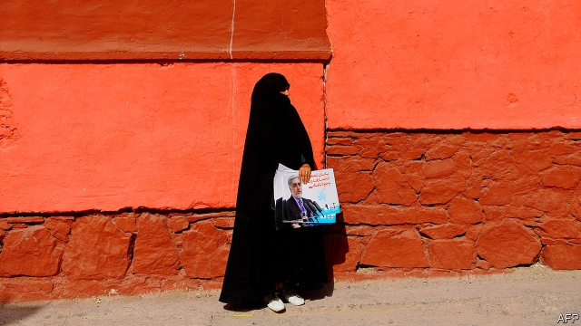

###### Umpire state-building

# Afghanistan’s presidential poll looks likely to be disputed 

 

> print-edition iconPrint edition | Asia | Oct 3rd 2019 

AFGHAN ELECTIONS are never quick and never easy. The presidential poll that took place on September 28th will be no exception. Voters were choosing a leader for the fourth time since the Taliban regime was toppled in 2001. Full results are not expected until November 7th. A run-off may then follow. Disputes are already rife. 

The contest is a repeat of the previous election, in 2014. The incumbent, Ashraf Ghani, is favourite; his closest rival is likely to be the man he defeated last time, Abdullah Abdullah. Campaigning was wan. Until America abruptly called off talks with the insurgents of the Taliban in early September, polling had widely been expected to be postponed, since it would have distracted from the negotiations. 

Afghanistan’s rugged terrain and atrocious roads would make even a peaceful election tricky. But the country is also racked by the 18-year-old war between the Taliban and the government, which is backed by America. American officials estimated last year that the Afghan government controlled barely half the country. The number of polling stations had to be cut by more than a quarter, partly because of insecurity. 

The Taliban had vowed to stop the vote. Widespread violence was expected on polling day. In the end, casualties were lower than feared, though at least five people were killed and 80 wounded in attacks on polling stations. Even so, the threat of bloodshed, along with the Taliban’s grip on rural areas and widespread apathy, led to an embarrassingly low turnout. Some 2.6m people cast ballots. That is about 27% of registered voters and roughly 15% of people of voting age. 

Violence was not the only source of trepidation ahead of polling. Previous elections have been mired in fraud. The lack of security has hampered monitoring and so helped the cheats. Sceptics have warned that a disputed result could lead to a dangerous political stand-off, with losers refusing to accept the outcome, as happened in 2014. Several candidates denounced the vote as unfair before a single ballot was cast. Others, such as Gulbuddin Hikmatyar, a bloodstained warlord, threatened to resort to violence if they concluded the poll had been rigged. 

Mr Ghani insisted that the election would strengthen the state and give him a mandate to talk to the Taliban. Afghanistan’s international backers agreed, at least publicly, and stumped up millions to pay for the poll. New biometric voting machines were brought in and new voter lists drawn up in an effort to curb cheating. 

It will take weeks for the results to come through. There has already been confusion over how many polling stations opened and how many people voted. Since the Taliban sabotaged mobile-phone networks, hundreds of polling stations were unable to communicate with the capital. Mr Ghani’s opponents say the security services invisibly influenced the vote, by declaring that areas that supported opposition candidates were too insecure to allow voting to proceed. 

The biggest flare-up is likely to be between Mr Ghani and Dr Abdullah. The latter claimed he was cheated of victory in 2014; only American wrangling to cobble together a unity government ended the argument. Mr Ghani became president, while Dr Abdullah took a hastily created new post of chief executive. 

The unity government brought little unity. “Abdullah has a particular bitter vendetta, given that he believes he defeated Ghani in 2014,” says Michael Kugelman of the Wilson Centre, an American think-thank. “So he certainly won’t back down easily, especially if he is declared a loser to his rival Ghani once again.” Foreign diplomats pleaded for candidates to wait patiently for results. Instead, the two camps both swiftly declared that their own tally showed that their man had won. 

It is unclear what America will do if the result is disputed again. In 2014 it was only American arm-twisting that resolved the row—but President Donald Trump makes no secret of his desire to disentangle America from Afghanistan. ■ 

