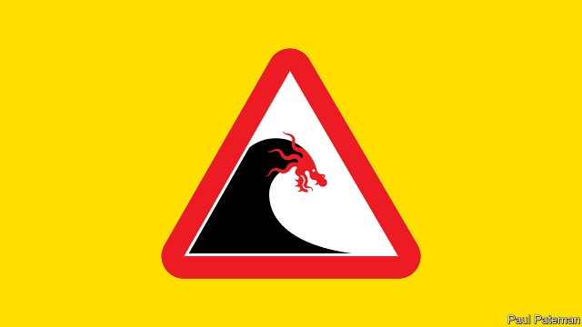

###### Banyan

# China is resorting to new forms of bullying in the South China Sea 

 

> print-edition iconPrint edition | Asia | Oct 3rd 2019 

LESS IS HEARD these days about China’s massive terraforming operations in the South China Sea, which not long ago exercised neighbours as well as the United States. But that does not mean China is any less assertive in the 1.4m square-mile (3.5m square-km) sea which, on the flimsiest grounds, it claims pretty much in its entirety. On the contrary, China seems to think its artificial islands allow it to open a new phase of self-assertion in the face of the South-East Asian countries with overlapping claims in the sea. 

Starting in 2013 seven artificial islands sprouted around distant reefs that China controlled. Other countries, including Vietnam, the Philippines and Taiwan, have also reclaimed land from the South China Sea for airstrips and bases. But the scale of China’s efforts dwarfs theirs. President Xi Jinping swore that China’s operations served only the common good, an assertion undermined by the immense ecological damage of the construction, and by the subsequent installation of missiles, military radar and reinforced bunkers for warplanes. 

If the terraforming no longer makes headlines, it is because it is largely complete. The new bases, say American commanders, allow China to control the entirety of the South China Sea in any scenario short of all-out war with the United States. The new port and resupply facilities are helping China project power ever further afield. Chinese survey vessels look for oil and gas in contested waters. They run back and forth “like a lawnmower”, says Bill Hayton of Chatham House, a British think-tank. 

Vietnam, in particular, is alarmed. In 2014 China towed an oil platform into Vietnam’s exclusive economic zone (EEZ, meaning the area off its coast in which it claims exclusive fishing and mineral rights), sparking a stand-off between Chinese and Vietnamese maritime militias and big anti-China protests in Vietnamese cities. The platform was subsequently removed, but China recently unveiled a new, even bigger one. 

Further afield, over a dozen Chinese coastguard vessels patrol back and forth around two reefs, barely underwater, where China previously had no permanent presence: the Second Thomas Shoal, west of the Philippines, where a small Filipino force maintains a presence aboard a rusting hulk; and the Luconia Shoals, off the Malaysian part of Borneo. The operations assert sovereignty: patrol enough, and other countries might eventually accept China’s de facto control. Meanwhile, some of the same vessels have intimidated rigs (or their supply vessels) drilling in Vietnamese and Malaysian waters. 

Yet not everything is going China’s way. Rumours suggest the new islands’ concrete is crumbling and their foundations turning to sponge in a hostile climate. And that is before considering what a direct hit from a super-typhoon might do. 

More significantly, neighbouring countries are resisting Chinese pressure to develop gasfields that lie within their EEZs jointly. Even though the Philippines agreed in principle to one joint development, a formal agreement to that end has yet to be signed. Nor has China prevented foreign oil companies from working with other littoral states. The rig Chinese vessels harried in Vietnamese waters is operated by a Russian state enterprise, Rosneft, even though Russia is supposedly a close friend of China’s. 

Meanwhile, China’s bullying is impeding the adoption of a “code of conduct” between it and the ten-nation Association of South-East Asian Nations (ASEAN)—despite China proposing 2021 as the deadline for achieving one. Ian Storey of the ISEAS-Yusof Ishak Institute in Singapore sees lots of obstacles. One is making any code legally binding—for instance, by lodging it with the UN; China would oppose that. Another is defining the geographical scope of the agreement. China will insist on the vague but expansive “nine-dash line” which encompasses nearly the whole sea. Nearly everyone else will oppose that. 

Then there is the question of what activities should be forbidden. China would resist bans on further reclamation and militarisation. And ASEAN would surely reject an insidious provision against military exercises with countries outside the code, in effect giving China a veto over drills between ASEAN members and America. China’s demands for the code of conduct, says Teodoro Locsin, the Philippine foreign secretary, are intended as “implicit recognition of Chinese hegemony”. They are, he continues, “a manual for…the care and feeding of a dragon in your living room.”■ 

