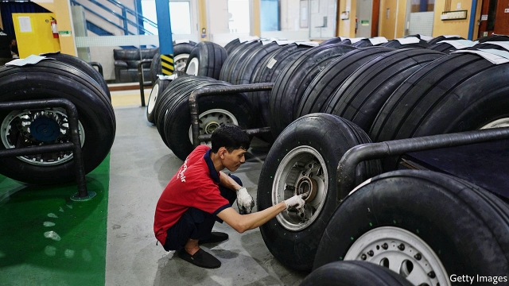

###### Goods for the godly

# This magazine is certified halal 

 

> print-edition iconPrint edition | Asia | Oct 3rd 2019 

IVON WIDIAHTUTI’S job is, on the face of it, straightforward. As an auditor at the Food, Drug and Cosmetics Assessment Agency (LPPOM), an organisation in the leafy city of Bogor, Ms Widiahtuti reviews the applications of companies hoping their products will be deemed halal, meaning that their consumption or use does not break any of the strictures of Islam. Lately, however, her job has acquired an absurd streak. Halal is a concept most commonly applied to diet, and Ms Widiahtuti spends most of her time considering applications from food and beverage companies which want to assure Muslim consumers that their products are free of pork and alcohol, which devout Muslims eschew. But some applications concern products that aren’t edible. As she lists the musical instruments and sex toys that she and her team have inspected recently, she giggles at the absurdity of asking: is this vibrator halal? 

Ms Widiahtuti does not believe that CEOs are becoming more pious. But ordinary Indonesians are. The country is home to more Muslims—some 230m—than anywhere else in the world. They, in turn, consume more products that have been certified halal than Muslims anywhere else. Companies spy opportunity. The number of products that received halal certifications quadrupled between 2012 and 2017. A small but growing share of such companies do not make goods that can be digested. Over the past five years the Indonesia Ulema Council (MUI), a government-funded body that issues spiritual guidance to the devout and runs LPPOM, has given its seal of approval to the makers of a fridge, a frying pan, sanitary pads, cat food and laundry detergent. 

Yahya Staquf, a prominent Muslim cleric, does not understand how such things can be halal. Many share his consternation. When Sharp, a Japanese electronics giant, announced in 2018 that a fridge it was selling in Indonesia had received halal certification, it was widely ridiculed. In fact, the mockery in that case was misplaced: according to Ms Widiahtuti, the process of making the plastic parts of fridges can involve products derived from pigs. Owing to Sharp’s halal certification, Muslims who purchase the appliance can now be confident that their food will not come into contact with contaminated plastic. 

When more and more companies like Sharp started approaching MUI, it issued guidance stipulating that any product related to food preparation or prayer—no matter whether it can be consumed—is eligible for certification. Pianos and sex toys do not fall under that rubric, Ms Widiahtuti notes, so she rejected those applications. 

In an effort to boost exports and pose as pious, Indonesia’s lawmakers have expanded the scope of certification yet further, however. They have approved a law requiring all consumer goods to be certified as halal from October 17th. Ms Widiahtuti suspects that, in practice, the law will be applied only to certain products, but that is only an assumption. “The scope is very general. What is the limit?” she wonders. Ms Widiahtuti may have to decide whether pianos and vibrators are godly goods after all. ■ 

