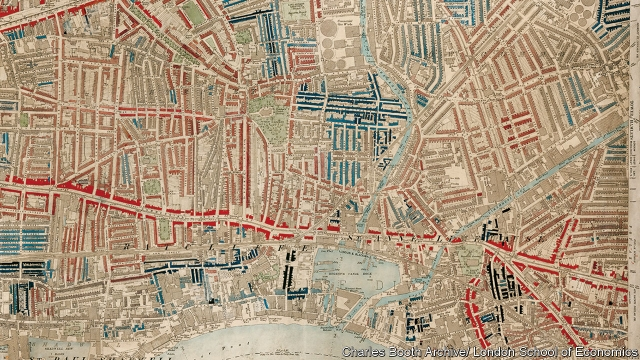

###### Always with us

# Charles Booth’s quest to fathom poverty in Victorian London 

 

> print-edition iconPrint edition | Books and arts | Oct 5th 2019 

Charles Booth’s London Poverty Maps. By Mary Morgan and the London School of Economics.Thames & Hudson; 288 pages; $75 and £49.95. 

“I CURSED EVERY minute I gave to it,” Charles Booth complained of his monumental survey of life and labour in London. It is easy to see why: from 1886 to 1903, while running a leather dealership and a steamship line, Booth pursued a crazily ambitious private scheme to chart the socioeconomic condition of every street in what was then the biggest city in the world. To find out how many Londoners were poor—and why—he and his squad of investigators accompanied policemen on patrols, and conducted interviews in pubs and sweatshops. Their observations of housing and habits, plus the data they received from school-board visitors, were transmuted into colour-coded maps. Like illuminated manuscripts, they are mesmerising in their detail and diligence. 

The colour scheme descends from red and yellow for wealthy residents to blue for “chronic want” and black for “vicious, semi-criminal”. The handsome volume in which the maps have now been reproduced includes contemporaneous pictures—faces smiling out from the squalor, or scowling—plus extracts from the investigators’ notes. As Sarah Wise, author of one of the new book’s contextualising essays, puts it, these notes are “a compendium of anxieties” held by the well-off about the working classes, censorious judgment mixing with compassion in a characteristically Victorian way. Prostitution figured prominently, as did booze; sozzled women were a particular worry. Italian thieves were said to be less violent than their English counterparts. Irish and Jewish immigrants were widely reviled. 

In outline, the picture of London that emerges is familiar. Then, as now, the east was poorer than the west—a pattern set long ago by the direction of the Thames and the prevailing winds—even if much of the heavy industry of Booth’s time is gone, and the once-humming docks are quieter. Then, as now, wealth and poverty were more entwined than in many metropolises, the neat grids of red and yellow on the maps disrupted by thickets of blue and slugs of black. Sometimes streets are cross-hatched, or outlined assiduously in one colour and filled in another, to indicate their jumbled complexion. 

Some of the slums Booth documented have since become exorbitantly trendy, though gentrification was a feature of his day, too, the poor circulating to the city’s margins to make way for others. For all the moralising, he concluded that vice accounted for a small share of the 31% of Londoners living in poverty. Most were done in by misfortune (illness, accident, bereavement) or by badly paid and erratic work. 

The anecdotes in the book are as captivating as the maps. The cat’s-meat seller in Holloway does a roaring trade because “nearly every poor family is a customer for its cat even though it can hardly afford to feed itself.” Urchins save for their funerals; 64 tramps wait for their dinner outside a Kensington church. In Deptford there are “shoeless children running about and frowsy women gaping at doors”. Rose, the keeper of a Hackney sweet-shop, is thought respectable but for “going on a spree” once a year, on which she “drinks a drop too much and takes up with chance men who fleece her.” These vivid, hard London lives are all long gone—replaced perpetually by new struggles and stories. ■ 

