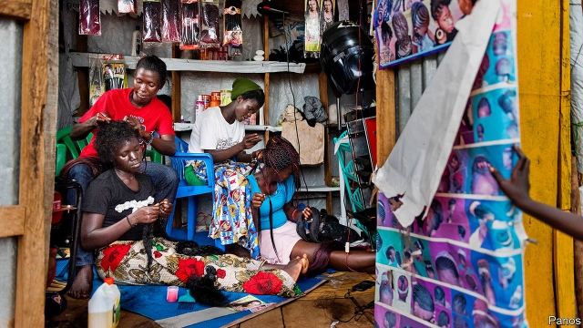

###### Uberising luck

# Africa is full of schemes to help entrepreneurs 

 

> print-edition iconPrint edition | Business | Oct 3rd 2019 

IN 1999 A Ugandan teacher decided to start her own school. Barbara Ofwono Buyondo had $350 of savings. Bankers would not give a loan without collateral, especially to a young woman. With no money for tables, children wrote on their chairs, kneeling. Today her company, Victorious Education Services, is one of the leading schools in Uganda. Over 4,000 fee-paying pupils attend its five campuses, swept up by a fleet of branded buses and welcomed by primly uniformed teachers. 

Decent jobs are so scarce in Africa that, like Ms Buyondo, many people create their own. Surveys by the Global Entrepreneurship Monitor find that one in three working-age adults in sub-Saharan Africa either runs a new business or is trying to start one, compared with one in six Americans and one in 20 Germans. In Tanzania informal firms created four-fifths of new non-farm jobs between 2002 and 2012. Most such enterprises are also tiny. Schemes to help them emulate Ms Buyondo’s success have a mixed record. 

Take attempts to give promising entrepreneurs access to capital. A study in 2017 by David McKenzie of the World Bank looked at YouWiN!, a government-run contest in Nigeria which awards $50,000 on average to applicants with the best business plans. He found winners used the money well, becoming larger and more profitable than otherwise similar firms that did not win. But such initiatives, which resemble a lottery, are inherently hard to scale. Other studies have found that extending microloans to entrepreneurs does not generally raise their incomes. 

An alternative approach is to foster good business practices. Enterprise programmes range from small non-profit initiatives to the $100m foundation established by Tony Elumelu, a Nigerian tycoon. At a recent training session run by Enterprise Uganda, a government-backed initiative, some 70 businesspeople discussed how to manage employees. The trainer warns against hiring indolent relatives. “You can’t have a minister without portfolio in your business,” he says (half-jokingly). One woman recounts how her husband kept antagonising customers, until she moved him to accounts. 

These, too, are a mixed bag. Good record-keeping and marketing have been linked to subsequent business success. All too often, though, classroom-style courses meant to inculcate such skills do not succeed in getting trainees to practise what they have learned. In Togo, for instance, Mr McKenzie and colleagues found that teaching practical skills was less effective than showing students how to set goals and identify markets. 

Entrepreneurs often need specific information, for example, where to sell their products or source supplies. A randomised trial by researchers from the University of Notre Dame in America linked young businesswomen in a Kenyan slum with local mentors dealing in similar trades. Their profits were 20% higher over the following year, relative to a control group, mainly because they had switched to cheaper suppliers. A study in Egypt showed that artisanal rugmakers learned to make higher-quality carpets after being connected with more demanding rich-world buyers. 

Budding business folk need other sorts of assistance. Down a narrow alley in Kampala, Uganda’s capital, Ivan Zziwa has built a mini-conglomerate. He fixes phones, sells accessories, blends juice, hires out chairs and offers mobile money services, with the help of four people. He says online conversations with a volunteer mentor in Spain prompted him to expand into wholesale and door-to-door deliveries. This offered a way to market his existing businesses to new customers. It may also reduce risk. 

The mentoring was arranged by Grow Movement, an NGO that pairs volunteer consultants from all over the world with small businesses in Africa. A forthcoming study finds that entrepreneurs who received this long-distance coaching increased their monthly sales by a quarter. They did so not by changing their business practices, such as accounting, but by changing their entire business. One stationer describes how he started making his own exercise books, which was cheaper than buying them. A rural businessman selling liquid soap and fertiliser decided to expand into solar lights, water filters and cooking stoves after his mentor prodded him to look for unmet needs. 

As elsewhere, however, most African success stories involve a lucky break. Ms Buyondo’s came when a savings group at church lent her money and two teachers agreed to work for deferred pay. Mike Duff mentored Mr Zziwa. He recalls how chance encounters and nuggets of advice while studying at the London School of Economics helped his own career (he now runs an eco-retreat). He describes his Skype conversations with Mr Zziwa as the “uberisation” of good fortune. Mr Elumelu talks of his foundation trying to “institutionalise luck”. Starting a business will always be a game of chance. ■ 

