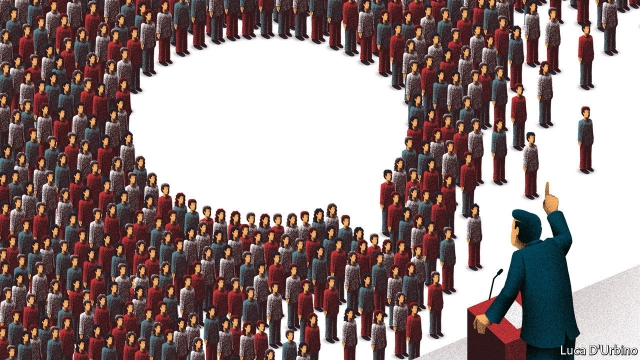

###### Political rhetoric

# When politicians invoke “the people” 

 

> print-edition iconPrint edition | Leaders | Oct 5th 2019 

SINCE THE first three words of the preamble to the United States’ constitution thundered into the world’s political lexicon, “the people” has been one of the favourite invocations of those in, or in pursuit of, power. It has also been one of the most abused. No state has been as undemocratic or unpopular as the Democratic People’s Republic of Korea. The People’s Movement for the Liberation of Angola has paid more attention to liberating the country’s assets into its leaders’ foreign bank accounts than to freeing Angolans from the oppression of poverty. In the media the formula signals a determination to ignore popular taste: the People’s Daily makes no more effort to appeal to its Chinese readers than Pravda did to tell the truth to its Soviet ones. So when Downing Street frames the election Britons are expecting as “Parliament versus the people”, the people should beware. 

References to “the people” are standard fare in political speech. Emmanuel Macron, France’s president, likes to bang on about the mandat du peuple, and the responsibility it confers. This is fine; the danger arises when “the people” are weaponised against a supposed enemy. 

It is not just politicians who do this. Princess Diana said she wanted to be the “queen of people’s hearts”—in implied contrast to the awkward husband who commanded the affections of nobody but his mistress. But with the rise of populism, the tactic is spreading among politicians. Sometimes the enemy is a foreign one. Hugo Chávez, Venezuela’s late demagogue, called on the people to resist “the empire”—George W. Bush was unpopular worldwide, and thus a convenient target. Today Mexico’s president, Andrés Manuel López Obrador (AMLO), unwilling to antagonise his northern neighbour, prefers the vaguer “mafia of power”. Sometimes it is a religious minority, such as Muslims, who are clearly excluded from the ruling Bharatiya Janata Party’s celebration of its success in India “in inciting amongst the people a desire for a unique cultural Indic renaissance”. Any of these foes may be used to whip up support for a struggling politician. 

But the target is usually the institutions that stand in the politician’s way, especially the legislature, the courts and the media. Such checks and balances are essential to the proper workings of a democracy but, inevitably, inconvenient for presidents and prime ministers who are not particular about the means they use to achieve their ends. President Donald Trump has referred to the media as “enemies of the people”; Poland’s ruling PIS party justifies its attacks on the legal system and the opposition by reference to its connection to the narod; Boris Johnson, Britain’s prime minister, has set himself up as defending the will of “the people” against those in Parliament and the courts who are stopping Britain from leaving the European Union without a deal. 

Once a politician has defined those who elected him as “the people”, then he embodies their will and it is but a short step to defining his own enemies as the nation’s. After Polish MPs called for an EU investigation of their government, the prime minister, Jaroslaw Kaczynski, called them traitors. Mr Johnson calls a law designed to avoid a chaotic departure from the EU “the Surrender Act”, and accuses its supporters of “collaboration”. Mr Trump tweets that “what is taking place is not an impeachment, it is a COUP, intended to take away the Power of the People, their VOTE, their Freedoms, their Second Amendment, Religion, Military, Border Wall, and their God-given rights as a Citizen of The United States of America!” 

 

If “the people” are thwarted by the courts or parliament, they may be driven to unconstitutional action. That’s what some Britons thought the Conservative Party chairman meant when he said that, if they were denied Brexit, they would “look at other ways of initiating change”. And it is what some Americans concluded when Mr Trump retweeted a pastor’s warning that impeachment would “cause a Civil War like fracture in this Nation”. If “the people” take matters into their own hands, what is a president to do? At a recent press conference, AMLO declared, “I believe that not only you’re good journalists but you’re also prudent...And if you cross the line, well, you know what happens, right? But it’s not me, it’s the people.” He did not specify what the people might do, but Mexico’s journalists understand the risks: 12 have been murdered this year. 

Voters should keep an ear cocked for this dangerous phrase. It marks the user out not as a democrat but as a scoundrel.■ 

