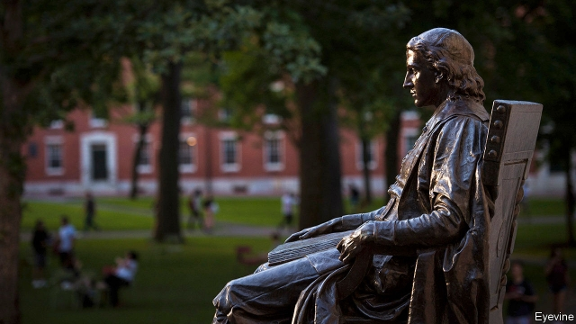
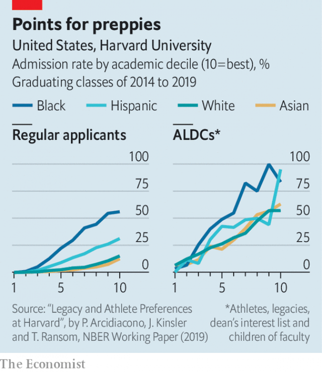

###### Making a meritocracy

# A judge finds there is nothing wrong with Harvard admissions 

 

> print-edition iconPrint edition | United States | Oct 5th 2019 

THE WORLD’S most prestigious universities are primarily in two countries: America and Britain. Strangely, though, the more aristocratic, less meritocratic system of admissions is found not in the country with a House of Lords and a hereditary monarchy, but in the land of rugged individualism. The American system is under attack, however. In a closely watched case that began in 2014, a group of Asian-American students are suing Harvard, claiming discrimination relative to whites. This has shed light on the inner workings of the admissions process, which has been tightly guarded by Harvard. 

Many of the disclosures, such as the preferential treatment given to mostly white and wealthy “legacy students” (those with relatives who attended the university), look embarrassing. Yet on October 1st a federal judge in Boston ruled in the university’s favour. This will be merely the prologue to a protracted legal battle. 

Most of the interest in the case stems from the possibility that it could up-end the system of affirmative action for “under-represented racial minorities” (chiefly blacks and Hispanics) at elite American universities. This certainly seems to be the goal of Edward Blum, the conservative legal activist funding the case, who has brought other high-profile challenges to the reigning system. The Supreme Court has previously held that universities may engage in affirmative action—though it bans quotas—in the interests of promoting a racially diverse body of students. Mr Blum’s aim is plainly to appeal the case all the way to the highest court. His previous attempt, over admissions to the University of Texas, was narrowly decided by the Supreme Court in 2016, before President Donald Trump appointed two new conservative justices, Neil Gorsuch and Brett Kavanaugh. 

 

The most interesting thing that has come out of court documents is detail on the programme of affirmative action for wealthy students maintained by Harvard and other universities of its stature. A recent working paper by three economists, one of whom was an expert witness for the plaintiffs, shows that 43% of white students attending received some sort of preferential treatment in admissions (because they were legacies, recruited athletes, on the “dean’s interest list” or the children of faculty). They estimate that most of these would not have got in otherwise. 

The boost for these applicants is as high as the one given to blacks. Asian-Americans, who receive the fewest admissions preferences, are squeezed as a result. A white student who is in the middle of the pack academically, but has legacy status, has a higher chance of getting in than a typical Asian applicant in the top tenth. 

Race-conscious admissions programmes are constitutionally valid only if they are the least obtrusive means to attain diversity. Allison Burroughs, the judge in the case, acknowledged that removing the preferences would increase the number of non-white students. But she concluded they could still remain because “Harvard would be far less competitive in Ivy League intercollegiate sports, which would adversely impact Harvard and the student experience” and that top-notch faculty may not join without a promised leg-up for their progeny. (Never mind that sailing competitions are not the central focus of university life; and a few academics may still want to work at the place.) Judge Burroughs displayed a remarkable level of deference to the university’s argument. The Supreme Court, should the case make it there, probably will not. ■ 

