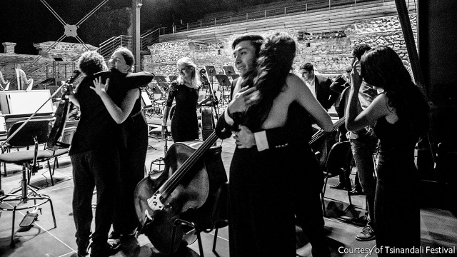

###### The food of love

# A new orchestra seeks harmony in the Caucasus 

 

> print-edition iconPrint edition | Books and arts | Oct 12th 2019 

WHEN DIANA SARGSYAN sat down next to Rashid Aliyev for her first rehearsal with the Pan-Caucasian Youth Orchestra (PCYO), her fellow violinist’s greeting shook her. “We are going to hate each other,” he predicted. “We are enemies.” It was an inauspicious start for the “peace” orchestra created for the inaugural Tsinandali Festival, an ambitious music event held last month on a winemaking estate in leafy eastern Georgia. Or so it seemed. 

Ms Sargsyan is Armenian; Mr Aliyev is from Azerbaijan. Their countries have quarrelled over the disputed territory of Nagorno-Karabakh since a war in the early 1990s. Their fellow musicians included Gulin Atakli, an oboist from Turkey—which, as well as being Azerbaijan’s ally, is embroiled in a row over whether the mass killing of ethnic Armenians in 1915 constituted a genocide. In a performance of Shostakovich’s 9th Symphony, the strings were led by a Ukrainian violinist, Galina Korinets—whose country was invaded in 2014 by Russia, where Vera Nebylova, one of the PCYO’s cellists, plays in the national youth orchestra. Russia also occupies two enclaves in Georgia, where Eliso Babuadze, another cellist, studies at the Tbilisi conservatoire. 

There were many players in the 80-strong band and the wider Tsinandali Festival who were notionally foes. “There is so much war and conflict in this region,” says George Ramishvili, founder of the festival and chairman of its main sponsors, the Silk Road Group, an investment outfit. “We wanted to challenge this.” That is not to mention the domestic strife in some of the countries represented. Fazil Say, a Turkish pianist, narrowly avoided jail after criticising the government on Twitter; at the festival he performed two pieces about the protests in Istanbul in 2013. 

The PCYO is part of a trend in high-level music therapy. In 2011 the I, Culture orchestra was formed in Poland, aiming to unite musicians from former Soviet satellites. The most prominent ensemble of the kind is the West-Eastern Divan Orchestra, which was set up 20 years ago by Daniel Barenboim, an Argentine-Israeli conductor and pianist, and the late Arab academic Edward Said, bringing together instrumentalists from across the Arab-Israeli divide. 

Acclaimed as it is, Mr Barenboim’s group suggests the limits of such initiatives. Based in Spain, it cannot play in many countries from which its musicians are drawn. Relations between members are said to be volatile. Still, solving intractable conflicts may be an unfair measure of success. “We are not stupid!” exclaims Claudio Vandelli, the PCYO’s assistant music director. “But we hope that this will change the atmosphere, little by little.” 

In this case, the therapy seems to be working. “From the start”, says Ms Atakli, “we have seen ourselves as musicians—as internationalists. Music is a universal language.” During a rehearsal break the players conversed in Russian and English, the two other languages common to most. At their hotel they played chess and chatted in mixed groups. An impromptu salsa party helped them bond. Ms Korinets, the Ukrainian, finds the idea that she is at war with her Russian friends outlandish. 

And it turns out that Mr Aliyev was only joking about Ms Sargsyan being his enemy; he guffaws as he describes her startled expression. Another new Armenian buddy has asked to be friends on Facebook. “I thought, what would my friends think back home if they saw I’d linked up with an Armenian?” Mr Aliyev says. But “that’s not my problem, it’s theirs.” ■ 

