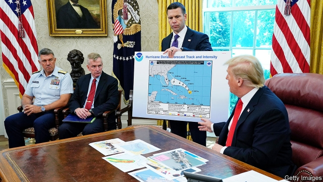

###### Axes of evil

# Lies, damn lies and charts 

 

> print-edition iconPrint edition | Books and arts | Oct 12th 2019 

How Charts Lie. By Alberto Cairo.W.W. Norton; 226 pages; $25.95 and £15.99. 

“IF ANYTHING ON this graphic causes confusion, ignore the entire product.” This footnote appeared on an official (if impenetrable) spaghetti-like weather map tweeted by Donald Trump on September 4th. It was not on the crudely doctored version that he wheeled out at the White House on the same day, to justify his mistaken warning that, among other places, Alabama would “most likely be hit (much) harder than anticipated” by Hurricane Dorian. But perhaps it should have been. The fiasco arose in part because of the “cone of uncertainty” sometimes used to delineate the possible paths of a storm—a template which, as luck would have it, is one of many maps and charts patiently explained by Alberto Cairo in “How Charts Lie”. 

His book could not be more timely. Charts and maps pepper traditional and social media more than ever, but there have been few attempts to improve what Mr Cairo calls the “graphicacy” of their consumers. His corrective begins with a chapter on how to read a chart, and this basic notion—that, to be understood, graphs must be read, not merely glanced at—permeates the book. He outlines the essential “scaffolding” of a chart (scales, legend, source and so on), before describing the many ways that data can be built upon it. Only once readers know what a solid structure looks like can they learn to spot a façade. 

There are plenty out there. In one of the author’s examples, global warming is all but erased when the annual temperature for the past 130 years is plotted with a baseline starting at zero, resulting in a reassuringly flat line; in another, a dual-axis chart appears to show a shocking rise in abortions carried out by Planned Parenthood, a health-care provider, while their life-saving cancer-screenings plummet. In both cases, the structure is designed to mislead. Mr Cairo enjoins searching questions: Who made the chart? What is their agenda? 

Deception can begin before the axes are drawn, when the content is selected. Truncating a time-scale to exclude awkward data—for instance, to omit a downturn in profits—is a well-known shady practice. So is overloading a graph to obscure an inconvenient truth. Sometimes the numbers are just plain wrong. In 2014 a blogger made a splash when he plotted state-level data from Pornhub, a website, and found Kansans were viewing far more porn than other Americans. Later it emerged that Pornhub’s geolocation tracker was bamboozled by people accessing the site through a VPN, which led the gizmo to register them all in the geographical centre of the contiguous United States: a field in north Kansas. 

Mr Cairo uses this incident to consider the fallacy of drawing conclusions about individuals from group data. He commends the blogger for admitting his mistake, pointing out that this increases perceptions of trustworthiness. And his book reminds readers not to infer too much from a chart, especially when it shows them what they already wanted to see. Mr Cairo has sent a copy to the White House. ■ 

