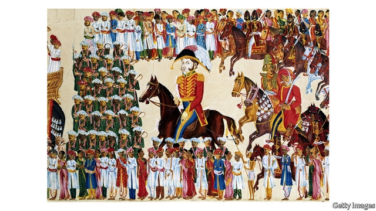

###### Bad company

# The astonishing and violent rise of the East India Company 

 

> print-edition iconPrint edition | Books and arts | Oct 12th 2019 

The Anarchy: The Relentless Rise of the East India Company. By William Dalrymple. Bloomsbury; 576 pages; $35 and £30. 

AT THE START of his new book William Dalrymple notes that it is “always a mistake to read history backwards”, and to assume that what happened was inevitable. Readers are unlikely to make that mistake with his subject—the dramatic rise of the East India Company (EIC)—a tale so improbable as almost to defy belief. 

A private company granted a monopoly on trade with Asia, the EIC launched its first expedition in 1601. Armed with “40 muskets”, its crew of second-raters promptly got stranded in the English Channel for two months. At the time India accounted for a quarter of global manufacturing, and backward Britain just three percent. By about 1800 the EIC commanded the most powerful armed forces in Asia; its armoury in Calcutta held 300,000 muskets. In the intervening centuries it had grabbed control of India, killed and impoverished many of its people, enriched Britain and raised questions about the boundary between the state and commerce that still resonate. 

Mr Dalrymple sails through this story in fine style. The first substantial contact between the EIC’s grubby emissaries and northern India’s sophisticated Mughal rulers took place in 1614, with the British grovelling for commercial privileges; soon the flow of spices to Europe by sea upended centuries of overland trading routes through the Middle East. After that comes the decay of the Mughal empire, the development of Madras and Calcutta and wars between the French, British and local rulers. The battle of Plassey in 1757 was pivotal: the EIC secured control over Bengal, and thus the ability to exploit its population. 

By the end of the 18th century the company’s cruelty and cronyism caused outrage in London, and the British government began to exercise more direct oversight. There followed a final drive for territorial dominance. In 1792 the EIC controlled only 9% of the subcontinent’s area; by the early 19th century it ran most of it. In 1859 the EIC formally handed over power to the British government. 

Luck played a huge role in all this; several times the company flirted with disaster. But it also had some competitive advantages. Until the mid-18th century it relied on naval power and commercial savvy. After that new weapons and military tactics became critical, until eventually some local rivals achieved military parity. The Tipu Sultan of Mysore, perhaps the EIC’s most effective adversary, used French technology. At that point the EIC’s financial clout became vital; it could tap into a network of lenders in Bengal. Following the American war of independence, Britain discouraged the growth of a settler class in India who might rebel. And the British were expert manipulators. “Know you not the custom of the English?” wrote Tipu. “Wherever they fix their talons they contrive little by little to work themselves into the whole management of affairs.” 

Like other modern historians, Mr Dalrymple repudiates romanticised conceptions of colonialism. But in this case, he is not breaking new ground: accounts of the EIC’s murderous blend of commerce and government are nothing new. Adam Smith called it a “strange absurdity”. Edmund Burke accused it of “cruelties unheard of”. The first page of John Keay’s history, published in 1991, describes its venal reputation. At times Mr Dalrymple’s narrative, with its romping descriptions of battle scenes, itself verges on Hornblower. 

What stands out is rather his sympathetic portrayal of India’s embattled Mughal rulers. He renders a poignant depiction of Shah Alam, an emperor in name but for much of his life a puppet of the EIC, who expressed himself through beautiful poetry. The book’s major omission is a full analysis of the Asian trading system centred around Bengal—the role of commercial agents who acted autonomously from the company; the position of Calcutta as an entrepot; and the strong links between the EIC and Chinese trade. Stamford Raffles, who founded Singapore, was a clerk in the EIC. William Jardine, who would co-found a firm that led the opium trade with China, first worked as an EIC ship’s surgeon. 

What relevance does the EIC have today? The reader will find plenty that echoes in modern India. The well-to-do in Kolkata (formerly Calcutta) still grumble about Marwari money-men. India’s practice of running its federal administrative service with a tiny group of elite officers owes something to the EIC. Centuries of domination by the Mughals and then the British remain part of modern political debate, especially for Hindu nationalists. 

Ultimately, Mr Dalrymple makes a bolder claim: that the EIC was an augury of today’s Western multinationals and tech giants. That is far-fetched. A better comparison is with China’s state-led expansion abroad. While it lacks the EIC’s habit of violence, modern China shares both its strategic ambition and its commercial veneer. Asia is still grappling with that awkward mix, four centuries after the EIC’s motley crew sailed from the foggy Thames. ■ 

