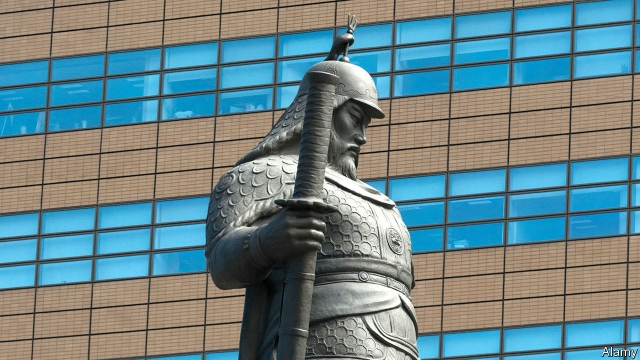

###### Investing for victory

# New South Korean investment schemes aim to prop up domestic industry 

 

> print-edition iconPrint edition | Finance and economics | Oct 12th 2019 

A STATUE OF Admiral Yi Sun-Shin, famous for his victories over the Japanese navy in the 16th century, casts a fierce eye over Gwanghwamun Square in the centre of Seoul. Recently he has also been staring down at visitors in branches of Nonghyup, a local bank. A picture of the man in full battle gear encourages customers to invest in the “Certain Victory Korea Fund”, which Nonghyup’s asset-management arm set up in August to bet on domestic firms it says will benefit from government support in the wake of a trade dispute with Japan. 

Nonghyup is not the only South Korean bank seeking to capitalise on a nationalist moment. KB Kookmin Bank, a rival, is planning a similar fund. Several have been offering free tickets to a film about a famous battle with Japan to anyone opening a liberation-themed account. One has been giving out loans with the interest rate capped at 8.15%, alluding to August 15th, when the country celebrates the end of Japanese occupation. Another said it hoped its “Liberation Day” savings account would “inspire patriotism” as well as increase customers’ assets. 

The financial nationalism chimes with the economic agenda of Moon Jae-in, the president, who has promised billions of dollars in support to local manufacturers of components hit by recent Japanese export restrictions. The aim is to make South Korea “self-sufficient” in such materials. Mr Moon put some of his own money into the “Victory Korea” fund to great fanfare shortly after its launch. Nonghyup says the move drew great interest. Other politicians have since followed. 

The Nonghyup fund is still tiny, at just under 90bn won ($75m). It is classified as “high risk”, because it is unclear how successful the government will be in encouraging self-sufficiency. Substituting for imported materials is likely to drive up production costs across the board. And the economic impact of the trade dispute is likely to be negative. 

But experience suggests that individual companies benefiting from targeted subsidies could do well, reckons Shaun Roache of S&P, a ratings agency. Samsung, South Korea’s biggest chipmaker, has already begun to use locally produced chemicals to guard against potential shortfalls caused by the trade restrictions. Even if the dispute with Japan intensifies, the admiral’s followers could be laughing all the way to the bank. 

