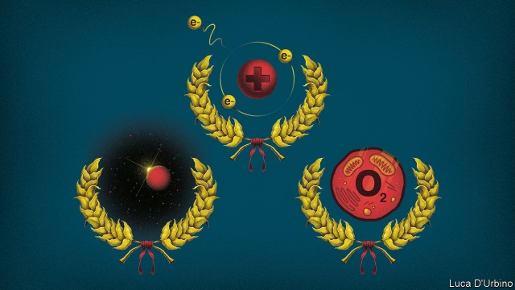
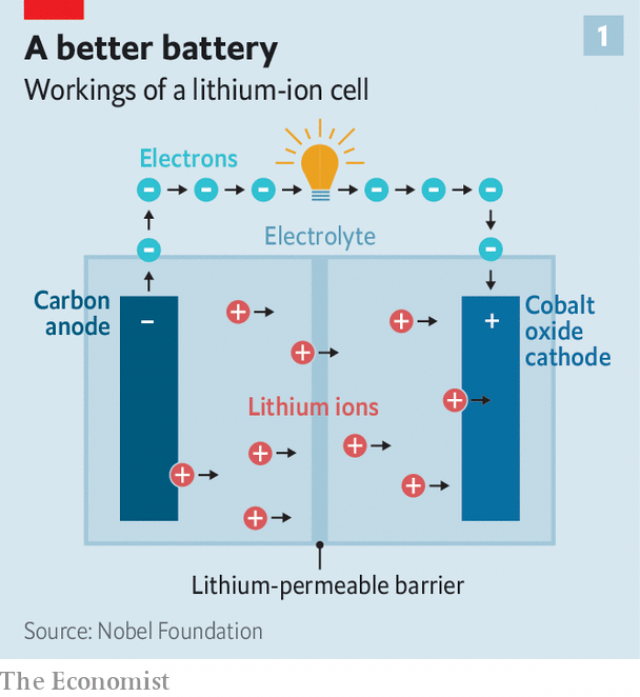
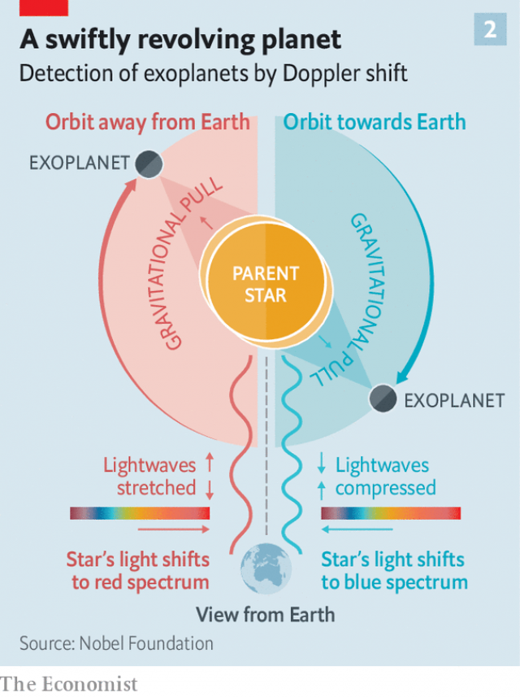
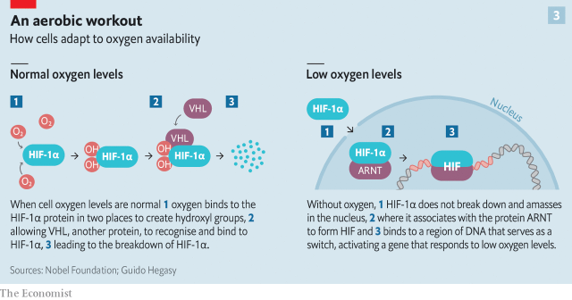

###### The 2019 Nobel prizes

# Batteries, exoplanets, cosmology and cell biology win Nobel laurels 

 

> print-edition iconPrint edition | Science and technology | Oct 12th 2019 

ALFRED NOBEL’S will states that the annual prizes bearing his name should be given to those who “have conferred the greatest benefit to mankind”. The science awards, though, have a tendency to end up in the hands of those who have made esoteric, if profound, advances rather than practical ones. Not so with this year’s prize in chemistry. Three researchers—two from America and one from Japan—have been rewarded for their work in developing the lithium-ion battery. 

Lithium-ion batteries have transformed society because they are lightweight and rechargeable. They have therefore become ubiquitous in everything from mobile phones, tablets and laptops to electric cars. They could also, in the future, become important in storing the intermittently available energy produced by renewable sources such as wind and solar power, as the world attempts to move away from fossil fuels. 

Lithium is the lightest metal in the periodic table (it will float on water, though not for long, because it is also one of the most reactive and turns rapidly into lithium hydroxide), and its atoms have three electrons. Two are tightly bound to its nucleus but the third is easily dislodged to create a positively charged lithium ion. 

The beginnings of making a battery out of lithium and its ions came in the 1970s, when the world was gripped by the oil crisis. Exxon, a large oil company, was interested in developing sources of energy that did not involve petroleum and one of this year’s laureates, Stanley Whittingham, was working at the time in the firm’s research division. He was investigating potential superconductors. Specifically, he was interested in solid materials that contained atom-sized spaces. When ions entered these spaces—a phenomenon called intercalation—some of the properties of the solid material, such as its conductivity, would be changed. 

 

Dr Whittingham discovered that when lithium ions intercalate with a substance called titanium disulphide, the interaction stores a useful amount of energy. Employing metallic lithium as an anode and titanium disulphide as a cathode, he built a rechargeable battery cell that worked at room temperature. In it, lithium at the anode is ionised and the ions thus produced then move through an intervening electrolyte and into the spaces in the titanium disulphide cathode. The liberated electrons, meanwhile, traverse an external circuit to create an electric current that can be used to do work. During its recharge cycle, the external current is reversed and the lithium ions move back through the electrolyte in response (see diagram 1). 

At first Exxon thought the battery had great potential and decided to commercialise it. But when oil prices fell back the company lost interest. It was about then that the second of this year’s chemistry laureates, John Goodenough, who was working at Oxford University, came across the idea and decided to try to improve it. In 1980 he found that, by replacing the titanium disulphide in the cathode with cobalt oxide, he could double the output voltage. 

Akira Yoshino, the third laureate, took Dr Goodenough’s idea and transformed it into the modern battery that sits inside the world’s computers and phones. In the 1980s he was working at the Asahi Kasei Corporation, in Japan, at a moment when electronics companies were becoming increasingly interested in lightweight batteries that could power new electronic devices such as video cameras and cordless telephones. Dr Yoshino was happy with Dr Goodenough’s cathode, but felt that the anode needed redesigning. 

Instead of lithium, he tried various carbon-based materials that might hold lithium ions. He found success with petroleum coke, a by-product of the fossil-fuel industry. This, he discovered, could hold such ions in abundance. His design was not only safer than using a pure lithium anode (lithium has a distressing tendency to catch fire), but longer lasting, too. In Dr Yoshino’s version of the battery, both anode and cathode have a long life because they are not damaged by chemical reactions as the battery is used or recharged. By 1991, the first lithium-ion battery based on Dr Yoshino’s design had been commercialised by Sony, an electronics company. 

Speaking at a press conference shortly after being awarded the prize, Dr Yoshino said he had pursued his research in the 1980s purely to satisfy his own curiosity, without much thought as to whether or not his inventions would one day be useful. Given the lithium-ion battery’s subsequent (and continuing) importance, Dr Yoshino’s curiosity ended up fulfilling Nobel’s will to the letter. 

The physics prize was split two ways, but both halves went for discoveries beyond Earth. One was for a finding that is, by astronomical standards, quite close by—a planet going around a star a mere 50 light-years distant. The other was for an overview of the entire universe. 

In October 1995 Michel Mayor and Didier Queloz, a pair of astronomers then working at the University of Geneva, presented a paper at a scientific conference in Florence. A few months earlier, they had discovered a planet beyond the solar system. It was a gaseous ball twice the size of Jupiter and was going around a star called 51 Pegasi, at a distance of about 8m kilometres—a twentieth of the distance from Earth to the sun. As a consequence of this proximity it orbited 51 Pegasi once every four terrestrial days and had a surface temperature in excess of 1,000°C. The discovery was a puzzle for astronomers. Until then they had thought that such large, Jupiter-like planets could form only far away from their host stars. 

That discovery of 51 Pegasi b, as this planet is now known, launched the field of exoplanet astronomy. To date, astronomers have found almost 4,000 other such planets—and the wide variety of sizes, orbits and compositions of these objects continues to surprise researchers, who have yet to come up with a comprehensive physical theory of how planetary systems form. 

 

Since planets do not shine by themselves, astronomers needed to develop special methods to find them. The one Dr Mayor and Dr Queloz used relies on a phenomenon called the Doppler effect. As a planet orbits its star, that star will also move slightly, as it is pulled around by the gravity of the planet (see diagram 2). This will cause the frequency of the starlight arriving at Earth to oscillate (that is, the star will change colour slightly) in the same way that the frequency of an ambulance siren shifts as the vehicle passes by. Nowadays a second approach, which measures the dip in starlight as a planet passes across its disc, is more common. But the Doppler-shift method, as employed by Dr Mayor and Dr Queloz, is still used as well. 

The half-prize for the overview of the universe went to James Peebles of Princeton University, who has spent decades developing a theoretical framework to describe how the cosmos evolved from the Big Bang 13.7bn years ago to the state it finds itself in today. According to Sweden’s Royal Academy of Science, which awards the physics prize, Dr Peebles was the person who, in the 1960s, shifted cosmology from speculation to a rigorous discipline. 

Until the first decades of the 20th century, astronomers had assumed the universe to be stationary and eternal. This was shown to be incorrect in the 1920s, with the discovery that all galaxies are moving away from each other. In other words, the universe is expanding. Rewind the clock and this means that, at the start of time, now called the Big Bang, the universe would have been incredibly small, hot and dense. 

Around 400,000 years after the Big Bang it had expanded and cooled enough for light to travel through space unimpeded. Astronomers can detect the glow of that first light today but, because its wavelength has been stretched by 13bn years of the expansion of space, it manifests itself not as light but as a glow of microwave radiation that fills the entire sky. This cosmic microwave background was discovered, by accident, in 1964 by radio astronomers, who used earlier theoretical work by Dr Peebles to explain their discovery. Dr Peebles also showed that tiny fluctuations in the temperature of the microwave background were crucial to understanding how matter would later clump together to form galaxies and galaxy clusters. 

Since the early 1990s, space-based observatories have built up increasingly precise portraits of the cosmic microwave background and, true to Dr Peebles’s predictions, these show that temperature variations of just one hundred-thousandth of a degree map onto the observed distribution of matter and energy in the universe. 

Rewarding cosmic shifts in understanding might seem to be a normal day’s work for those who give out the Nobel prizes. But Martin Rees, Britain’s Astronomer Royal, sees something new in this year’s awards in physics. The award to Dr Peebles, he says, will be welcomed by physicists as recognition of a lifetime of sustained contributions and insights by an acknowledged intellectual leader, rather than a one-off achievement. 

Such lifetime-achievement awards are more usually associated with the Oscars than the Nobels. But that is not inappropriate. In many ways the Nobel prizes are a Swedish version of the Oscars—with seriousness substituted for superfice, substance for style, and genuine modesty among the winners for the false sort. 

Those qualities were certainly to the fore in the award of the prize for physiology or medicine. This shone a spotlight onto work that, though of crucial importance in understanding how human bodies work, is—unlike batteries, exoplanets and matters cosmological—almost invisible to the outside world. Yet together William Kaelin, Sir Peter Ratcliffe and Gregg Semenza have answered an important question: how cells detect and adjust to the level of oxygen available to fuel their activities. 

The crucial molecule in the system that matches cell physiology to oxygen availability is a protein complex called hypoxia-inducible factor (HIF). HIF was discovered and named by Dr Semenza, who works at Johns Hopkins University, in Baltimore. In the 1990s Dr Semenza was studying erythropoiesis, the process that generates red blood corpuscles. These are the cells that carry oxygen in the bloodstream, and their number depends on how much oxygen there is around. Professional athletes, for example, often train at high altitude, where the thin air means oxygen is scarce, in order to grow extra red blood cells that will assist their respiration when they compete nearer to sea level. 

The hormone that triggers erythropoiesis is called erythropoietin, or EPO. Indeed EPO, which is manufactured as a drug to help those with anaemia, is also used illegally by some athletes to boost their red-cell count without the trouble of visiting high altitudes. (In cycling, for example, it is notorious.) Dr Semenza was looking at a stretch of DNA, located within the gene that encodes EPO, which switches that gene on and off. In doing so he discovered HIF, a protein complex that, by attaching to or detaching from the DNA switch (see diagram 3), does the switch-throwing. Since Dr Semenza’s discovery, 300 genes similarly regulated by HIF have been found. 

 

Dr Kaelin’s contribution was to discover a further protein, VHL, that regulates how levels of HIF in a cell are controlled by oxygen levels. HIF actually consists of two proteins, now known as HIF-1 alpha and ARNT. ARNT is always present in a cell, but the level of HIF-1 alpha depends on the amount of oxygen present. More oxygen means less HIF-1 alpha. That, in turn, means less of the HIF complex. Genes like that for EPO, which rely on HIF to switch them on, thus remain inactive. 

Dr Kaelin, who works at the Dana-Farber Cancer Institute in Boston, was studying an inherited genetic illness called von Hippel-Lindau’s disease which greatly increases the likelihood of certain tumours (sometimes benign, sometimes malignant, affecting organs including the kidneys and eyes) developing. VHL is the protein encoded by the gene that, when mutated and thus non-functional, causes von Hippel-Lindau’s disease. Dr Kaelin showed that a non-functional VHL-encoding gene caused many HIF-regulated genes to go into overdrive—which is the underlying cause of the tumours in question. 

The pieces of the puzzle were then put together by Sir Peter, who works at Oxford University. He showed that VHL and HIF-1 alpha interact with one another, and that this interaction, which incorporates molecules called hydroxyl groups into the mix, makes HIF-1 alpha susceptible to degradation in the presence of oxygen. The degradation is not direct. It is not that HIF-1 alpha is being oxidised, and thus destroyed. Rather, the hydroxyl groups, which are created by a reaction between HIF-1 alpha and oxygen, mark it for destruction by a cell’s protein-degrading machinery. 

The practical upshot of all this is a better understanding of the biology underlying anaemia, tumours such as those encouraged by von Hippel-Lindau’s disease and many other oxygen-sensitive processes. These include the healing of wounds, the growth of blood vessels (one reason for the link with tumours, since these need extra blood vessels in order to grow), and the likelihood of heart attacks and strokes. With luck, drugs tailored to regulate the actions of the various HIF-controlled genes involved will be able to promote or prevent these phenomena—and, albeit more quietly than is the case for lithium-ion batteries, the intention of Nobel’s will will have been fulfilled in this case, too.■ 

Listen to our discussion about the Nobel prizes at economist.com/nobelprizes2019 

