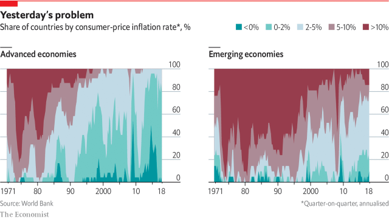

###### The world economy

# Inflation is losing its meaning as an economic indicator 

 

> print-edition iconPrint edition | Special report | Oct 10th 2019 

INFLATION USED to be the scourge of the world economy and the bane of American presidents. In 1971 amid an overheating economy Richard Nixon took to television to announce a freeze on “all prices and wages throughout the United States”. A board of bureaucrats ruled on what this meant for everything from golf club memberships to commodity futures. Gerald Ford, Nixon’s successor, preferred a grassroots approach. He distributed buttons bearing his slogan: WIN, for “whip inflation now”. Ronald Reagan, running for office four years later amid another surge in prices, declared inflation to be “as violent as a mugger, as frightening as an armed robber and as deadly as a hit man”. 

Today the lethal assassin has gone missing. Most economies no longer struggle with runaway prices. Instead they find inflation is too low, as judged by their inflation targets. A decade of interest rates at or near rock-bottom has not changed that. Nor has the printing of money by central banks in America, the euro zone, Britain and Japan that has expanded their balance-sheets beyond a combined $15trn (35% of their combined GDP). Nor have unemployment rates that are in many countries the lowest they have been for decades. 

The IMF counts among its members 41 countries in which monetary-policy targets inflation. Add in the euro zone and America (where the Fed has multiple goals), and you get 43. Of those 28 will either undershoot their inflation targets in 2019 or have inflation in the bottom half of their target range, according to the fund’s most recent round of forecasts. (When those forecasts are updated on October 15th, after this special report goes to press, that number will probably rise.) By GDP 91% of the inflation-targeting world is an inflation laggard on this measure. That includes nearly all the advanced economies under examination—Iceland is the sole exception—and more than half of the emerging markets. 

This shift in the inflation landscape reflects both the successes and the failures of economic policy. The advent of inflation-targeting central banks since the 1990s has gradually immunised economies against runaway prices. But policymakers seem either unwilling or unable to stop inflation falling short of their targets. This special report will argue that anchored inflation expectations, technological change and the flow of goods and capital across borders have conspired to make inflation a less meaningful—and less malleable—economic indicator. Central banks are therefore finding their targets harder to hit. At the same time, constraints on monetary policy mean that the risk of inflation shortfalls looms larger than that of excessive price rises. Central bankers and politicians must find ways to adapt economic policy to this new world. 

Low inflation is striking over both the long term and the short term. In the long term it is the culmination of a decades-long trend. The rich world conquered runaway prices by the late 1990s as governments made central banks independent and gave them inflation targets. In the 2000s and the early 2010s commodity-price booms kept prices rising at a decent clip. But since the oil price crashed in 2014, inflation above 2% has been rare. In emerging markets it is higher, but the direction of change is the same (see chart). For nearly two decades economists have talked of an era of “global disinflation”. 

 

In the short term low inflation is especially striking because it seems to defy the “Phillips curve”, the supposed inverse relationship between inflation and unemployment. In two-thirds of countries in the OECD, a club of mostly rich countries, a record proportion of 15- to 64-year-olds have jobs. According to the models taught in economics courses and used by central banks, a jobs boom on this scale should have brought accelerating prices and wages. For the most part, it has not. 

Central bankers have been caught out. For years they have promised that jobs growth would soon be over and inflation would rise. They have repeatedly been proved wrong and are conscious of their mistakes. In February 2016 Mario Draghi, the outgoing head of the European Central Bank (ECB), described whether inflation targets can be met as “the most fundamental question facing all major central banks”. Mark Carney, governor of the Bank of England, recently warned of an “increasingly untenable” economic-policy consensus. In March this year Jerome Powell, the Fed’s chairman, said low global inflation was “one of the major challenges of our time”. The Fed’s failure to hit its inflation target has encouraged an assault by President Donald Trump, who is incensed that in 2018 Mr Powell slowed growth by raising interest rates to see off an inflationary threat that has not yet materialised. 

The disease of the 1970s and 1980s was simultaneous high inflation and high unemployment. That both are now low might seem like cause for celebration. Certainly inflation below target is a better problem to have than runaway prices. But it poses problems for three reasons. First, it represents a missed opportunity. Monetary policy could have been looser, and hence growth faster, without price pressures taking off. Second, central banks missing their inflation targets undermines their credibility. In Europe markets’ long-term inflation expectations have sunk to little over 1%, lower than when the ECB started its quantitative-easing programme in early 2015, despite an inflation target of below but close to 2%. When inflation targets are not credible, the future is more likely to spring a costly surprise. Unexpectedly low inflation causes lenders to profit and borrowers to suffer, because debts do not shrink as fast in real terms as they were expected to when loans were agreed. 

Central bankers have repeatedly been proved wrong 

Most important, low inflation can be self-reinforcing. More significant than the nominal interest rate set by central banks is the real interest rate, which adjusts for inflation. As the public comes to expect lower inflation, the real rate rises, weakening demand and pushing inflation down even more. That would not be a problem if central banks could cut the nominal rate further to fight the disinflationary slump, but they have little room to do so. In Europe and Japan nominal interest rates are already below zero. They are near zero in Britain, and only a little higher in America. Though the exact location of the lower bound on interest rates is uncertain, it exists somewhere because the public always has the option of holding cash at a zero nominal return. 

Why has inflation reached this curious—and precarious—point? Some would argue that inflation is falling short because governments have lost the ability to boost prices. This cannot be true. If it were, they could cut taxes to zero, boost spending, print money to finance the resulting deficits and never see an inflationary downside. Inflation will always respond, eventually, to a determined policymaker who has access to interest rates and the printing presses. Governments can always debase their currencies, as high inflation in Argentina and Turkey shows. 

This might suggest that below-target inflation reflects only a failure of ambition. But that is not right either. Inflation has become harder to fine-tune because economies have changed in ways that are not yet fully understood. Monetary policy must not just become more ambitious but also adapt to rely less on failing models and to take a longer-term view. And while central banks are hamstrung by low rates, fighting low inflation will increasingly fall to fiscal policy. The case for reform rests first on an understanding of where economic models have gone wrong. ■ 

See next article: Economists’ models of inflation are letting them down 

