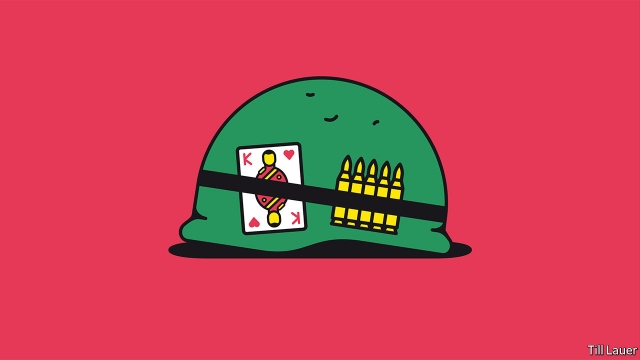

###### Banyan

# Thailand’s army chief sees a commie conspiracy to topple the king 

 

> print-edition iconPrint edition | Asia | Oct 19th 2019 

IT WAS A speech worthy of Dr Strangelove. In a 90-minute lecture-turned-rant at the army headquarters on October 11th, Apirat Kongsompong, the head of Thailand’s armed forces, accused academics and other leftists of implanting “communist chips” in the minds of brainwashed youths. Opposition politicians such as Thanathorn Juangroongruangkit, leader of the Future Forward Party, were involved in the conspiracy, too, the general added—how else to explain Mr Thanathorn’s meeting with a democracy activist from Hong Kong? The aim of their plotting, General Apirat confided, was nothing less than the toppling of Thailand’s sacred monarchy. 

To foreigners all this may sound like an absurd spoof, but to democratically minded Thais, it was ominous. Similar talk preceded a notorious massacre at Thammasat University in Bangkok in 1976, when soldiers and police casually fired into a crowded campus of student protesters, their work finished by a right-wing lynch mob. Perhaps 100 students died. Moreover, General Apirat’s father, who was also head of the army, led a junta that overthrew an elected government in 1991. 

If nothing else, General Apirat’s railing gives the lie to the claim that the army has returned to barracks. It last seized power in a coup in 2014. Elections in March were meant to mark a return to civilian rule, but instead saw the coup leader, Prayuth Chan-ocha, carry on as prime minister. Despite his considerable efforts to rig the election, Mr Prayuth’s army-backed party required the help of nearly a score of tiny parties to form a government. In an apparent message to politicians who might be tempted to take the supposed restoration of democracy seriously and make life difficult for Mr Prayuth, General Apirat says he will not hesitate to launch another coup if “political chaos” demands it. 

Mr Thanathorn, a wealthy, telegenic 40-year-old, is fast replacing Thaksin Shinawatra (the former prime minister, now in exile, whose parties have long dominated democratic politics) as state enemy number one. Mr Thanathorn’s message resonates, especially among the young: trim the army’s power, rewrite the constitution and foster an open politics that serves all Thais, not just the elites around the royal court. He has already been barred, on a technicality, from taking up his seat in parliament. Worse awaits. His party is likely to be disbanded. The authorities are looking for excuses to lock him up. But with Mr Thanathorn’s reputation for probity (in contrast to Mr Thaksin), they would only create a martyr. 

General Apirat’s approach, then, only divides an already polarised society further. Why does he pursue it? Read his lips: absolute loyalty to King Maha Vajiralongkorn. The sovereign, a playboy martinet, demands nothing less. Even his queen and consort have had to undertake military training—in the queen’s case in his own personal guard. Not only has he made clear his disdain for democratic norms, he has also asserted direct authority over the army, putting various units under his personal command. This means that any future coup would be seen to carry King Vajiralongkorn’s imprimatur. 

Perhaps General Apirat hopes that his stern lectures will make future coups unnecessary, by helping to keep all Thais in their place in King Vajiralongkorn’s cosmic hierarchy. Yet even among the elites, not everyone is happy. Mid-level army officers are grumbling that the king’s demands—he has sent top units he distrusts out of the capital—are messing with their careers. Ordinary Thais, meanwhile, gripe about the traffic jams caused when the streets are cleared to make way for royal motorcades. 

The more immediate problem is that General Apirat’s kind of rhetoric, endlessly repeated by army-backed media, does not cow those who want change. His lecture received a barrage of criticism from academics and journalists. Young netizens said they were old enough to make up their own minds, just as they did when the king urged them to vote for the right sort of politician. If he intended to generate fear, he failed. 

Survivors of the massacre at Thammasat later moved into academia, or became senior figures in politics under Mr Thaksin. Mr Thanathorn himself was a (later) head of the university’s student union. Nobody claims that General Apirat will resort to grenade-launchers, which the army used in 1976. But many observers worry that an absolutist king and his courtiers are putting Thailand on course for a fresh round of protest—and the inevitable bloody put-down.■ 

