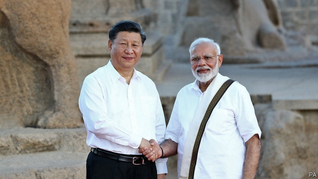

###### Forced smiles

# The leaders of China and India pretend to get along 

 

> print-edition iconPrint edition | Asia | Oct 19th 2019 

DRAGON AND tiger, or panda and elephant? As Xi Jinping, the Chinese president, and Narendra Modi, India’s prime minister, met for an “informal summit” on October 12th, the masala of metaphors in the Indian press was telling. Strongmen on their own political turf, the two men ambled as tourists through the eighth-century rock carvings of Mamallapuram on India’s south-eastern coast before banqueting at a romantic seaside temple, the last vestige of a once-thriving port that traded with China 1,300 years ago. Yet their countries, jointly home to more than a third of humanity, are not the best of pals. 

The list of mutual irritants is long. Each side claims land the other controls. China asserts a right to the entire Indian state of Arunachal Pradesh. Both have friends the other hates. China is an increasingly vital financial, military and diplomatic lifeline for India’s eternal, nuclear-armed foe, Pakistan, while India has for decades hosted prominent Tibetan exiles, including the Dalai Lama. China grates at India’s blunt opposition to its Belt and Road Initiative, aimed at integrating Asia through infrastructure built with Chinese loans. India is annoyed by China’s $53bn surplus in the $96bn trade between the two. It shows its disapproval by, among other things, rebuffing Chinese proposals to deepen “people-to-people” contacts, suspecting that the offer of things like research collaboration is just a cover for more insidious aims. For its part, China sends a minuscule 250,000 tourists a year to India, out of some 149m who travel abroad. 

India also fears the growing disparity between China’s military might and its own. With an economy that is now five times bigger, and with an industrial base and defence budget to match, China is rapidly outstripping a neighbour that still relies on imported weapons. Nor is it just China’s warships and submarines that are pushing into what India sees as its ocean. Dollops of Chinese money have impressed, and in some cases heavily indebted, smaller states that India sees as part of its backyard, such as the Maldives and Sri Lanka. 

China, meanwhile, casts a wary eye at India’s growing closeness to adversaries such as America, Australia and Japan. Partly because India views itself as a superpower-in-waiting, and partly from a desire not to provoke its bigger neighbour, India has shied away from formal alliances. But even under the erratic Trump administration India’s ties with America, which include a growing number of defence agreements, have continued to strengthen. “Nobody in Delhi is under the illusion anymore that China is a reliable partner, or even an alternative to an increasingly shaky relationship with the United States, a deepening partnership with Japan and stronger engagement with other middle powers across Europe and South-East Asia that are equally concerned about China’s unfettered and increasingly assertive rise,” says Constantino Xavier of Brookings India, a think-tank. 

Given so many sources of tension, what did Mr Xi and Mr Modi find to talk about? “Its almost like the deal is, we will not discuss the real issues in the relationship,” says Jabin Jacob of Shiv Nadar University in Delhi. “It’s an example of diplomacy without accountability, and largely meant to impress domestic audiences.” India says very little about China’s controversial policies in Hong Kong and Xinjiang, and has notably curbed the exiled Tibetans it hosts. In return, it hopes China will pipe down on the issue of Kashmir, which India recently stripped of autonomy. In that respect, at least, Mr Xi has signally disappointed, saying shortly before his visit that he was concerned about the situation in Kashmir and supported Pakistan’s stance. 

A similar shadow-play of competing influences goes on in India’s near-abroad. After meeting Mr Modi, Mr Xi flew to the Nepalese capital, Kathmandu. It was the first visit by a Chinese president in 23 years. The largely Hindu republic has strong historic and cultural ties to India, but its government has tilted northward in recent years. Both countries are run by communists, after all, and many Nepalese resent India’s occasionally bullying policies towards their country. 

Mr Xi signed some 18 bilateral agreements in Nepal, offering promises of Chinese investment in roads and railways. But the deal he wanted most, an extradition pact that might have targeted Nepal’s large community of Tibetan exiles, remained elusive. Considering the size of the mountains and the weakness of Nepal’s economy, the planned infrastructure links to China will take years to materialise. India, meanwhile, says it will strengthen road and rail links from its side. 

Another area of competition is Sri Lanka. China muddied its own pitch there by signing too many murky deals for ports and other infrastructure, causing a political backlash that favoured India. Now the pendulum is swinging back. Presidential elections in November look likely to return the pro-China Rajapaksa family to power. India has contributed to various development projects, but cannot match the scale of China’s largesse. The Chinese ambassador last year handed Sri Lanka’s outgoing president, Maithripala Sirisena, $300m as a gift from Mr Xi, to spend as he wished. “Unfortunately, staying power and the capacity for the long haul are missing from the Indian playbook,” laments Mr Jacob. ■ 

