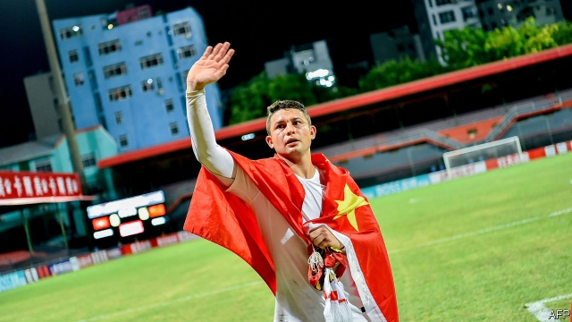

###### Moving the goalposts

# China’s football fans ask what it takes to become Chinese 

 

> print-edition iconPrint edition | China | Oct 19th 2019 

WHEN HE WAS still vice-president, in 2011, Xi Jinping declared three goals for Chinese football: to qualify for, host and eventually win a World Cup. China had appeared only once in the tournament, in 2002, and failed to score a single goal. The consistently embarrassing performance of the national team touches a sensitive nerve in a country striving for great-power status. China’s squad is ranked 68th in the world, just above that of North Macedonia (population 2m). Mr Xi, an avid football fan, insists the country can do much better. 

No one expects China to lift the ultimate trophy any time soon. But it may at least qualify to play in the next World Cup competition, due to be held in Qatar in 2022. Its prospects may have improved thanks to a new strategy adopted by China’s football federation: recruiting talented foreigners to the team and giving them Chinese citizenship to ensure they comply with the World Cup’s nationality rules. 

China’s own law on citizenship does not allow dual nationality, so someone becoming Chinese has to renounce any other passports. But some are ready to take up the offer. Last month Elkeson, who is originally from Brazil and goes by one name, became the first player without Chinese ancestry to don the Chinese jersey. He joins Nico Yennaris, a British-born player whose mother is Chinese, as the team’s second naturalised citizen. A gifted striker, Elkeson might be its best player. He scored two goals in his debut match in September and another in his second game on October 10th. That is one quarter of all China’s goals in its current World Cup campaign. 

Under the rules of FIFA, football’s global governing body, naturalised players must have strong links with the country they represent. This might include having a parent or grandparent born in that country, or having lived there oneself for five years continuously since the age of 18. China’s Super League, the equivalent of England’s Premier League, has several foreign players who would pass the residency test. As many as seven are being naturalised, says China’s football federation. 

More problematic is the way they are regarded by native Chinese. Normally it is virtually impossible to acquire Chinese citizenship unless one is the child of a Chinese national. At the time of the most recent census in 2010 fewer than 1,500 people had managed it. Comments on social media suggest many Chinese fans believe Chinese ethnicity is essential for players on the national team. “We are not a country of immigrants,” said an angry fan on Weibo, a Twitter-like service, after Elkeson announced he had become Chinese. Another wrote: “You don’t love China. You only love Chinese yuan.” 

Some were more explicitly racist. “At least he’s not black,” said one commentator. Hao Haidong, a former national player who is the country’s most prolific scorer of all time, said the use of naturalised citizens in Team China was “very scary”. In response to such criticisms, the football federation has promised not to recruit foreign-born players on a “large scale”. 

China’s chances of playing in Qatar are still not promising. On October 15th it suffered a humiliating scoreless draw against the Philippines, ranked 127th. Yet many fans noted how well Elkeson played. “I support naturalisation” was a common refrain on Weibo in the hours that followed. ■ 

