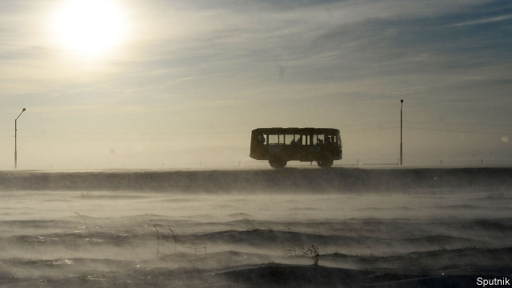
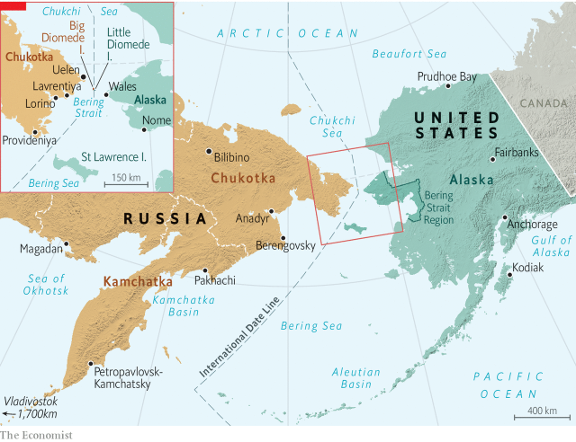
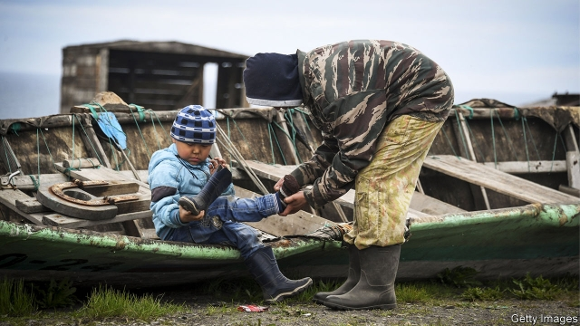

###### So near and yet so far

# Russia’s Chukotka and America’s Alaska are an era apart 

 

> print-edition iconPrint edition | International | Oct 19th 2019 

IT IS EASY to forget—if you ever knew—that Russia and the United States are less than three miles apart, across the icy waters of the Bering Strait (see map). From America’s Little Diomede Island, which is indeed very little, you can cheerily wave or glower, depending on your attitude, at Russia’s Big Diomede Island. Little Diomede has a hundred Alaskans on it, mainly Inuit; Big Diomede has a few military installations and some transient Russian soldiers. The two countries’ mainlands are only 55 miles (89km) apart at their closest. Far-sighted or foggy-minded engineers have long fantasised about building a connecting tunnel that would be only twice the length of the one that links England and France. 

Yet the two regions, joined by a land bridge perhaps as recently as 13,000 years ago, feel as if they are on different planets. Their differences, and perhaps even more importantly, their similarities, provide a lens through which to view the differing fortunes of both countries. 

Alaska is a vibrant state with a swelling population, a humming economy and a vigorous democracy—zinging with Democrats’ abuse for the present governor, a President Donald Trump-loving Republican. There exists a proud sense of federal statehood (achieved only in 1959) that belies its distance from Washington, DC. So too is there a sizeable minority of Inuit and other indigenous peoples who are volubly demanding greater cultural and financial rights after generations of discrimination. 

 

Chukotka, by contrast, has shrunk from 148,000 people when the Soviet Union collapsed in 1991 to fewer than 48,000 today, and on practically every front is struggling. Its standard of living is vastly inferior to that of its American counterpart across the water. Its government is far more tightly controlled by remote bosses in distant Moscow—even farther than Alaska is from Washington. The economy depends almost entirely on gold (managed by a Canadian firm), coal (managed by an Australian one) and meagre subsidies from Moscow. The local indigenous population has a far harder time trying to assert its rights. Russia’s main native association has been neutered by President Vladimir Putin. 

In the late 1980s, at the height of hopes that the “ice curtain” between the two old adversaries would melt under the warm gaze of Mikhail Gorbachev and Ronald Reagan, cross-channel friendship flowered. The tiny coastal Alaskan frontier town of Nome, created around a century earlier in a gold rush, reached out across the waves to Provideniya, the nearest Soviet port. In 1988 a bunch of prominent Alaskans, headed by the state governor and accompanied by a clutch of Alaskan natives (as Alaskans of pre-Colombian heritage happily call themselves), took a “friendship flight” across the narrow trough of sea from Nome to Provideniya to herald a new era of co-operation in the fields of science, environment, commerce, culture and diplomacy. 

Optimists, especially in Alaska, still seek to rekindle that friendship. But today they face two obstacles: the divergence in fortunes between the two places, and the re-emergence of the ice curtain, despite Mr Trump’s seemingly jovial relationship with Mr Putin in the Kremlin. 

The starting point of a cross-channel relationship in the 1980s was the re-establishment of visa-free travel for indigenous people on both sides of the channel. Many spoke the same language. Large numbers are cousins who had not met since 1948, when the cold war ended fraternisation across the strait. After 1988 there were joyful reunions and talk of open borders. 

The two peninsulas, that almost rub noses, have much in common. Their climates are among the harshest on the planet: the temperature in Chukotka once tumbled to -61ºC. The scenery on both sides is a desolate but beautiful mix of tundra, lake and mountain, frozen for eight months of the year. Chukotka is the least densely populated chunk of the Earth, bar Antarctica and stretches of the Sahara. 

Alaska’s northern half is almost as empty, its climate barely less brutal. Its Bering Strait Region, looking across at Provideniya, has around 20,000 inhabitants. The coastal waters on both sides freeze for most of the year. Alaska belonged to Russia until 1867, when America bought it—foolishly, as many in Washington, DC, sneered at the time—for a mere $7.2m. (That is $125m in today’s money, roughly what the state’s oil wells generate in revenue in four days.) 

Other similarities abound. Even in the summer, road connections in western Alaska are almost as sparse as in Chukotka. You can travel from Nome to Anchorage, the state’s commercial capital 864km away, only by air or, if you have a week to spare in the short-lived summer, by sea. Chukotka has no all-weather road network, though its zimniki—its winter ice-and-snow roads—do miraculously function. 

On both sides of the strait, permafrost means that houses are built on stubby stilts that in theory can be adjusted as the ground shifts between the long freeze and the fleeting thaw, offering passers-by a view of ungainly pipes and rubbish underneath. Permafrost also means that nothing can easily be buried or hidden, so an array of discarded cars, boats, fridges and toilet bowls disfigure the villages and surrounding tundra on both sides of the sea. 

Chukotka’s outposts are particularly dismal. Provideniya, once a humming port with 10,000-odd inhabitants in and around it, including a military-cum-naval base, has shrivelled to 2,000 or so. The town feels like a cracked shell. A huge, grey, tumbledown coal-fired power plant with smashed windows looms over the potholed, muddy main street largely devoid of traffic; it shuts down in July or August. 

The town has no proper hotel, just a corridor of five rooms with communal washing facilities on the third floor of a dilapidated block, entered via a smelly, unlit, unmarked stairwell. There is just one tiny restaurant called “Uyut” (“Cosy”), valiantly living up to its name but often empty. The town is served by a dismal state airline. Your correspondent was stranded for three days. “You were lucky it wasn’t a fortnight,” said a cheery local. A 36-hour boat ride to Anadyr was the only alternative. 

By contrast Nome, still officially twinned with Provideniya, runs far more smoothly, even though it suffers from some of the same problems—a terrifyingly cold and long winter climate, an excess of alcoholism, and a similar feeling among the local Inuit, who make up more than half the town’s populace of 3,700, that their language and culture are under threat. There is a shortage of housing, and sewage in some outlying villages still consists of primitive “honey buckets”. 

But, though it still has the rough flavour of a frontier town, Nome has a good hotel (owned by the local native corporation), several lively restaurants (two owned by Koreans), three radio stations, energetic churches, a superb library and museum, a local newspaper called the Nome Nugget edited by a couple originally from Germany, a brace of shops legally selling cannabis, and two big supermarkets, one of them Canadian-owned. Though Alaska’s natives were once horribly discriminated against (shops and inns sometimes had notices saying “No dogs or Eskimos”), native rights nowadays are vigorously promoted. “If you’re a racist in Nome,” says Diana Haeker, the Nugget’s editor, “you wouldn’t live here long.” 

A big Boeing jet flies back and forth to Anchorage every day, providing easy onward worldwide connections. An efficient private local airline, Bering Air, flies daily throughout the year to no fewer than 32 villages, some of them tiny, in the Bering Strait Region. Nome’s ebullient mayor, Richard Beneville, originally a New Yorker, is hoping for a federal investment of $500m to develop Nome’s port, since it is becoming increasingly ice-free as Arctic temperatures rise and cruise-liners are more frequently sailing past. 

On both sides of the strait threats to the indigenous way of life are similar. In Chukotka around 14,000 Chukchi hunt whales and walruses, or herd reindeer. Another 1,500 or so Yupik also live mainly off the sea, sharing many of the beliefs and language of their fellow Inuit peoples in northern Alaska, Canada and Greenland. 

The collapse of the Soviet Union in 1991 threw the entire region of Chukotka into the deepest despond, even starvation, as subsidies dried up, the administration fell apart and most of the ethnic Russians, who comprised the population’s majority along with their Ukrainian brethren, cleared off. Nowadays many of the ethnic Russians sign contracts with salaries two or three times higher than in western Russia because of the hardship, then go back home after a few years. Others stay because they love the challenge of living in a desolate but beautiful wilderness, and express the same frontier spirit, coupled with patriotism, as their counterparts in Alaska. 

Chukotka was saved from catastrophe by a minerals billionaire, who is now the owner of Chelsea Football Club. Roman Abramovich was elected the member of the Russian state Duma for Chukotka in 1999, and then served as governor from 2001 to 2008. A decade on, he is still revered in the region. When Mr Abramovich arrived, he was so horrified by the plight of his constituents that he poured in $2bn of his or his company’s cash, providing a modicum of health, education, housing and even sanitation to a desperate populace. 

Oddly, the collapse of the Soviet system of subsidies and the sudden end of its often clumsy efforts to turn the reindeer herder and whale hunter into homo sovieticus boosted traditional ways of living, since subsistence again became the sole means of survival. Though the International Whaling Commission bans whale-hunting worldwide, it exempts indigenous peoples on both sides of the Bering Strait, letting them have quotas to sustain their livelihood. In winter the people survive largely on whale and walrus meat. 

Hunters are given handouts of equipment, petrol and sometimes salaries by the state, but even so, many people drift away to Anadyr or western Russia—or lapse into sloth and alcoholism. Your correspondent had to wait a day for the village’s star hunter to appear. The explanation was blandly matter of fact: “He’s drinking.” According to the Russian Red Cross, the average male lifespan during the 1990s slumped to 34. Two years ago Russia’s health minister put Chukotka’s alcoholism rate at nearly six times higher than elsewhere in Russia, itself no paragon of sobriety. 

Some are trying to beat their demons. At a meeting of Alcoholics Anonymous (AA) in Lorino, a whaling village in Chukotka, a dozen members describe their efforts. Some are coy, others are keen to share. The mood is warm. There is laughter amid tears, as the Russian saying goes. 

One participant, a whale-hunter with a scarred face, tells how he fights to be honest in order to have an alcohol-free, better life. Another, a striking Russian woman in her 40s who is visiting from Moscow with the Red Cross, describes the redemptive joy in her life since renouncing the bottle. Three amiably bored children, between five and eight years old, loll around for lack of baby-sitters. On the wall a portrait of Mr Putin looks severely down. 

The natives of western Alaska suffer from many of the same troubles, especially alcoholism and poverty: Anchorage, Alaska’s commercial capital, has no fewer than 33 AA meetings. So too do they struggle to retain their culture and language, which Christian missionaries once tried to squash. More and more speak only English. 

In Nome the mayor bemoans a dire shortage of adequate housing. Half a dozen of the villages in the Bering Strait Region have no proper sewage. Natives’ average incomes are still far below those of white Alaskans. At 15% of the Alaskan population, they are underrepresented in the state legislature, with four out of 40 in the state house and two out of 20 state senators. Only one of Nome’s city councillors is a native. But native rights are far more respected than they once were. 

Recent comparative social statistics between Chukotkans and Alaskans are hard to come by. Mostly this is because the Russians bottled out after the most comprehensive joint analysis, the Survey of Living Conditions in the Arctic (SLiCA), was published in 2007 as a project of the Arctic Council, a forum for all eight Arctic countries. If SLiCA were reapplied today, Chukotka would probably come off even worse, since a sense of drift has followed the philanthropic Mr Abramovich’s departure. 

SLiCA’s last report exposed a dramatic difference in attitudes. Asked how satisfied they were with their “influence over management of natural resources such as fish, game, oil, mines and environment”, 83% of Chukotkan natives said they were dissatisfied, versus 32% of the Alaskan natives in the Bering Strait Region. Only 4% of native Chukotkans were satisfied compared with 35% of Bering Strait natives. In the more northerly bit of Alaska, flush with oil, 66% expressed their satisfaction. 

Native Chukotkans were two-and-a-half times more likely to feel depressed. Some 97% of them considered suicide a social problem versus 60% of Alaskans. Only a fifth of Chukotkans versus half of Alaskan natives reckoned their own health was good. Twice as many Alaskan natives as Chukotkans thought indigenous culture and history were well taught in school. 

Alaskan wages, for people of every ethnicity, are vastly higher than in Chukotka, while living costs are fairly similar. The Russian federal minimum wage of $174 a month is a fraction of the Alaskan minimum of $1,582. Even when Russia’s “regional co-efficient” is applied to Chukotkan wages, pushing many of them up to around $462 to compensate for the hardship of the extreme north-east, Alaskan wages are mostly four or five times higher. 

But the most obvious difference is in access to opportunity. Chukotka is horribly inaccessible, whereas any part of Alaska can be reached at the drop of a fur hat. Chukotka still has no proper internet connection, let alone good infrastructure. 

 

With no real roads on either side, Alaska’s incomparably superior airline network enables anyone to move around with ease. Alaska has more than 8,200 licensed pilots, the highest proportion in any American state, perhaps in the world. A score of private planes, as well as Bering Air’s fleet, are parked on the edge of Nome. 

If the same freedom of the air existed in Chukotka, prospects for the region’s much-touted upmarket tourism would be transformed. But Chukotka was until recently a “closed zone” to which even Russian citizens had limited access. When it was suggested that small private planes would benefit the Beringia National Park, intended as a showpiece of conservation, a local guide laughed: “The bureaucrats would never allow it.” She was referring obliquely to the ubiquitous Border Guards who come under the successor body to the KGB. 

The other big difference is democracy. Despite Mr Abramovich’s efforts, Chukotka has yet to recover from nearly a century of political repression and brutally crass communist mismanagement. Today’s officials defer to Mr Putin. The only regional newspaper, the weekly Krainii Sever (“Extreme North”), edited in Anadyr, is state-owned. There is no independent radio or press. Chukotkans elect their own representatives but the main shots, including decisions on the size and distribution of subsidies, are called in Moscow. 

Under Mr Putin, Russian associations of indigenous people have been shorn of independence. Muscovite twitchiness that non-Russian nations will demand further, or even full, autonomy extends even to Chukotka. When your correspondent explained the rights of self-determination exercised by Alaska’s natives to a professor in Anadyr, she exclaimed, “Thank God we don’t have anything like that here!” 

Western Alaska is palpably jollier. Despite its isolation, it is an open society. Nome has a lively council with tax-raising powers. The lot of Alaska’s indigenous people, though still far from universally happy, was transformed by the Alaska Native Claims Settlement Act of 1971, which distributed nearly $1bn in compensation for past wrongs and allocated a tenth of the state’s territory directly to the natives. Some of Alaska’s 13 native corporations drive hard bargains with oil and other companies. 

It is a tragedy for Chukotka that it has once more been cut off from Alaska. In the current political climate the ice curtain will not melt again soon. Once upon a time, Governor Abramovich told his counterpart across the water that he would like to emulate Alaska’s model. If only. ■ 

