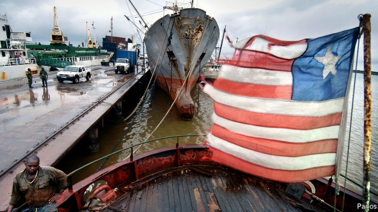

###### How convenient

# Why do one in ten ships fly tiny Liberia’s flag? 

 

> print-edition iconPrint edition | Middle East and Africa | Oct 19th 2019 

LIBERIA’S ECONOMY is on the rocks. The aid money that held the country steady after its brutal civil wars is ebbing and inflation has surged to more than 25%. Many businesses are struggling to stay afloat. But one industry seems to be weathering the storm: shipping. 

The tiny west African country, with a GDP of just $2.1bn, has one of the largest seagoing fleets in the world. Over 4,400 vessels (about 12% of global shipping) fly its flag. And the number is growing. 

The secret of this maritime success is an old practice known as the flag of convenience. In the 1920s shipowners began to register their vessels abroad for a small fee. This allowed them to avoid taxes and labour laws back home. Liberia had few regulations and made it easy to sign up. By the 1960s it had the largest merchant navy in the world. 

But two civil wars in the 1990s and 2000s hit the registry hard. Charles Taylor, the president from 1997 to 2003, used some of the $20m a year generated by the registry to pay arms dealers. His bloody reputation prompted many shipowners to switch to Panama. When the fighting ended in 2003, its registry was more than twice the size of Liberia’s. 

Liberia is striving to win back the ships it lost. Last year it renewed an agreement with China that makes it easier and cheaper to ship products into Chinese ports under a Liberian flag. The groundwork for that deal was laid in 2003, when Liberia dropped Taiwan and recognised China. (Panama has done the same; the Marshall Islands, with the third most popular flag, has not.) Efforts are paying off: measured by gross tonnage, Liberia’s fleet grew by 8% in 2018. 

Ordinary Liberians still see few benefits from the country’s vast fleet. The state wastes much of the revenue generated by the registry (now thought to be over $20m a year). Ships don’t often call at Monrovia, the capital, a ghostly place littered with rusting hulks. On bad days the wrecks outnumber container ships.■ 

