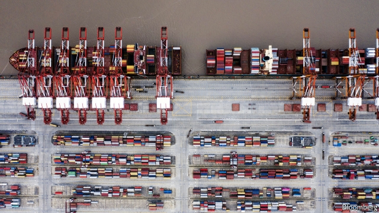
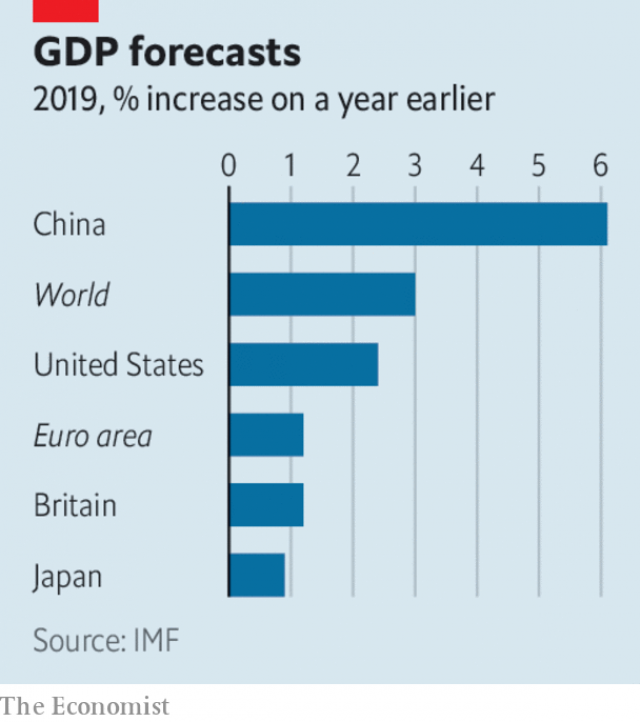

###### Who can trust Trump’s America?

# Business this week 

 

> Oct 19th 2019 

Steven Mnuchin, America’s treasury secretary, warned China that a new round of tariffs would be imposed on Chinese goods in December if it did not adhere to the accord struck between the two countries on October 11th. Under the deal China will buy more American agricultural produce, toughen protections for intellectual property and provide more access to its financial-services market, enough concessions to stop America raising tariffs on $250bn-worth of exports. China was cautious about the prospect for a breakthrough that will end the trade war. Donald Trump was more ebullient, declaring that the deal amounted to a “love fest”. 

Huawei reported that its business supplying 5G network equipment is thriving, despite being blacklisted by the American government, and that to date, it has signed 60 contracts with telecoms companies around the world. The Chinese maker of telecoms equipment has stockpiled essential components that are in limited supply from American firms because of the ban. 

Goldman Sachs reported a big drop in quarterly profit and revealed that it had lost $80m so far on its investment in WeWork, a loss-making office-rentals startup that had to abort its long-awaited stockmarket debut when its valuation sank. By contrast, JPMorgan Chase, which was the lead underwriter on WeWork’s IPO, recorded a rise in net profit, to $9.1bn. The bank is said to be working on a financing package for WeWork to stop it running out of cash next month. 

An international panel of experts reviewing the certification process of Boeing’s 737 MAX jetliner, which has been grounded following two crashes, published a report that was highly critical of the aerospace company and the Federal Aviation Administration. The report found that the FAA had “inadequate awareness” of what the plane’s new automated system was supposed to do. On the day it was published, Boeing separated Dennis Muilenburg’s dual positions as chief executive and chairman, in order to augment the board’s “active oversight role”. 

Nestlé said it would return SFr20bn ($20bn) to shareholders over the next few years, after reporting solid revenues and a boost from the sale of its skincare business. The Swiss food-and-drink maker’s share price has risen by a third since January. 

Investors responded positively to Netflix’s quarterly earnings. The video-streaming company undershot its forecast for new subscribers in America during the third quarter, though that was still a rebound from the previous three months, when it lost domestic users. It added 6.3m international customers, above expectations. Netflix also lowered its outlook, as it braces for the launch of rival streaming services from Apple and Disney next month. 

Facebook held the first meeting of the association that will oversee its proposed Libra digital currency, despite a barrage of objections raised by global regulators. Facebook insists Libra will be up and running next year, even though eBay, Mastercard, PayPal and Visa have pulled out. Still, 21 companies have signed up to the payments network, including Uber and Vodafone. 

 

The IMF again downgraded its growth forecasts amid “uncertainty about the future of the global trading system and international co-operation”. The world economy is projected to grow by just 3% this year, the slowest pace in a decade. The “systemic economies” of America, China, the euro zone and Japan can expect only a moderate expansion over the next few years. The IMF pointed out that subdued growth has coincided with easy monetary policy, but warned that central banks have little ammunition left when economies are in a “tougher spot”. 

The Federal Reserve began buying short-term government bonds at a monthly rate of $60bn in order to refill its portfolio until at least the second quarter of next year. It is doing this to ease a cash crunch and sharp rise in banks’ overnight lending costs (the repo rate). The size of the intervention took many by surprise. The central bank described it as a technical move, not a return to quantitative easing, which involved buying longer-dated treasuries. 

The United Automobile Workers union reached a tentative deal over a new contract with General Motors. The workers have been on strike for over a month, which is said to have cost the carmaker up to $1.5bn. 

James Dyson scrapped his firm’s project to build electric cars, acknowledging that it was not commercially viable. The British inventor, whose cordless vacuum cleaners and other gadgets have eased the burden of household chores, reportedly pulled the plug on the Dyson vehicle in the face of intense competition from established carmakers, who are ramping up production of their own battery-powered models. 

