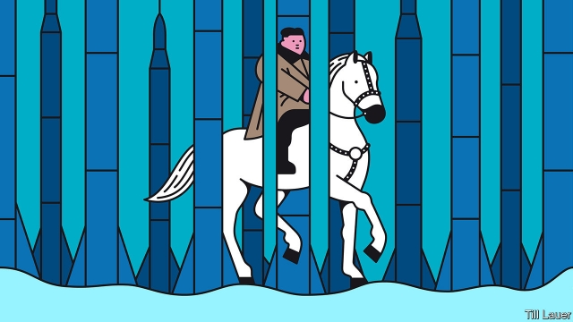

###### Banyan

# Beware North Korea’s petulance and propaganda 

 

> print-edition iconPrint edition | Asia | Oct 26th 2019 

AS THE FIRST snows of winter fell on sacred Mount Paektu, Kim Jong Un knew what he had to do. The dictator threw on his greatcoat, saddled up his white steed and rode up the mountain’s slopes until man and beast were gazing into the caldera lake that glints at the summit, pure as the Korean race. 

Holy mountain and white charger have long played a central part in the Kim family’s propaganda. They are stolen straight from the cult that once surrounded Emperor Hirohito of Japan, Korea’s former colonial oppressor. But for the old iconography to be given a showing now is notable. Until recently the most striking image of Mr Kim was against the glimmering skyline of Singapore, where he celebrated an extraordinary coming-out party with President Donald Trump last year. There have also been dramatic handshakes at the demilitarised zone with Moon Jae-in, South Korea’s president, as well as with Mr Trump. Now openness and modernity are out. The chill, Mr Kim has decided, is back. The marshal is protecting his vulnerable people from his lonely guardpost atop Mount Paektu. 

South Korea is suffering most from the change. Mr Moon plays the solicitous suitor to Mr Kim, but gets nothing but abuse in return. A supposedly friendly football match between the two countries in the North Korean capital in mid-October gave a sense of the chill. South Koreans and the foreign press were not allowed into the near-empty stadium. The North Korean team glowered at their opponents, as if about to assault them. The game ended in a goalless draw. This week Mr Kim announced the end of South Korean involvement in a rare instance of North-South co-operation, a tourist resort at Mount Kumgang built by South Korean developers. He ordered the “unpleasant” buildings to be razed. 

For Andray Abrahamian of George Mason University Korea, who like many North Korea experts saw real prospects for detente, this default to the old petulance is a “massive failure of public diplomacy” on the part of Mr Kim. Why did the dictator turn his back on the economic opening offered by Mr Moon? Surely no future South Korean leader will be so open-handed. Perhaps Mr Moon’s optimism persuaded Mr Kim that his paramount goal, a deal with Mr Trump over his nuclear and missile programmes, would be easy. Certainly, at a summit in Hanoi in February, Mr Kim miscalculated by offering to close only a knackered plutonium reactor in exchange for a lifting of international sanctions. On October 5th American and North Korean negotiators met in Stockholm, raising hopes of a new flexibility. Again the talks ended abruptly. 

It is not impossible that Mr Kim and Mr Trump will meet for yet another summit before the end of the year. But if Mr Kim hopes for a breakthrough, he is surely overestimating Mr Trump’s desperation for a deal or his administration’s ability to focus on one amid the fog of impeachment. In the meantime, the feel-good factor is gone. 

Not least, Mr Kim is trying America’s patience with fresh missile tests, and threatens an end to all self-restraint if not offered goodies by year-end. Since May the North has tried out three new, solid-fuel, short-range ballistic missiles. In early October it fired an intermediate-range missile into Japanese waters from an underwater platform. 

If it is all a diplomatic failure on Mr Kim’s part—think of the economic opportunities, not to mention the security guarantees that would have flowed from a deal—it is also a fiasco for Mr Trump. On his watch, North Korea has expanded its nuclear arsenal to about 40 weapons and greatly improved the missiles needed to use them. 

In fact, from Mr Kim’s narrow perspective, the failed summitry and reversion to sabre-rattling could be considered a great success. His nine years in power are something Mr Trump can never match, after all. His mafia state looks more secure than ever. And after three years of “maximum pressure”, the UN-led sanctions regime is wilting. Bad blood between America, on the one hand, and China and Russia, on the other, has undermined the UN panel that enforces sanctions. The hectic diplomacy, meanwhile, has allowed Mr Kim’s envoys to pursue illicit activities, from sanctions-busting to cyber-heists at foreign financial institutions. North Korea’s stricken economy limps on. 

It falls massively short, admittedly, of what ordinary North Koreans deserve. But they never counted. Mr Kim, by contrast seems to think he is back: belligerent, bemissiled and beefier than ever.■ 

