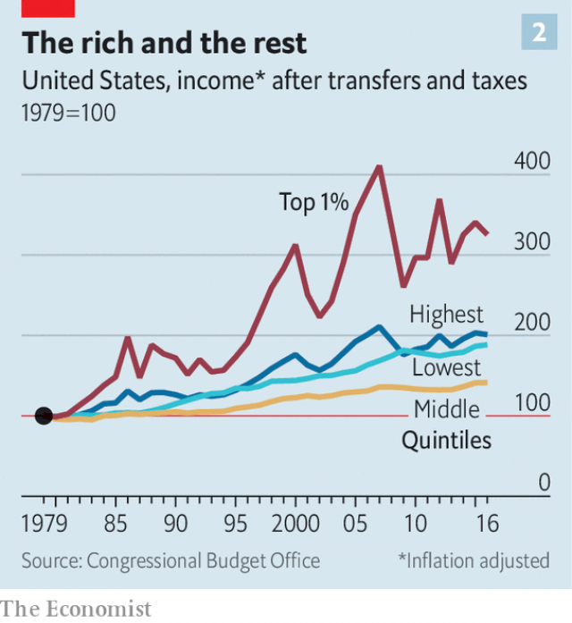
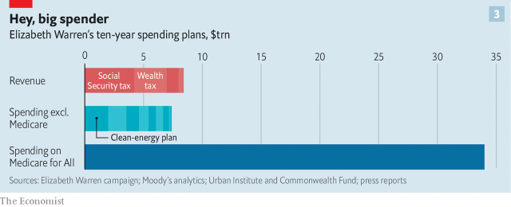

###### Warrensworld

# Elizabeth Warren’s many plans would reshape American capitalism 

 

> print-edition iconPrint edition | Briefing | Oct 24th 2019 

IN 1936 Franklin Delano Roosevelt said of the big businesses lining up against his re-election: “They are unanimous in their hate for me—and I welcome their hatred.” Elizabeth Warren, who is seeking the Democratic nomination in next year’s presidential election, takes a similar approach. After a cable news personality reported that executives of big companies are anxious about the possibility of a Warren presidency, she tweeted: “I’m Elizabeth Warren and I approve this message.” 

Ms Warren, a former professor at Harvard who is currently a senator for Massachusetts, is offering Democratic primary voters a menu as ambitious as anything seen since FDR’s New Deal: a fundamental reworking of American capitalism. It is going down well. In The Economist’s average of public-opinion polls, as of October 23rd, Joe Biden has just a narrow lead over Ms Warren. Her support stands at 24%, the former vice-president’s at 25% (see chart 1). Betting markets rank her the clear favourite, with a nearly 50% chance of grasping the nomination. Polls pitting her against President Donald Trump see her beating him. 

Ms Warren has been fishing for primary support in many of the same pools as Bernie Sanders, a senator for Vermont. But there is a sharp ideological distinction between them. Mr Sanders calls himself a “democratic socialist”; he talks of class struggle and wants workers to own 20% of big companies. This resonates with much of the old left, and has support from new leftists such as Alexandria Ocasio-Cortez, a representative from New York. Ms Warren, in contrast, proclaims herself “a capitalist to my bones”. Mr Sanders would never say, as Ms Warren did last year, “I love what markets can do...They are what make us rich, they are what create opportunity.” 

 

It was a paean with a crucial proviso: “But only fair markets, markets with rules.” Ms Warren believes that the rules under which American markets operate are unfair. She sees a system corrupted by cash turned into political capital. Thus most carbon emissions remain unpriced, tech giants accumulate more power and oligopolies dominate health care. Such market failures—or, in this view, market sabotage—gum up competition and widen income inequality, leaving millions of working families “hanging on by their fingernails”. Setting them right requires a wide range of reforms. 

That this assessment thrills Democratic primary voters should perhaps not come as a surprise. Healthy capitalism depends on healthy competition. Yet two-thirds of American industries have seen market concentration rise in the past two decades. Competition should constrain profits as companies fight for customers; in America profits have soared. 

In 2016 the incomes of the highest 1% of American earners were 225% higher in real terms than they had been in 1979 (see chart 2). For the middle-class, the growth was 41%. Today’s tight labour market gives American workers more negotiating power than they have had in years. But that does not make up for the long-term shift towards inequality, both between the top 1% and everyone else, and between college graduates and less-skilled workers. Higher education, good health care and decent housing are unaffordable to many. America has some of the highest levels of poverty of any rich nation, and some of the lowest life expectancies. 

 

To tackle inequality Ms Warren proposes a pincer movement. “Predistribution”, an idea developed by Jacob Hacker, a professor at Yale, would seek to boost pre-tax incomes for working families and limit economic gains perceived to be unjust, thus tempering the engines of inequality. Hence a variety of actions aimed at breaking up or reining in big firms and better equipping workers. Old-fashioned redistribution would also seek to right the damage already done with taxing and spending. Ms Warren would not just reverse Mr Trump’s tax cuts. She would also impose new taxes on large companies and rich individuals—who would see their taxes rise more steeply than they have for almost a century, reversing a decades-long fall. 

Companies would face an extra 7% tax on all profits above $100m—an amount levied on the profits the firms report in their accounts, rather than their taxable profits under current law. There is often a large discrepancy between the two; tax exemptions created by a well-lobbied Congress result in many profitable companies paying little tax. The highest earners would also face heftier payroll taxes. Blaming the shortfalls that loom for Social Security (public pensions) by 2035 on “inadequate contributions by the rich”, Ms Warren would introduce new levies worth nearly 15% on roughly the top 2% of households. 

Then there is the wealth tax. Targeting the super-rich, Ms Warren promises a 2% annual levy on net worth over $50m, rising to 3% on fortunes above $1bn. Rich people expend a lot of effort avoiding such taxes. Indeed, the complexity of working out what they should cough up is one reason only three rich countries have them, compared with 12 in 1990. 

The sense that a Warren presidency would be costly to them personally, as well as forcing change on their companies, doubtless adds to the antipathy felt towards her among most of America’s business elite. But the Social Security benefits for the elderly, free public college for students and universal child care which, among other ideas, these trillions could fund appeal to many voters. 

Some of these plans would also show positive effects on economic growth, according to independent analyses by Mark Zandi, chief economist at Moody Analytics. The campaign, which has published some of his reports, has not yet shared the number-crunching Mr Zandi has done on free public college and student-debt cancellation, which may be less positive. (The Warren campaign would not confirm or deny this.) “Broadly speaking, she pays for what she has proposed,” says Mr Zandi. The only exception is Medicare for All. “It’s not clear to me how she is going to pay for it all. She hasn’t asked me to evaluate it.” 

Medicare for All is a nationalised health-care plan proposed by Mr Sanders which Ms Warren endorses. The plan illustrates the sheer size of the changes Ms Warren envisages (see chart 3). It would get rid of private health insurance, an industry with a market value of $530bn. Her more mainstream rivals for the nomination have started to press the senator on whether the $3trn in annual costs that come with that policy would require her to increase taxes on the middle class. She has not come up with a convincing answer—though she says that one is forthcoming. 

 

Private equity would also be at risk. The “Stop Wall Street Looting Act” she has introduced in the Senate changes the way private-equity firm employees’ income is taxed. Currently they pay capital gains and investment tax of just 23.8% on their earnings. Under her plan they would pay income tax of up to 37%. But not everything Ms Warren wants to do to the industry is a matter of redistributing its gains. Her predistribution agenda requires the power of such concentrations of capital to be reduced. Measures on “joint and several liability” in private equity contained in the act would in effect shut down their business, say industry bosses. By making the partners who manage and invest in the funds liable for the debt and pension costs of companies they acquire, they would impose a burden that public companies do not have to shoulder, scaring away institutional investors. That would affect the ownership of 8,000 companies, more than twice the number of listed firms. 

Other companies would also be broken up. She would revive the Glass-Steagall Act, separating banks’ deposit-taking business from their riskier investment activities. Federal regulators have allowed some giants to gain more power by acquiring potential rivals. Ms Warren would unwind those mergers. Bayer, a huge life-sciences company, would have to sell Monsanto, a seed and chemicals company it acquired in 2018; Facebook would have to spin off Instagram and WhatsApp (see article). Online marketplaces with global revenues of more than $25bn would be regulated as “platform utilities”, and stopped from offering their own products and services on the regulated platforms. Google would have to sell its online advertising exchange, Amazon would not be able to sell on its marketplace.  

Ms Warren also wants companies to be generally more accountable. In big companies, 40% of board seats would be reserved for workers’ representatives. All companies with revenues of more than $1bn would need to obtain a federal charter requiring their directors not just to serve their shareholders but also consider the effects of what they were doing, or not doing, on their workers, their suppliers, their neighbours, the environment and so on. State attorneys-general could petition the commerce department to revoke a company’s charter if they felt those norms were repeatedly being flouted. 

In this she can claim to be going with the flow. In August nearly 200 chief executives, including JPMorgan Chase’s Jamie Dimon, Johnson & Johnson’s Alex Gorsky and Walmart’s Doug McMillon pledged “a fundamental commitment to all of our stakeholders”. “I completely agree with her that businesses need to be focused on stakeholders, not just shareholders,” says Marc Benioff, the chief executive of Salesforce, a software giant. But Ms Warren wants to turn these promises into state-monitored action. 

Whether Ms Warren’s many plans would have their desired effect is open to question. So are their unintended consequences. A big investment bank might be enmeshed in credit markets in such a way as to need a government bail out in a crisis even if it had no deposit-taking arm. Workers on boards would probably garner higher wages, but that brings other complications. A multinational company might have its headquarters in America but have more staff outside it, says Luigi Zingales of the University of Chicago. Why should American workers get a bigger say than those overseas? Dissuading corporate takeovers would limit companies’ ability to change with the times. Most disturbing, to Mr Zingales and many others, is the notion of company charters which the federal government could revoke. “Imagine a Trump administration with the power to go after companies in this way,” he says. 

Not all of the predistribution agenda is aimed at humbling the mighty. Like most of the Democratic contenders Ms Warren wants paid family leave, a $15 federal minimum wage within five years, government investments in training and reforms that will make it easier for people to unionise. She would also ban forced arbitration and non-compete clauses, giving workers more power to challenge their employers and find new jobs. “Gig economy” companies would be required to treat workers as salaried employees. 

Ms Warren is not just seeking to change the rules for business. She also sees a big role for government in making America competitive: a role built on industrial policy and protectionism. A new uber-agency called the Department of Economic Development would be charged with creating American jobs. Products made possible by taxpayer-funded R&D would have to be made in America. 

If that sounds like a Warren policy that Mr Trump might support, it is not the only one. Ms Warren promises to run a government “more actively managing our currency value to promote exports and domestic manufacturing” in response to other countries manipulating their exchange rates. She wants new committees representing consumers, rural areas and each region of the country to be able to delay trade deals that worry them. Since every trade deal will worry someone somewhere that sounds like an end to trade deals. 

This brings to the fore a tension at the centre of Ms Warren’s capitalism. Many of her domestic policies are justified in terms of increasing competition. Blocking anti-competitive deals may be troublesome for Facebook but is generally good for everyone else. Yet when it comes to industrial and trade policy her love of competition wanes. She becomes, instead, a conventional protectionist. 

Take the example of clean energy. Ms Warren sees environmental policy as an opportunity to play favourites and to protect American manufacturing. She wants an accelerated phase-out for carbon-free nuclear electricity and a ban on fracking, which has not only made America the world’s top oil producer but also provided it with a lot of cheap natural gas. This appeals to the Democrats’ base; but it would also make America’s transition to cleaner energy more expensive and less effective. Ask someone selling coal-fired electricity what they want for Christmas and an end to nuclear power and cheap gas will come high on the list. 

Ms Warren abhors lobbying—she proposes an “excessive lobbying tax”, rising up to 75% for companies spending more than $5m annually. Nevertheless, despite this, her approach creates a lot more direct government investment that firms might lobby for. She seems unfazed by the possibility of government’s capture by insiders when those insiders are the right people with the right intentions. It is worth noting that Ms Warren designed her biggest governmental achievement to date, the Consumer Financial Protection Bureau, in a way that gave its director unusual power and autonomy. 

Ms Warren has tried to avoid the practice of meeting Wall Street executives and big donors to help shape her agenda. Her solutions are instead informed by consultations with professors and think-tankers. Despite this, within these academic circles, Ms Warren’s ideas spark debate. 

Because the proceeds of her new taxes are to be spent, they should not suck demand from the economy. More competition could encourage innovation. Subsidised child care could encourage more work; subsidised health care more willingness to chase dreams. That said, a disorderly dismantling of the fracking and private-equity industries, continued trade strife and the possible disincentives to work and invest caused by much higher taxes would cut the other way. 

 

Larry Summers, a professor who led Barack Obama’s National Economic Council, and Natasha Sarin of the University of Pennsylvania argued earlier this year that a wealth tax would be difficult to implement and could depress enterprise. They also think it would raise less money than the Warren campaign claims. 

Income inequality would surely fall somewhat, especially by taxing the very top of the income distribution. Emmanuel Saez and Gabriel Zucman, two economists at the University of California, Berkeley, who influenced Ms Warren’s tax policy and who have written a new book on inequality (see article), estimate that her proposals would increase the tax bill of the richest 0.01% of Americans. Currently, they pay 33% of their pre-tax income in tax, which would rise to 61%. But there is a limit to how much inequality can be fought through taxing the very rich. Much depends on Ms Warren’s policies to improve the life of the precarious middle class, for instance through health insurance and subsidised child care. 

The fact that most of the Democratic field is less radical than Ms Warren suggests that, even if her party were to take the Senate and retain the House in 2020, much of her agenda would be watered down. If Republicans retained control of the Senate there would be a lot less she could do. But she would still have some scope to act. 

The Environmental Protection Agency could reverse regulatory rollbacks set by the Trump administration. The federal government could enforce stricter labour standards, such as a $15 minimum wage in the public sector. Warren appointees to the Federal Trade Commission and the justice department could reverse previously approved mergers and reject new ones, though such actions would probably be challenged in the courts. A National Labour Relations Board in her hands could decide that “misclassification” of workers as independent contractors was a violation of labour law, upending the gig-economy. Her power over trade and tariffs would be comparatively unconstrained. 

A good position months before the first primaries and a year before the election is no one’s idea of a guaranteed win. But Democratic voters like what they see. In a recent poll by Quinnipiac University, 40% of respondents said Ms Warren had the best policy ideas, compared with 16% for Mr Biden and 12% for Mr Sanders. This suggests that real change is afoot within the party, even if it is not quite yet a new New Deal. But as well as worrying about what Ms Warren proposes, American bosses need to realise that she is no longer the outlier she may once have appeared to be. ■ 

